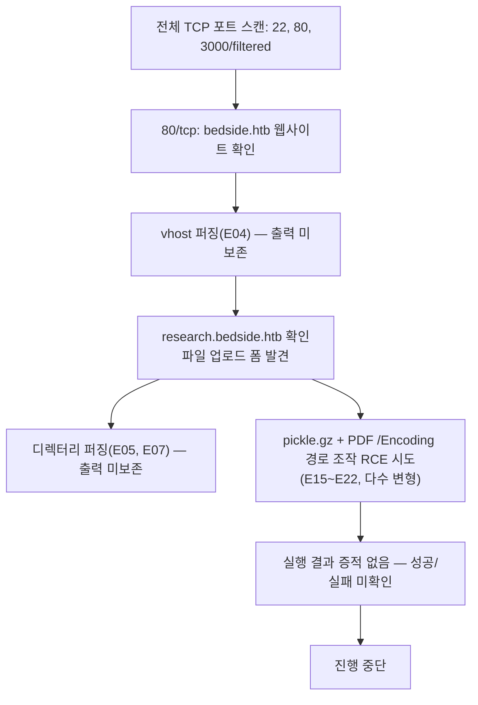

# A. 작성 전 증적 감사

**종합 판정: BLOCKED (진행중 문서로서 `force_writeup` 상당 지시에 따라 계속 작성)**

이 세션의 목표 자체가 "완료된 공격 체인을 서술"하는 것이 아니라 "미완료 상태를 정직하게 기록"하는 것이므로, 통상적인 §9 게이트 기준으로는 `BLOCKED`(초기 접근 미검증, root/user 직접 증적 전무)이지만 사용자가 진행중(In Progress) 상태의 write-up을 명시적으로 요청했다. 이에 따라 감사는 `BLOCKED`로 판정하되, 본문 전체를 "무엇을 시도했고 무엇이 확인되지 않았는지"의 기록으로 계속 작성한다. 모든 미확인 지점에는 `[증적 부족]` 또는 `[미확인]`을 표시한다.

## 1. 차단 항목

1. 초기 접근이 확인되지 않았다 — `scripts/E15`~`E22`의 pickle 역직렬화/PDF `/Encoding` 경로 조작 익스플로잇 시도 코드는 존재하지만, 이 세션(혹은 이전 세션)이 실제로 이 스크립트들을 실행한 원본 출력(stdout 캡처, HTTP 응답 본문, 대상 마커 파일 확인 결과 등)을 기록한 증적 파일이 `BedSide/` 어디에도 없다. 따라서 RCE 성공 여부를 판정할 수 없다.
2. user flag, root flag, `loot/` 디렉터리, SSH 접속 증적이 전혀 없다 — `HTB{`, `flag`, `root.txt`, `user.txt` 문자열로 폴더 전체를 검색했으나 매치 없음.
3. `scripts/E02_nmap_sv.sh`(서비스/버전 스캔, 포트 22/80/3000 대상)의 실행 결과 파일이 `scans/`에 없다 — 스크립트만 있고 출력은 없다.
4. `scripts/E04_ffuf_vhost.sh`, `E05_ffuf_dir.sh`, `E07_ffuf_research_dir.sh`의 ffuf 결과 JSON(`E04_ffuf_vhost.json` 등, 스크립트 내 `-o` 옵션으로 지정된 경로)이 폴더에 없다 — vhost/디렉터리 퍼징이 실제로 무엇을 찾아냈는지 원본으로 확인할 수 없다.

이 감사는 위 차단 항목들을 해소하지 않고 그대로 문서화하는 것을 목적으로 한다(진행중 기록).

## 2. 경고 항목

1. `http/E06_research_index.html`이 실제로 존재하는 것으로 보아 `research.bedside.htb` vhost는 어떤 식으로든 발견되어 접근되었다고 추정되지만, 그 발견 경로(E04 ffuf 결과인지, 수동 추측인지)를 증명하는 원본 파일이 없어 `[추론]`으로만 서술한다.
2. `scripts/E17_generate_exploit_pdf.py`의 docstring에 `"CVE-2025-64512"`라는 문자열이 등장하지만, 이 CVE 번호는 NVD/MITRE 등 공식 소스로 이번 세션에서 검증하지 않았다. AGENTS.md §8 원칙에 따라 확정 사실로 인용하지 않고 `[외부 검증 필요]`로만 취급한다.
3. `scripts/E18_simple_pdf_exploit.py`가 `pdfminer.high_level.extract_text`를 로컬(`/tmp/simple_exploit.pdf`)에서 파싱해 보는 코드를 포함하지만, 이것이 대상 서버가 실제로 사용하는 PDF 파싱 라이브러리와 동일하다는 근거는 없다 — 서버 측 구현은 `[미확인]`이다.
4. 포트 3000/tcp가 `filtered` 상태로 nmap에 기록되어 있다(`scans/E01_nmap_full_tcp.nmap`). 서비스명은 `ppp`로 표시되나 이는 nmap의 알려진 포트-서비스 매핑 추정치일 뿐 실제 서비스를 확인한 것이 아니다 — `[미확인]`.
5. 스크린샷 증적은 전혀 없다. 모든 증적은 텍스트/스크립트 파일이다.

## 3. 자동 정규화 항목

없음.

## 4. 자료 목록

- `scans/E01_nmap_full_tcp.nmap`, `.gnmap`, `.xml`, `scans/E01_nmap_full_tcp.sh`: 전체 TCP 포트 스캔 원본과 실행 스크립트
- `scripts/E02_nmap_sv.sh`: 서비스/버전 스캔 스크립트(출력 없음)
- `http/E03_index.html`: `bedside.htb` 루트 페이지 원본
- `scripts/E04_ffuf_vhost.sh`: vhost 퍼징 스크립트(출력 없음)
- `scripts/E05_ffuf_dir.sh`: `bedside.htb` 디렉터리 퍼징 스크립트(출력 없음)
- `http/E06_research_index.html`: `research.bedside.htb` 루트 페이지 원본(업로드 폼 포함)
- `scripts/E07_ffuf_research_dir.sh`: `research.bedside.htb` 디렉터리 퍼징 스크립트(출력 없음)
- `scripts/E15_pickle_pdf_exploit.py` ~ `E22_zip_test.py`: pickle 역직렬화/PDF 파싱/zip 업로드 관련 익스플로잇 시도 코드(실행 결과 없음)

## 5. 공격 체인 완전성 표

| 단계 | 주장 | 필요 증적 | 확인된 증적 | 상태 |
|---|---|---|---|---|
| 열거 | 22/80/3000 포트 오픈, 두 개 vhost(`bedside.htb`, `research.bedside.htb`) 확인 | nmap 원본, HTTP 응답 원본 | E01, E03, E06 | 확인됨 |
| 서비스 식별 | 22/80/3000의 정확한 소프트웨어/버전 | nmap -sV/-sC 출력 | 없음 | 미확인 — 증적 부족 |
| 초기 접근 | pickle 역직렬화 + PDF `/Encoding` 경로 조작으로 RCE | 서버 응답, 대상 마커 파일 확인 결과 | 없음 | 미확인 — 증적 부족 |
| 사용자 권한 | 해당 없음 | user.txt 등 | 없음 | 미확인 |
| 권한 상승 | 해당 없음 | root.txt 등 | 없음 | 미확인 |

## 6. 이미지/증적 경로 검사

스크린샷 없음. 위 표의 경로는 실제 폴더에 존재함을 `Glob`/`Read`로 확인했다(2026-09-14 세션).

## 7. 세션 종속 값 및 민감 정보 검사

- `$TARGET` = 10.129.248.191 (`scripts/E01_nmap_full_tcp.sh`, `E02_nmap_sv.sh`에 하드코딩됨) — 세션 종속 값으로 취급.
- 민감한 자격 증명, 토큰, flag는 확인되지 않았다.

## 8. 취약점 분류 검사

- 시도된 공격 가설: 자체 구현/서드파티 라이브러리 결함으로 추정되는 역직렬화 취약점(CWE-502 계열, `pickle.loads` 추정) — 서버 측 소스나 응답으로 직접 확인되지 않아 미분류로 남긴다.
- `scripts/E17`이 언급한 CVE 번호는 외부 검증 미완료로 사용하지 않는다.

## 9. 본문에서 언급할 스크립트의 실제 존재 여부

`scripts/E01_nmap_full_tcp.sh`, `E02_nmap_sv.sh`, `E04_ffuf_vhost.sh`, `E05_ffuf_dir.sh`, `E07_ffuf_research_dir.sh`, `E15_pickle_pdf_exploit.py`, `E16_multipath_rce.py`, `E17_generate_exploit_pdf.py`, `E18_simple_pdf_exploit.py`, `E19_comprehensive_enum.py`, `E20_simple_rce_test.py`, `E21_check_paths.sh`, `E22_zip_test.py` 모두 실제로 폴더에 존재함을 확인했다.

## 10. 추가 증적 목록

다음 자료가 있어야 공격 체인을 완결지을 수 있다.

1. `scripts/E02_nmap_sv.sh` 실행 결과(-sC/-sV 출력) — 22/80/3000 서비스 소프트웨어·버전 식별
2. `scripts/E04_ffuf_vhost.sh`, `E05_ffuf_dir.sh`, `E07_ffuf_research_dir.sh`의 실제 ffuf JSON 결과 — vhost/디렉터리 목록 확정
3. `scripts/E15`~`E22` 각 실행 시의 HTTP 응답 원문과 대상 측 결과(마커 파일 존재 여부, 프로세스 사용자) — RCE 성공/실패 판정
4. 대상이 업로드 파일을 실제로 어떻게 처리하는지(어떤 프로세스가 언제 pickle/PDF를 파싱하는지)에 대한 관찰 — 비동기 워커 존재 여부, 처리 지연 시간 등
5. 포트 3000/tcp의 실제 서비스 식별(현재 `filtered`로만 확인됨)

---

# B. 최종 Write-up

```yaml
---
title: "HTB BedSide Write-up"
machine: "BedSide"
platform: "Hack The Box"
os: "Unknown"
difficulty: "Unknown"
date_started: "Unknown"
date_completed: "Unknown"
writeup_mode: "PRIVATE_STUDY"
status: "Partial"
tags:
  - htb
  - cybersecurity
  - writeup
---
```

# HTB BedSide Write-up

## 0. 문서 범위 및 주의사항

본 문서는 진행중(In Progress) 상태의 개인 풀이 기록이다. **root/user flag를 획득하지 못했으며, 초기 접근(코드 실행)조차 증적으로 확인되지 않았다.** 폴더에 남아 있는 자료는 정찰 결과 일부와, 실행은 되었을 수 있으나 결과가 기록되지 않은 익스플로잇 시도 스크립트뿐이다. 아래 서술은 실제로 존재하는 파일에서 직접 확인한 내용만을 `[확인됨]`으로 표기하고, 그 외는 `[추론]` 또는 `[미확인]`으로 명시한다.

## 1. 개요

BedSide는 "Bedside Clinic"이라는 가상의 심장질환 전문 병원을 표방하는 웹 서비스를 노출하는 머신이다[확인됨](`http/E03_index.html`). 동일 대상에서 `research.bedside.htb`라는 별도 vhost가 확인되며, 이 vhost는 X-ray/CT 등 의료 영상 및 연구 문서를 업로드해 "AI 모델 학습"에 사용한다고 안내하는 파일 업로드 폼을 제공한다[확인됨](`http/E06_research_index.html`). 이 업로드 기능을 겨냥해 pickle 역직렬화 및 PDF 파서의 `/Encoding` 필드 조작을 결합한 원격 코드 실행을 다수 시도했으나(`scripts/E15`~`E22`), 실행 결과를 기록한 증적이 폴더에 전혀 없어 성공 여부를 판정할 수 없는 상태에서 작업이 중단되었다.

## 2. 공격 흐름



**한 줄 공격 체인(진행중, 미완결)**: `bedside.htb`/`research.bedside.htb` vhost 확인 → `research.bedside.htb` 업로드 폼을 통한 pickle 역직렬화 + PDF `/Encoding` 경로 조작 RCE 시도 → 결과 미확인으로 중단.

## 3. 실습 환경

- `$TARGET` = 10.129.248.191 (세션 종속 값, `scripts/E01_nmap_full_tcp.sh` 및 `E02_nmap_sv.sh`에서 확인)
- `$DOMAIN` = bedside.htb, research.bedside.htb (`http/E03_index.html`, `http/E06_research_index.html`의 `<title>` 및 본문에서 확인)
- 공격 환경: `[미확인]` — WSL/Kali 환경으로 추정되나(`scripts/*.sh` 내 출력 경로가 `/home/kali/bedside/...`) 직접 확인된 세션 로그는 없다.
- 사용 도구: nmap, ffuf(추정, 스크립트 기준), curl, Python3(`requests`, `pickle`, `gzip`, `zipfile`, `pdfminer` 등)

## 4. 공격 표면 요약

| 포트 | 서비스 | 비고 |
|---|---|---|
| 22/tcp | ssh | 버전/배너 미확인(`[증적 부족]`) |
| 80/tcp | http | `bedside.htb`, `research.bedside.htb` 두 vhost. 백엔드 스택 `[미확인]` |
| 3000/tcp | filtered (nmap 추정 서비스명 `ppp`) | 실제 서비스 식별 안 됨, `[미확인]` |

## 5. 정보 수집

### 목표
열린 포트와 웹 표면(vhost)을 확인한다.

### 관찰 및 가설
전체 TCP 포트 스캔 결과 22, 80이 열려 있고 3000은 필터링됨을 확인했다(E01). 80/tcp에서 `bedside.htb`라는 vhost가 응답하는 것을 확인했고(E03), 이후 `research.bedside.htb`라는 두 번째 vhost의 페이지 내용도 폴더에 남아 있다(E06). `research.bedside.htb`가 파일 업로드 및 "AI 모델 학습용 변환" 기능을 광고하고 있어, 업로드된 파일(특히 PDF)이 서버 측에서 파싱/변환된다는 가설을 세운 것으로 보인다.

### 검증 명령 또는 요청
```bash
sudo nmap -p- --min-rate 3000 -T4 -Pn -oA /home/kali/bedside/E01_nmap_full_tcp $TARGET
sudo nmap -sC -sV -p22,80,3000 -oA /home/kali/bedside/E02_nmap_sv $TARGET
ffuf -w /usr/share/seclists/Discovery/DNS/subdomains-top1million-5000.txt \
     -H "Host: FUZZ.bedside.htb" -u http://$TARGET/ -fw 21 \
     -o /home/kali/bedside/E04_ffuf_vhost.json -of json
ffuf -w /usr/share/seclists/Discovery/Web-Content/raft-medium-directories.txt \
     -u http://bedside.htb/FUZZ -recursion -recursion-depth 1 \
     -o /home/kali/bedside/E05_ffuf_dir.json -of json
ffuf -w /usr/share/seclists/Discovery/Web-Content/raft-medium-directories.txt \
     -u http://research.bedside.htb/FUZZ \
     -o /home/kali/bedside/E07_ffuf_research_dir.json -of json
```

### 핵심 결과
```
PORT     STATE    SERVICE
22/tcp   open     ssh
80/tcp   open     http
3000/tcp filtered ppp
```
(`scans/E01_nmap_full_tcp.nmap`)

`http/E03_index.html`: `bedside.htb` — "Bedside Clinic" 정적 소개 페이지(About/Treatments/AI Innovations/Contact), 특이 입력 지점 없음.

`http/E06_research_index.html`: `research.bedside.htb` — "Bedside Research Portal", `multipart/form-data` 파일 업로드 폼(`name="uploadFile"`), 허용 포맷 명시: `jpeg, jpg, png, bmp, tiff, dcm, pdf`, "Collections can be uploaded as archives"(아카이브 업로드 허용 문구).

`E02`, `E04`, `E05`, `E07`의 실행 결과 파일은 폴더에 없다 — 서비스 버전, vhost 퍼징 전체 목록, 디렉터리 퍼징 결과는 `[증적 부족]`으로 남긴다.

### 성공 판정
포트 목록과 두 vhost 페이지 본문은 원본 파일로 직접 확인했으므로 확인됨. 서비스 버전과 퍼징 전체 결과는 원본이 없어 판정 불가.

### 취약점 원인과 공격 조건
해당 없음(정찰 단계).

### 해석과 다음 결정
`bedside.htb`는 정적 소개 페이지로 뚜렷한 입력 지점이 없어 배제하고, 파일 업로드 기능이 있는 `research.bedside.htb`를 공격 표면으로 선정한 것으로 보인다(`[추론]` — 이 판단 과정 자체를 설명하는 코멘트나 노트는 없음).

### 증적
E01, E03, E06 (E02, E04, E05, E07은 스크립트만 존재, 출력 없음)

## 6. 초기 접근

### 목표
`research.bedside.htb`의 파일 업로드 기능을 통해 원격 코드 실행을 시도한다.

### 관찰 및 가설
`[미확인]` — 이 가설을 세운 근거(예: 응답 헤더에서 프레임워크 식별, 에러 메시지, 소스 유출 등)를 설명하는 코멘트나 별도 증적이 스크립트 내부에 없다. 코드만으로 재구성하면 다음과 같은 가설로 보인다.

- 업로드된 `.pickle.gz` 파일이 서버 어딘가에 저장된다.
- PDF 업로드 시 서버가 PDF를 파싱하며, PDF 내 폰트 객체의 `/Encoding` 필드 값(정상적으로는 `/WinAnsiEncoding` 등 표준 인코딩 이름이어야 함)을 경로처럼 해석해, 먼저 업로드한 pickle 파일을 가리키도록 조작하면 서버가 이를 로드해 `pickle.loads()`로 역직렬화한다.
- `scripts/E17_generate_exploit_pdf.py`의 주석은 이 가설을 `"CVE-2025-64512"`로 지칭하지만, 이 CVE 번호는 이번 세션에서 NVD/MITRE 등 공식 출처로 검증되지 않았다 — `[외부 검증 필요]`.

### 검증 명령 또는 요청
시도된 변형은 최소 6가지 스크립트(E15, E16, E17, E18, E20, E22)로, 공통적으로 다음 패턴을 사용한다.

```python
# 악성 pickle 생성 (예: scripts/E15_pickle_pdf_exploit.py)
class RCE:
    def __reduce__(self):
        import os
        return (os.system, ('id > /tmp/bedside_rce_test.txt 2>&1',))

pickled = pickle.dumps(RCE())
pickle_gz = gzip.compress(pickled)
# multipart/form-data로 research.bedside.htb에 업로드
```

```python
# /Encoding 필드가 업로드된 pickle 파일 경로를 가리키는 PDF 생성 (예: scripts/E17_generate_exploit_pdf.py)
# 6 0 obj<< ... /Encoding /uploads/test /DescendantFonts[7 0 R] >>endobj
```

시도된 경로 후보(각 스크립트에서 반복적으로 다르게 시도됨): `/test`, `uploads/cwd_test`, `/var/www/html/uploads/cwd_test`, `/app/uploads/cwd_test`, `pwn`, `uploads/pwn`, `/uploads/pwn`, `/tmp/uploads/pwn` 등. `scripts/E19_comprehensive_enum.py`로 `/admin`, `/api`, `/upload`, `/process`, `/uploads` 등 후보 엔드포인트를 GET/POST로 열거했고, `scripts/E21_check_paths.sh`로 `uploads/test.pdf`, `files/test.pdf`, `static/uploads/test.pdf` 등 저장 경로 후보를 curl로 확인했다. `scripts/E22_zip_test.py`는 별도로 zip 아카이브 업로드 시 경로 순회(`../../../../tmp/ziptrav_marker.txt`)를 시도했다.

### 핵심 결과
`[증적 부족]` — 위 스크립트들 중 어느 것의 실행 stdout, HTTP 응답 본문, 또는 대상 마커 파일(`/tmp/bedside_rce_test.txt`, `/tmp/rce_from_pickle`, `/tmp/rce_result.txt`, `/tmp/bedside_pwned` 등) 내용을 기록한 파일도 `BedSide/` 폴더에 없다. 각 스크립트는 자체적으로 로컬 파일시스템 경로(`/tmp/...`)를 확인하는 코드를 포함하는데, 이는 공격자 로컬 머신 기준 경로이지 대상 서버 경로가 아니다 — 설령 실행되었더라도 대상 서버의 `/tmp`를 직접 읽을 방법(예: 별도의 콜백/LFI)이 스크립트 안에 없어, 이 확인 로직 자체가 대상 코드 실행을 증명하지 못하는 구조다.

### 성공 판정
판정 불가(`[미확인]`). AGENTS.md의 성공 판정 원칙상 "코드 생성/제출"만으로는 성공을 단정할 수 없고, 최소한 `id`/마커 파일 등 실제 부작용을 원본 도구 결과로 확인해야 하는데 그런 기록이 전혀 없다.

### 취약점 원인과 공격 조건
가설 수준의 CWE-502(신뢰할 수 없는 데이터의 역직렬화)로 분류할 수 있으나, 서버가 실제로 pickle을 로드하는지, `/Encoding` 값이 실제로 파일 경로로 해석되는지는 대상 응답이나 소스로 확인되지 않았다 — `[미확인]`.

### 해석과 다음 결정
반복적으로 페이로드 저장 경로(pickle 파일이 실제로 어디에 어떤 이름으로 저장되는지)를 추측(E16, E20)했으나 근거가 되는 서버 응답(업로드 성공 시 반환되는 파일명/경로 등)을 기록한 증적이 없어, 추측이 맞았는지조차 확인할 수 없는 상태로 작업이 중단된 것으로 보인다.

### 증적
E15, E16, E17, E18, E19, E20, E21, E22 (모두 스크립트만 존재, 실행 결과 없음)

## 7. 사용자 권한 획득

해당 없음 — 초기 접근 자체가 확인되지 않아 도달하지 못했다.

## 8. 권한 상승 열거

해당 없음.

## 9. 권한 상승

해당 없음.

## 10. 권한 및 신뢰 경계 전환

해당 없음.

## 11. 취약점 요약

| # | 분류 | 설명 | 관련 증적 | 상태 |
|---|---|---|---|---|
| 1 | 미분류(가설) | `research.bedside.htb` 업로드 파일 처리 과정에서 pickle 역직렬화 + PDF `/Encoding` 경로 조작을 통한 RCE 가능성 | E06, E15~E22 | 미확인 — 대상 응답/부작용 증적 없음 |

## 12. 실패한 접근과 트러블슈팅

- E15~E20이 각기 다른 pickle 페이로드 저장 경로(`/test`, `uploads/cwd_test`, `pwn` 등)를 순차적으로 시도한 것으로 보아, 업로드된 파일이 실제로 저장되는 경로를 알아내지 못해 여러 번 추측한 것으로 판단된다(`[추론]`) — 다만 각 시도의 실제 응답이 기록되지 않아 어떤 경로가 "거의 맞았는지"조차 알 수 없다.
- `scripts/E19_comprehensive_enum.py`로 관리자/API류 엔드포인트를 다수 열거했으나 결과가 기록되지 않았다.
- `scripts/E22_zip_test.py`의 zip 경로 순회 시도 역시 결과 미기록.
- 종합하면, 이 단계의 실질적인 트러블슈팅 내용(어떤 시도가 어떤 이유로 막혔는지)은 **원본 로그 부재로 재구성 자체가 불가능**하다 — 이는 이번 진행중 write-up의 핵심 한계다.

## 13. 실습 중 생성한 흔적과 정리

`[미확인]` — 대상 서버에 실제로 업로드된 파일(`test.pickle.gz`, `pwn.pickle.gz`, 각종 `.pdf`, `.zip` 등)이 몇 개인지, 어디에 남아 있는지 확인할 방법이 이 폴더의 증적만으로는 없다. 로컬(공격자 측) `/tmp/*.pickle.gz`, `/tmp/*.pdf` 등 임시 파일의 정리 여부도 `[미확인]`.

## 14. 탐지 및 대응

- **근본 원인(가설 단계)**: 파일 업로드 후 서버 측에서 사용자 제어 PDF 필드(`/Encoding`)를 신뢰하고, 그 값을 이용해 로컬 파일(특히 사용자가 업로드한 다른 파일)을 로드해 역직렬화한다면 CWE-502에 해당한다. 다만 이 원인은 이번 세션에서 실증되지 않았다.
- **단기 완화(일반론)**: 업로드 처리 파이프라인에서 `pickle`/`eval`류의 신뢰할 수 없는 역직렬화를 사용하지 않는다. PDF 파싱 시 폰트 인코딩 등 메타데이터 필드를 파일시스템 경로로 해석하지 않는다.
- **근본 수정**: 서버 측 코드를 직접 확인하지 못했으므로 구체적 수정안을 제시할 근거가 없다 — `[미확인]`.
- **탐지 가능한 흔적**: `[미확인]`.

## 15. 핵심 학습 포인트

1. 익스플로잇 스크립트를 여러 버전 작성해 실행하더라도, 실행 결과(stdout, HTTP 응답, 대상 부작용)를 파일로 남기지 않으면 이후 세션에서 무엇이 실제로 검증되었는지 전혀 재구성할 수 없다 — AGENTS.md의 "원본 출력을 tee/도구 옵션으로 보존" 원칙이 지켜지지 않으면 진행 상황 자체가 소실된다.
2. `pickle`/역직렬화 기반 RCE 가설은 페이로드 저장 경로를 맞추는 것이 핵심 난관이 될 수 있다 — 업로드 성공 응답에 저장 경로/파일명이 노출되는지 먼저 확인하는 편이 무작위로 경로를 추측하는 것보다 효율적이다.
3. 외부에서 언급된 CVE 번호(`scripts/E17`의 `"CVE-2025-64512"`)는 공식 소스로 검증하기 전에는 확정 근거로 사용해서는 안 된다.
4. 정찰 단계(nmap -sV, ffuf)의 출력을 저장하지 않으면, 서비스 버전이나 발견된 vhost/디렉터리 전체 목록처럼 이후 판단의 기초가 되는 정보가 다음 세션에서 통째로 사라진다.

## 16. 참고 자료

없음 — 이번 세션에서 공식 자료를 외부 검증 목적으로 조회하지 않았다.

## 부록 A. 사용한 스크립트

- `scripts/E01_nmap_full_tcp.sh`, `E02_nmap_sv.sh`: nmap 정찰
- `scripts/E04_ffuf_vhost.sh`, `E05_ffuf_dir.sh`, `E07_ffuf_research_dir.sh`: ffuf vhost/디렉터리 퍼징
- `scripts/E15_pickle_pdf_exploit.py`, `E16_multipath_rce.py`, `E17_generate_exploit_pdf.py`, `E18_simple_pdf_exploit.py`, `E20_simple_rce_test.py`, `E22_zip_test.py`: pickle 역직렬화 + PDF `/Encoding` 경로 조작 RCE 시도 변형들
- `scripts/E19_comprehensive_enum.py`: 엔드포인트 열거
- `scripts/E21_check_paths.sh`: 업로드 파일 저장 경로 추측용 curl 스크립트

## 부록 B. 원본 스캔 및 응답

`scans/E01_nmap_full_tcp.nmap`/`.gnmap`/`.xml`, `http/E03_index.html`, `http/E06_research_index.html` 참고. 그 외 스크립트들의 실행 결과 원본은 존재하지 않는다.

## 부록 C. 증적 목록

이 머신 폴더에는 `notes/evidence-index.md`가 아직 없다. 존재하는 증적은 위 자료 목록(§ A-4) 및 각 절의 "증적" 항목을 참고한다.

---

## 다음 시도할 것 / 막힌 지점

### 막힌 지점

1. **가장 근본적인 문제**: `research.bedside.htb` 업로드 파일이 서버에서 실제로 어디에, 어떤 이름으로 저장되는지 확인되지 않았다. E16, E20이 여러 경로를 추측했지만 업로드 응답 자체(HTTP 상태 코드 외의 본문 메시지 등)를 기록하지 않아 어느 추측이 근접했는지조차 알 수 없다.
2. E15~E22 모든 실행에 대해 **결과가 전혀 캡처되지 않았다** — 다음에 이어서 진행하려면 반드시 `-o`/`tee` 등으로 원본 출력을 `http/` 또는 새 `logs/`에 저장하는 방식으로 재시도해야 한다.
3. `scripts/E02_nmap_sv.sh`(서비스 버전 스캔)의 결과가 없어 80/tcp, 3000/tcp가 정확히 어떤 소프트웨어(프레임워크, 웹서버, WSGI/ASGI 서버 등)인지 모른다. 이 정보 없이는 PDF 파싱 라이브러리 종류(pdfminer, PyPDF2, pikepdf 등)를 특정할 수 없고, 그 결과 `/Encoding` 필드가 실제로 어떻게 처리되는지도 추측에 그친다.
4. 3000/tcp가 `filtered`로만 확인되었고 정체가 불명이다 — 만약 이 포트가 연구 포털의 백엔드 API나 별도 처리 워커라면 초기 접근의 진짜 진입점이 아직 발견되지 않았을 가능성이 있다.
5. ffuf 디렉터리/vhost 퍼징 결과(E04, E05, E07)가 저장되지 않아 다른 vhost나 숨겨진 엔드포인트가 더 있는지 알 수 없다.

### 다음 시도할 것

1. `E02_nmap_sv.sh`를 재실행하고 `-sC -sV` 출력을 반드시 `scans/`에 저장한다 — 웹 서버/포트 3000 서비스 식별이 최우선이다.
2. `E04`, `E05`, `E07`의 ffuf를 재실행하고 JSON 출력을 실제로 보존한다.
3. `research.bedside.htb`에 정상 파일(예: 평범한 `.pdf`, `.png`)을 업로드해 응답 본문 전체(상태 코드뿐 아니라 body)를 저장하고, 저장 경로나 파일 ID가 응답에 노출되는지 먼저 확인한다 — 이 정보 없이 경로를 추측하는 현재 방식은 비효율적이다.
4. pickle 업로드 후 서버가 그 파일을 실제로 어떻게 참조/처리하는지(즉시 파싱하는지, PDF 업로드 시점에만 트리거되는지, 비동기 워커가 도는지) 별도로 관찰한다 — 타이밍 차이나 별도 상태 엔드포인트가 있는지 확인.
5. 성공 판정을 위해 로컬(공격자) `/tmp` 파일이 아니라, 실제로 대상 서버에서 나온 콜백(예: 공격자 리스너로의 HTTP/DNS 콜백)을 유발하는 페이로드로 전환해, "서버가 실제로 명령을 실행했는지"를 원격에서 직접 확인할 수 있는 방식으로 익스플로잇을 재설계한다 — 현재 스크립트들은 이 부분이 구조적으로 취약하다(§6 핵심 결과 참고).
6. `scripts/E17`이 언급한 CVE 번호를 공식 소스(NVD/MITRE, 관련 라이브러리의 공식 보안 공지)로 검증해, 실제로 이 머신과 관련 있는 공개 취약점인지 확인한다.
