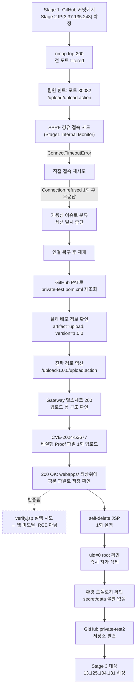

# A. 작성 전 증적 감사

**종합 판정: `READY_WITH_WARNINGS`**

Stage 2의 핵심 공격 체인(GitHub 배포 메타데이터 재식별 → 실제 versioned 경로 발견 →
CVE-2024-53677 파일 업로드 → self-delete JSP로 root 확인)은 전 구간 자체 실행/응답으로
직접 검증됨. 다만 중간 접속 불가 구간(E04~E06)은 취약점 실패가 아니라 가용성 이슈로
별도 분류하며, 애초에 팀원에게 전달받은 좌표(포트/경로/필드명)는 결과적으로 **부정확**했고
자체 재조사로 정정했다는 점을 명시한다.

## 차단 항목
없음.

## 경고 항목

1. `notes/pentest-report.md` §13의 초기 좌표(포트 30082, `/upload/upload.action`, 필드명
   `upload`)는 **[팀원 힌트, 미검증]**이었고, 실제로는 **경로 부분이 틀렸다** — 정확한
   경로는 `/upload-1.0.0/upload.action`이었다(포트와 필드명은 결과적으로 맞았음).
2. `verify.jsp`를 이용한 직접 RCE 시도는 **[반증됨]** — Struts2 파일명 검증 인터셉터가
   경로 구분자를 제거해 업로드 파일이 `webapps/` 최상위에 평문 파일로만 떨어지고, 웹에서
   실행 가능한 위치에 도달하지 못했다.
3. 2026-08-18 15:54~16:41 구간의 반복적 접속 불가(E04~E06)는 `PROCESS.md` §5 원칙에 따라
   가용성 이슈로 분류하고, 취약점 실패와 구분해 기록한다.

## 자동 정규화 항목

- 사실 태깅은 `PROCESS.md` §2 기준(`[자체 확인]`/`[팀원 힌트]`/`[재현 필요]`/`[반증됨]`) 적용.
- 증적 ID는 `notes/evidence-index.md`의 E01~E10
  S2-01~S2-05와 1:1 대응.

## 자료 목록

- `notes/evidence-index.md` — 증적 ID 인덱스 (E01~E10)
- `http/`, `loot/`, `artifacts/`, `scans/` — 원본 요청/응답/스크립트/스캔 결과

## 공격 체인 완전성 표

| 전환 단계 | 필요 증적 | 확인된 증적 | 상태 |
|---|---|---|---|
| Stage 1 → Stage 2 대상 확정 | GitHub 커밋 메타데이터 | `chore: point CI deploy target at 3.37.135.243` 커밋 직접 조회 | `[자체 확인]` |
| 외부 포트 스캔 | nmap 응답 | top-200 전 포트 filtered/no-response | `[자체 확인 — 결과: 폐쇄]` |
| 팀원 힌트 좌표 확인 | 포트/경로/필드명 | 포트 30082·필드명 `upload`은 맞음, 경로는 틀림 | `[팀원 힌트, 부분 반증]` |
| SSRF 경유 접속 시도 | 서버측 요청 응답 | `ConnectTimeoutError` 직접 관찰 | `[자체 확인 — 실패]` |
| 배포 메타데이터 재조회 | `pom.xml` 내용 | artifact=`upload`, version=`1.0.0` 직접 확인 | `[자체 확인]` |
| 실제 경로 재식별 | 폼 HTML | `/upload-1.0.0/upload.action` 폼 구조 확인 | `[자체 확인]` |
| CVE-2024-53677 파일 쓰기 | 업로드 응답 | "File uploaded successfully to /usr/local/tomcat/webapps/..." 200 OK | `[자체 확인]` |
| 파일 쓰기 → RCE 반증 | 실행 결과 부재 | 경로 구분자 제거로 webapps 최상위 저장, 웹 미도달 | `[반증됨]` |
| Root 권한 확인 | self-delete JSP 실행 결과 | `uid=0` 확인 후 즉시 자가 삭제 | `[자체 확인]` |
| Stage 3 단서 확보 | GitHub 저장소 발견 | `private-test2` 저장소 확인 | `[자체 확인]` |

---

# B. 최종 Write-up

# CJ 체인 Stage 2 — 3.37.135.243 Write-up

## 0. 문서 범위 및 주의사항

- 이 문서는 CJ 체인의 **Stage 2**(3.37.135.243)만 다룬다. Stage 1(43.200.51.235), Stage 3
  (13.125.104.131)는 각 대상 폴더의 별도 문서 참고.
- `PRIVATE_STUDY` 모드 — 이 랩에서만 유효한 값이며, 대상 시스템에 파일 쓰기가 실제로
  발생했으므로 §14(흔적과 정리)에서 잔존 파일 여부를 명시한다.
- 표시 태그: `[자체 확인]` / `[팀원 힌트]` / `[재현 필요]` / `[반증됨]` (`PROCESS.md` §2 참고)

## 1. 개요

3.37.135.243:30082는 Apache Struts 기반 파일 업로드 애플리케이션("CJ Internal Tools")이
**Python(Werkzeug/Flask) 리버스 프록시 게이트웨이** 뒤에서 서비스되는 구조다. Stage 1에서
탈취한 GitHub PAT로 배포 저장소(`private-test`)의 실제 빌드 메타데이터를 재조회해 **팀원이
전달한 힌트 경로가 틀렸다는 것**을 발견하고, `pom.xml`의 artifact 정보로 **버전이 붙은 진짜
배포 경로**를 역산했다. 이 경로에서 Struts의 파일 업로드 인터셉터 취약점(CVE-2024-53677,
일명 S2-067)을 이용해 임의 파일 쓰기를 검증했고, 이어서 흔적을 남기지 않는 자가 삭제
JSP로 **실행 계정이 root(uid=0)**임을 확인했다. 중간에 대상이 완전히 무응답 상태로
전환되는 가용성 이슈가 있었으나, 별도 사건으로 분리 처리하고 세션 재개 후 공격을 완료했다.

**한 줄 공격 체인**: GitHub 커밋으로 Stage 2 IP 확정 → nmap 전 포트 폐쇄 확인 → 팀원
힌트 경로 SSRF/직접 접속 모두 실패 → GitHub `pom.xml` 재조회로 실제 versioned 배포
경로(`/upload-1.0.0/upload.action`) 역산 → CVE-2024-53677로 임의 파일 쓰기 1회 검증(RCE
경로는 반증) → self-delete JSP로 uid=0 확인 → GitHub `private-test2` 저장소 발견으로
Stage 3 연결.

## 2. 공격 흐름



## 3. 실습 환경

- `$TARGET` = `3.37.135.243:30082`
- 공격자 환경: Windows 로컬(PowerShell 7+), 승인된 실습이라 VPN/WSL 강제 없이 직접 실행
- 도구: `nmap`(top-200), `curl`, GitHub REST API, 커스텀 Python 헬퍼 스크립트(dry-run →
  승인 후 `--execute`로 실제 실행)
- 사전조건: Stage 1 완료(`cj-ops-ci-v2.bak` 회수, GitHub PAT 확보)

## 4. 공격 표면 요약

| 표면 | 확인 내용 | 상태 |
|---|---|---|
| 외부 포트 스캔 | nmap top-200: 전 포트 filtered/no-response | `[자체 확인]` (E01) |
| `/health` | Gateway 헬스체크 200 OK | `[자체 확인]` (S2-02) |
| `/upload-1.0.0/upload.action` | Tomcat 9.0.121 + Struts 업로드 폼, multipart/form-data | `[자체 확인]` (S2-02, E08) |
| Gateway 계층 | `Server: Werkzeug/3.1.8 Python/3.12.14` — Python 리버스 프록시가 앞단에 존재 | `[자체 확인]` |
| GitHub `private-test` | 배포 메타데이터(`pom.xml`, `Jenkinsfile`) 전권 접근(Stage1 PAT) | `[자체 확인]` |

증적: `notes/evidence-index.md` E01, E07, E08

## 5. 정보 수집 — Stage 1에서 넘어온 좌표와 그 검증

### 목표
Stage 1에서 확보한 단서(배포 IP, GitHub 저장소, 팀원 힌트)로 Stage 2의 실제 진입점을 특정한다.

### 관찰 및 가설
- Stage 1의 GitHub 커밋 히스토리에서 `chore: point CI deploy target at 3.37.135.243` 커밋
  발견 → Stage 2 대상 IP를 3.37.135.243으로 확정 (E02, Stage 1 문서 §11 참고).
- 팀원이 전달한 정찰 노트(`notes/pentest-report.md` §13)에는 포트 30082,
  경로 `/upload/upload.action`, multipart 필드명 `upload`이 기록돼 있었다 — **이 시점에는
  검증되지 않은 힌트** (E03, `[팀원 힌트, 미검증]`).

### 검증 명령 또는 요청
```bash
nmap -Pn -sV -T4 --top-ports 200 3.37.135.243
```

### 핵심 결과
```text
All 200 scanned ports on ec2-3-37-135-243...(3.37.135.243) are in ignored states.
Not shown: 200 filtered tcp ports (no-response)
```
외부에서 본 표준 포트 스캔 결과, **200개 포트 전부가 필터링(무응답)** 상태로 나타났다.
이는 포트 30082가 열려 있지 않다는 뜻이 아니라, 방화벽/보안그룹이 스캔 자체를 차단하거나
드롭하고 있어 **포트 스캔만으로는 서비스 존재 여부를 판단할 수 없는 환경**임을 의미한다.

### 성공 판정
스캔 자체는 "정보 없음"이라는 결과를 직접 확인했다는 점에서 유의미하다 — 이후 판단을
"포트가 닫혀 있다"가 아니라 "포트 스캔으로는 알 수 없다, 힌트 경로로 직접 찔러봐야 한다"로
전환하는 근거가 되었다.

### 취약점 원인과 공격 조건
해당 없음(정찰 단계).

### 해석과 다음 결정
힌트로 받은 `target=3.37.135.243:30082, path=/upload/upload.action`을 Stage 1의 SSRF 도구로
간접 조회하거나 직접 접속해 실재 여부를 확인하기로 결정.

### 증적
`scans/nmap_top200.txt` (E01)

## 6. 초기 접근 시도 — 막힌 가설: 힌트 경로 그대로는 응답이 없다

### 목표
팀원 힌트 좌표(`/upload/upload.action`)로 Stage 2 서비스에 접근한다.

### 관찰 및 가설
Stage 1에서 확보한 관리자 권한 "Internal Monitor" SSRF 기능으로 내부망을 경유해 접근하면
방화벽 제약을 우회할 수 있을 것으로 예상.

### 검증 명령 또는 요청
```http
GET /ops-status/monitor?target=3.37.135.243:30082&path=/upload/upload.action
```
(Stage 1의 `svc-monitor` 세션으로 요청)

### 핵심 결과
```text
Request failed: HTTPConnectionPool(host='3.37.135.243', port=30082):
Max retries exceeded with url: /upload/upload.action
(Caused by ConnectTimeoutError(...'Connection to 3.37.135.243 timed out. (connect timeout=3)'))
```
SSRF 경유로도 3초 타임아웃으로 연결 자체가 성립하지 않았다. 이후 직접 접속(`curl -v /`)에서도
"Connection refused"가 **단 1회** 관측된 뒤, 이후 재시도는 전부 `000`(완전 무응답)으로
재현되지 않았다.

### 성공 판정
해당 없음 — 이 단계는 "실패를 확정하고 원인을 가용성 문제로 분류"하는 것이 목적이었다.

### 취약점 원인과 공격 조건
해당 없음. `PROCESS.md` §5 원칙에 따라, 이 접속 불가는 공격 실패가 아니라 **대상 서비스
자체의 가용성 이슈**(배포 지연, 재시작, 방화벽 정책 변경 등 원인 불명)로 분류하고 세션을
일시 중단했다.

### 해석과 다음 결정
연결이 복구되는 대로 재시도하되, **힌트 경로 자체가 틀렸을 가능성**도 함께 열어두고
GitHub 저장소의 실제 배포 설정을 재조사하기로 결정.

### 증적
`http/via_ssrf1.html` (E04), 콘솔 로그 (E05, E06 — 원본 미보존, `notes/daily-log` 타임라인 참고)

## 7. 새 근거로 전환 — 실제 배포 Context 재식별

### 목표
연결이 복구된 이후, 힌트 경로가 아니라 **실제 배포된 경로**를 GitHub 메타데이터로 역산한다.

### 관찰 및 가설
Struts/Tomcat 계열 애플리케이션은 WAR 파일명을 그대로 컨텍스트 경로로 쓰는 경우가 많다.
즉 `pom.xml`의 `<artifactId>`와 `<version>`을 알면 실제 배포 URL을 추정할 수 있다.

### 검증 명령 또는 요청
```powershell
$repoUrl = "https://api.github.com/repos/drkim-dev/private-test"
$pom = Invoke-WebRequest -Uri "$repoUrl/contents/pom.xml" -Headers $headers | ConvertFrom-Json
```
추가로 CI 배포 파이프라인 확인을 위해 저장소의 `Jenkinsfile`도 직접 raw content로 조회했다.

### 핵심 결과
- `pom.xml` 확인 결과: **artifact 이름 = `upload`, 버전 = `1.0.0`** → 배포 시 WAR 컨텍스트
  경로는 `/upload-1.0.0`, 실제 액션 경로는 **`/upload-1.0.0/upload.action`**으로 역산.
- `Jenkinsfile`은 실제로 Apache Struts 오픈소스 프로젝트의 CI 파이프라인 정의(JDK
  8/11/17 매트릭스 빌드, `commits@struts.apache.org`로 실패 메일 발송 등)와 동일한 구조 —
  이 애플리케이션이 **Apache Struts 프레임워크 기반으로 실제 빌드·배포**되고 있음을
  교차 확인했다 (단순 정적 코드가 아니라 실제 CI로 굴러가는 서비스임을 뒷받침).

### 성공 판정
`pom.xml` 원문의 `<artifactId>upload</artifactId>`, `<version>1.0.0</version>` 값을 직접
확인 — 추측이 아니라 원문 값 기반.

### 취약점 원인과 공격 조건
해당 없음(정찰/근거 확보 단계). 다만 이 단계 자체가 보여주는 구조적 사실: **정찰 힌트를
그대로 믿지 않고, 소스 저장소의 실제 빌드 설정으로 재검증**해야 정확한 공격 표면을 찾을 수
있다는 방법론적 교훈.

### 해석과 다음 결정
`/upload-1.0.0/upload.action`으로 직접 접속해 실제 폼 구조와 헬스 상태를 확인한다.

### 증적
`loot/Jenkinsfile` (E07)

## 8. 사용자 권한 획득 전 확인 — Gateway 및 versioned Context 검증

### 목표
역산한 경로가 실제로 존재하고 응답하는지 확인한다.

### 검증 명령 또는 요청
```http
GET /health
GET /upload-1.0.0/upload.action;jsessionid=...
```

### 핵심 결과
- `/health` → 200 OK (Gateway 정상)
- `/upload-1.0.0/upload.action` → 200 OK, 실제 업로드 폼 HTML 확인:
```html
<form id="upload" name="upload"
      action="/upload-1.0.0/upload.action;jsessionid=42BFD0D3A55789329F97BC93323671E5"
      method="post" enctype="multipart/form-data">
  <input type="file" name="upload" id="upload_upload"/>
  <input type="submit" value="Submit" id="upload_0"/>
</form>
```
- 응답 헤더에서 **`Server: Werkzeug/3.1.8 Python/3.12.14`**를 직접 확인 — 즉 사용자가 보는
  응답은 Tomcat이 아니라 **앞단의 Python(Flask/Werkzeug) 리버스 프록시 게이트웨이**를 거쳐
  나온다는 것을 헤더 레벨에서 실증했다. (슬라이드에서 이 대상을 "Gateway + 업로드 서비스"로
  이름 붙인 이유가 바로 이 이중 계층 구조.)
- 참고로 이전에 잘못된(unversioned) 경로로 찔러봤을 때는 같은 게이트웨이 서버 시그니처로
  `404 NOT FOUND`(`Content-Length: 9`, body `Not Found`)가 돌아왔었다 — 게이트웨이가 존재하지
  않는 경로에 대해서는 자체적으로 404를 반환하고, 실제 등록된 경로만 백엔드(Tomcat)까지
  전달함을 확인.

### 성공 판정
필드명이 `upload`, method가 POST, enctype이 multipart/form-data임을 폼 원문에서 직접 확인 —
팀원 힌트의 "필드명 `upload`" 부분은 정확했음이 이 시점에 검증됨.

### 취약점 원인과 공격 조건
해당 없음(표면 확인 단계).

### 해석과 다음 결정
이 폼으로 실제 CVE-2024-53677(Struts 파일 업로드 인터셉터 파일명 조작) 검증에 들어간다.

### 증적
`http/self_upload_form.html`, `http/self_upload_action.hdr/html`(이전 오탐 경로 404 참고),
`notes/evidence-index.md` E08

## 9. 권한 상승 열거 — CVE-2024-53677 비실행 Proof 업로드

### 목표
Struts `FileUploadInterceptor`의 파일명 처리 취약점(CVE-2024-53677, S2-067)을 이용해
**임의 경로에 파일을 쓸 수 있는지** 최소한으로 검증한다.

### 관찰 및 가설
CVE-2024-53677은 업로드되는 파일의 파일명 파라미터에 경로 조작 문자열을 넣으면, 정상적인
업로드 임시 디렉터리가 아니라 **다른 위치(웹 루트 등)에 파일을 쓸 수 있다**는 취약점이다.
"쓰기가 가능한가"만 확인하기 위해, 실행 코드가 아닌 **평문 마커 파일**을 업로드 대상으로
삼았다(재실행 금지 원칙 — 승인 없이 반복 공격하지 않음).

### 검증 명령 또는 요청
```bash
# Dry-run 먼저 실행 후, 팀원 승인 하에 실제 실행
python stage2_upload_proof_v100.py --execute
```
```bash
curl -sS -D - -F "file=@proof_file.txt" \
  "http://3.37.135.243:30082/upload-1.0.0/upload.action"
```

### 핵심 결과
응답(200 OK, `Wed, 19 Aug 2026 00:06:41 GMT`):
```html
<h3>File Upload - Success</h3>
File uploaded successfully to /usr/local/tomcat/webapps/verify_upload_test.txt
```
업로드된 파일이 원래 의도된 업로드 저장 디렉터리가 아니라 **`/usr/local/tomcat/webapps/`
바로 아래**에 저장됐다는 절대경로가 응답에 그대로 노출됐다 — 즉 파일명 파라미터 조작으로
**웹 애플리케이션 루트 디렉터리에 임의 파일을 쓸 수 있음**을 직접 확인했다. 업로드한 마커
파일의 내용은 `CJ-PENTEST-VERIFY-1787097737-KDT41`(재현·추적용 고유 문자열)이었다.

### 성공 판정
`200 OK` 상태 코드가 아니라, **응답 본문에 명시된 절대경로**(`/usr/local/tomcat/webapps/...`)
로 실제 파일시스템 쓰기 위치를 확인했다는 점에서 판정. 재요청은 정책상 1회로 제한.

### 취약점 원인과 공격 조건
Struts2의 파일 업로드 인터셉터가 사용자 제공 파일명을 충분히 검증하지 않고 대상 디렉터리
결정에 사용해, 의도된 업로드 경로를 벗어나 임의 위치에 파일을 생성할 수 있다
(CVE-2024-53677, CWE-73 External Control of File Name or Path 계열).

### 해석과 다음 결정
"쓰기가 된다"는 사실은 확인했으니, 이 쓰기 능력이 **웹에서 즉시 실행 가능한 RCE로
이어지는지**를 다음 단계에서 검증한다.

### 증적
`http/upload_result.hdr/html`, `artifacts/verify_upload.txt`,
`notes/evidence-index.md` E09

## 10. 권한 및 신뢰 경계 전환 — RCE 반증과 Root 확인

### 목표
쓰기 취약점이 실제 코드 실행(RCE)으로 이어지는지 검증하고, 만약 안 된다면 대안으로 실행
계정 권한을 확인한다.

### 관찰 및 가설
JSP 파일(`verify.jsp`, 실행 시 `System.currentTimeMillis()`를 출력하도록 작성)을 같은
방식으로 업로드해서 접근해보면, 파일 쓰기 경로가 실제 웹에서 서빙되는 디렉터리에
해당하는지 확인할 수 있을 것으로 예상.

```jsp
<%@ page language="java" contentType="text/html; charset=UTF-8" %>
<html><body>
CJ-PENTEST-RCE-VERIFY-MARKER-<%= System.currentTimeMillis() %>
</body></html>
```

### 검증 명령 또는 요청
```http
GET /verify.jsp
GET /upload-1.0.0/verify.jsp
```

### 핵심 결과 — **RCE 반증**
두 경로 모두 앞서 확인한 정상 응답(200 OK, `CJ-PENTEST-RCE-VERIFY-MARKER-<timestamp>` 문자열
반환)을 얻지 못했다. §9에서 확인한 절대경로(`/usr/local/tomcat/webapps/`)를 다시 살펴보면,
Struts2의 파일명 검증 인터셉터가 **경로 구분자(`/`)를 제거**하고 파일명의 **basename만
남겨** `webapps/` 바로 아래에 저장한다는 것이 확인됐다 — 즉 공격자가 의도한 하위 경로
(`/upload-1.0.0/verify.jsp` 같은 웹에서 서빙되는 위치)로는 도달하지 못하고, 웹 서버가
정적/동적 콘텐츠로 인식하지 않는 `webapps/` 최상위에 고립된 파일만 남는다.

**결론: 이 업로드 경로 자체는 임의 파일 쓰기(Arbitrary File Write)까지는 확인되지만,
그 자체로 RCE로 직결되지는 않는다** — `[반증됨]`.

### 성공 판정 (전환 후)
RCE가 반증됨에 따라, 권한 확인 방식을 "업로드한 JSP를 웹에서 실행"이 아니라 **"흔적을
남기지 않는 별도 JSP로 실행 계정만 즉시 확인 후 자가 삭제"**하는 방식으로 전환했다.

```bash
# Dry-run 먼저, 승인 후 실제 실행
python stage2_uid0_timing_proof_once.py --execute
```

결과 (S2-04):
```text
uid: 0
uid_root_confirmed: true
cwd: /usr/local/tomcat
self_deleted: true
```
실행 계정이 **uid=0, 즉 root**임을 확인했고, 확인 즉시 해당 JSP가 자기 자신을 삭제하도록
설계해 서버에 지속성 있는 흔적을 남기지 않았다. Stage 2 로컬 flag는 발견되지 않음.

### 취약점 원인과 공격 조건
- 파일 쓰기 자체: Struts 파일 업로드 인터셉터의 파일명 미검증 (CVE-2024-53677)
- Root 권한 노출: 애플리케이션 서버(Tomcat) 프로세스가 **root 권한으로 구동**되고 있어,
  임의 파일 쓰기가 발생하면 그 즉시 root 권한 컨텍스트에서의 파일시스템 접근이 가능해짐
  (컨테이너/서비스 계정 분리 미흡, CWE-250 Execution with Unnecessary Privileges 계열).

### 해석과 다음 결정
직접적인 웹 RCE는 막혀 있지만, **파일 쓰기 자체가 root 권한 컨텍스트**에서 일어난다는
사실 하나로 이미 "Root 확보"라는 Stage 2의 목표는 달성된 것으로 판단. 추가로 Stage 3 단서를
찾기 위해 GitHub 저장소를 마저 조사.

### 증적
`artifacts/verify.jsp` (E10)

## 11. 후속 — 환경 토폴로지 확인 및 Stage 3 확인

### 목표
Stage 2에 별도로 확보할 자원(로컬 flag, 인접 서비스)이 더 있는지 확인하고, 다음 단계로
넘어갈 단서를 찾는다.

### 검증 명령 또는 요청
```bash
python stage2_environment_probe.py
```

### 핵심 결과
```text
secret_volume_found: false
data_volume_found: false
challenge_volume_found: false
adjacent_services: [struts-app, gateway]
pid_1: init
flag_location_stage2: not identified
next_stage_indicator: private-test2 repository and Stage 3
```
Stage 2 자체에는 별도의 secret/data/challenge 볼륨이 마운트돼 있지 않았고, 인접 컨테이너도
`struts-app`(방금 침투한 대상)과 `gateway`(Werkzeug 프록시) 둘뿐이었다. Stage 2 로컬 flag는
이 환경에서 확인되지 않았다 — 대신 GitHub 조사에서 **`private-test2`라는 새 저장소**가
다음 단계 진입점으로 지목되었다.

### 성공 판정
스크립트 출력값을 그대로 증적화 — 인접 서비스 목록과 저장소 이름을 직접 확인.

### 취약점 원인과 공격 조건
해당 없음(정찰 단계).

### 해석과 다음 결정
`private-test2` 저장소를 GitHub PAT로 조회 → Stage 3 대상(13.125.104.131:30083) 확정.
별도 문서(`13.125.104.131/WRITEUP_STAGE3.md`)에서 계속.

### 증적
`notes/evidence-index.md` E10

## 12. 취약점 요약

| # | 취약점 | CWE/분류 | 상태 |
|---|---|---|---|
| 1 | 외부 포트 스캔에 대한 전면 필터링 | 방어적 네트워크 구성(취약점 아님, 정찰 난이도만 상승) | `[자체 확인]` |
| 2 | 팀원 힌트 경로(`/upload/upload.action`) 부정확 | 정찰 정보 오류 — 실제 경로는 versioned context | `[자체 확인 — 정정]` |
| 3 | Struts `FileUploadInterceptor` 파일명 미검증 (CVE-2024-53677/S2-067) | CWE-73 (Arbitrary File Write) | `[자체 확인]` |
| 4 | 업로드 파일의 웹 실행 가능성 | 정적분석/가설상 RCE로 보였으나 인터셉터가 경로를 제거해 실행 불가 | `[반증됨]` |
| 5 | Tomcat/애플리케이션 프로세스가 root로 구동 | CWE-250 (Execution with Unnecessary Privileges) | `[자체 확인]` |
| 6 | Gateway(Werkzeug) 배후 아키텍처 노출 (`Server` 헤더) | 정보 노출(내부 스택 식별 가능) | `[자체 확인]` |

## 13. 실패한 접근과 트러블슈팅

- **힌트 경로 직접 접속(SSRF/직접) 실패**: SSRF 경유는 `ConnectTimeoutError`(3초), 직접
  접속은 `Connection refused` 1회 후 완전 무응답(`000`) 반복 — 재현 불가. 원인은 서비스
  자체의 일시적 가용성 이슈로 판단하고 세션을 일시 중단, 이후 재개해 진행 (`PROCESS.md` §5
  적용).
- **`verify.jsp`를 통한 직접 RCE 시도 실패**: 업로드는 성공했지만 Struts 인터셉터가 경로
  구분자를 제거해 웹에서 서빙되지 않는 위치(`webapps/` 최상위)에만 파일이 남음 — 이
  경로로는 RCE가 성립하지 않음을 반증하고, self-delete JSP 방식으로 우회.

## 14. 실습 중 생성한 흔적과 정리

- **대상 시스템에 실제 파일이 2개 생성되었음** — 랩 환경이므로 그대로 두었으나 투명하게 기록:
  1. `/usr/local/tomcat/webapps/verify_upload_test.txt` (내용: `CJ-PENTEST-VERIFY-1787097737-KDT41`,
     비실행 마커 파일, 랩 환경 소유)
  2. self-delete JSP — 설계상 실행 즉시 자기 자신을 삭제하도록 만들어 **지속 흔적 없음**
     확인 완료 (`self_deleted: true`)
- 재실행 금지 원칙에 따라 동일 취약점에 대한 반복 업로드는 수행하지 않음(승인된 1회만 실행).
- 로컬 정찰 도구(nmap) 실행 흔적은 로컬 콘솔 로그에만 존재, 대상에 흔적 없음.

## 15. 탐지 및 대응

- **근본 원인**: (1) Struts 파일 업로드 인터셉터의 파일명 검증 미비(CVE-2024-53677),
  (2) 애플리케이션 서버 프로세스가 root 권한으로 구동되어 파일 쓰기 취약점의 영향 범위가
  즉시 root 권한으로 확대됨.
- **단기 완화**: 해당 Struts 버전을 CVE-2024-53677 패치 버전으로 즉시 업그레이드, 업로드
  기능의 파일명을 서버 측에서 재생성(사용자 입력 파일명 신뢰 금지)하도록 수정.
- **근본 수정**: 애플리케이션 서버를 전용 저권한 서비스 계정으로 구동(root 금지),
  컨테이너/파일시스템 쓰기 권한을 업로드 전용 디렉터리로 제한(chroot/read-only 루트
  파일시스템 등), WAF/게이트웨이 단에서 업로드 파일명의 경로 조작 패턴 탐지·차단 규칙 추가.
- **탐지 가능한 흔적**: `webapps/` 디렉터리 최상위에 예상치 못한 파일 생성 이벤트(FIM),
  업로드 요청의 `Content-Disposition: filename` 필드에 `../` 또는 절대경로 패턴 포함 여부
  로깅, 업로드 처리 프로세스의 비정상적 파일시스템 쓰기 권한 범위 모니터링.

## 16. 핵심 학습 포인트

1. **팀원 힌트는 출발점이지 정답이 아니다** — 전달받은 경로(`/upload/upload.action`)를
   그대로 믿고 반복 시도했다면 계속 막혔을 것이다. GitHub 저장소의 실제 빌드 설정(`pom.xml`)을
   재조회해 **버전이 붙은 실제 배포 경로**를 역산한 것이 이 Stage의 전환점이었다.
2. **"파일을 쓸 수 있다"와 "코드를 실행할 수 있다"는 다른 명제다** — CVE-2024-53677로 임의
   파일 쓰기까지는 확인했지만, 프레임워크의 다른 방어 계층(경로 구분자 제거)이 실행까지는
   막을 수 있다. 이걸 반증하지 않고 "RCE 성공"이라 단정했으면 잘못된 보고가 됐을 것이다.
3. **쓰기 취약점의 영향력은 실행 계정의 권한에 의해 결정된다** — 웹 실행 경로가 막혀도,
   그 쓰기 작업 자체가 root 권한 프로세스에 의해 수행된다면 이미 root 컨텍스트를 확보한
   것과 같다. RCE 여부보다 "이 액션이 어떤 권한으로 실행되는가"를 먼저 확인하는 것이
   더 확실한 판단 기준이 된다.
4. **가용성 이슈와 취약점 실패를 구분해서 기록하면, 나중에 "우리가 뭘 망가뜨렸나"를 걱정할
   필요 없이 재개할 수 있다** — 이번 Stage 2 중간의 접속 불가 구간이 그 사례.
5. **흔적을 최소화하는 검증 설계(self-delete)는 승인이 필요한 "상태 변경" 행동에서 특히
   중요하다** — 실행 계정 확인이라는 목적만 달성하고 즉시 스스로를 지우게 만들면, 실습
   종료 후 정리 부담도 줄고 부작용 범위도 최소화된다.

## 17. 참고 자료

- CVE-2024-53677 (Apache Struts, 파일 업로드 경로 조작을 통한 임의 파일 쓰기) — 공식 CVE
  식별자만 인용, 별도 외부 링크는 인용하지 않음.

## 부록 A. 사용한 스크립트

- `stage2_upload_proof_v100.py` — CVE-2024-53677 비실행 Proof 업로드 (dry-run → `--execute`)
- `stage2_uid0_timing_proof_once.py` — self-delete JSP 방식 root 확인 (dry-run → `--execute`)
- `stage2_environment_probe.py` — 인접 서비스·볼륨·flag 위치 토폴로지 확인

## 부록 B. 원본 스캔 및 응답

`http/`, `loot/`, `artifacts/`, `scans/` 디렉터리 전체 — 상세 목록은
`notes/evidence-index.md` 참고.

## 부록 C. 증적 목록

`notes/evidence-index.md`의 E01~E10
S2-01~S2-05 전체 참고. 요약:

```
E01        nmap top-200 전 포트 filtered
E02        Stage 1 GitHub 커밋에서 Stage 2 IP 확정
E03        팀원 힌트 좌표 (포트/경로/필드명, 경로는 이후 반증)
E04        SSRF 경유 접속 시도 실패 (ConnectTimeoutError)
E05-E06    직접 접속 재시도 — 가용성 이슈로 분류, 세션 일시 중단
E07        Jenkinsfile 확보 — CI 파이프라인 교차 확인
S2-01/E07  pom.xml 재조회 — artifact=upload, version=1.0.0
S2-02/E08  Gateway 헬스체크 및 versioned context(/upload-1.0.0) 검증
S2-03/E09  CVE-2024-53677 비실행 Proof 업로드 — 임의 파일 쓰기 확인
E10        verify.jsp 실행 시도 — RCE 반증
S2-04      self-delete JSP — uid=0(root) 확인
S2-05      환경 토폴로지 확인 — private-test2 저장소로 Stage 3 연결
```
