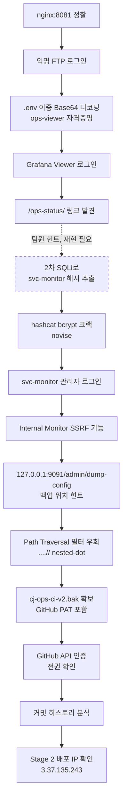

# A. 작성 전 증적 감사

**종합 판정: `READY_WITH_WARNINGS`**

Stage 1의 핵심 공격 체인(FTP→자격증명→Grafana→SSRF→Path Traversal→GitHub PAT→
Stage 2 IP 확인)은 전 구간 자체 실행/응답으로 직접 검증됨. 다만 체인 중간의
**2차 SQL Injection 자체의 존재**는 팀원 주장에만 근거하고 이 세션에서 독자 재현에
실패했다 — 이 부분만 경고로 남긴다.

## 차단 항목
없음.

## 경고 항목

1. `/ops-status/admin/last-login-sort`의 2차 SQL Injection은 **[팀원 힌트, 재현 필요]**다.
   `svc-monitor` bcrypt 해시가 어떻게 추출됐는지는 팀원 주장을 신뢰하는 것 외에 직접 증적이
   없다. 해시 자체를 크랙하고 그 계정으로 로그인에 성공한 것은 자체 확인이지만, **해시의
   출처(SQLi)** 자체는 미검증 상태다.
2. CVE-2024-9264(Grafana SQL Expression RCE) 시도는 `SELECT 1`도 500 에러를 반환해
   비활성으로 판단하고 중단함 — 추가 우회 시도는 하지 않았다.
3. `Upload.java` 정적분석 결과(임의 파일 업로드 → RCE 가능해 보임)는 **Stage 2에서 동적
   테스트로 반증**됨(`[반증됨]`, 증적은 `3.37.135.243/notes/evidence-index.md` E10). Stage 1
   문서에는 코드 발견 사실만 남기고, 결론은 반증되었음을 명시한다.
4. 17:34경 서버가 무응답으로 전환된 사건은 취약점 실패가 아니라 **가용성 이슈로 별도 분류**
   (`PROCESS.md` §5 원칙 적용).

## 자동 정규화 항목

- 사실 태깅은 `PROCESS.md` §2 기준(`[자체 확인]`/`[팀원 힌트]`/`[재현 필요]`/`[반증됨]`) 적용.
- 증적 ID는 `notes/evidence-index.md`의 E01~E18과 1:1 대응.

## 자료 목록

- `notes/pentest-report.md` — 원본 상세 기술 보고서 (본 문서의 상위 출처)
- `notes/daily-log-2026-08-18.md` — 일일 작업 일지
- `notes/evidence-index.md` — 증적 ID 인덱스
- `loot/`, `http/` — 원본 응답/자격증명 파일

## 공격 체인 완전성 표

| 전환 단계 | 필요 증적 | 확인된 증적 | 상태 |
|---|---|---|---|
| 열거 → FTP 익명 접근 | 배너/로그인 성공 | 배너 문자열 직접 확인 | `[자체 확인]` |
| FTP → 자격증명 확보 | `.env` 파일 내용 | 이중 Base64 디코딩 결과 | `[자체 확인]` |
| 자격증명 → Grafana 접근 | 로그인 성공 응답 | Viewer 권한 로그인 성공 | `[자체 확인]` |
| Grafana → `/ops-status/` 발견 | 대시보드 링크 | 직접 클릭/조회 | `[자체 확인]` |
| `/ops-status/` → 계정 해시 확보 | 2차 SQLi 응답 | 팀원 주장만 존재 | `[팀원 힌트, 재현 필요]` |
| 해시 → 평문 확보 | 크랙 로그 | hashcat 직접 실행, `novise` | `[자체 확인]` |
| 평문 → 관리자 로그인 | 로그인 성공 | `svc-monitor`/`novise` 로그인 성공 | `[자체 확인]` |
| 관리자 → SSRF 기능 확인 | 서버측 요청 시그니처 | `ConnectTimeoutError` 등 직접 관찰 | `[자체 확인]` |
| SSRF → 내부 설정 노출 | dump-config 응답 | JSON 응답 직접 확보 | `[좌표: 팀원 힌트 / 실행: 자체 확인]` |
| 노출 → 백업 파일 획득 | traversal 우회 응답 | `....//` 우회 성공, 파일 확보 | `[자체 확인]` |
| 백업 파일 → GitHub 접근 | API 인증 응답 | PAT 인증 200, 전권 확인 | `[자체 확인]` |
| GitHub → Stage 2 IP 확인 | 커밋 메타데이터 | 배포 커밋 직접 조회 | `[자체 확인]` |

---

# B. 최종 Write-up

# CJ 체인 Stage 1 — 43.200.51.235 Write-up

## 0. 문서 범위 및 주의사항

- 이 문서는 CJ 체인의 **Stage 1**(43.200.51.235)만 다룬다. Stage 2(3.37.135.243), Stage 3
  (13.125.104.131)는 각 대상 폴더의 별도 문서 참고.
- `PRIVATE_STUDY` 모드 — 이 랩에서만 유효한 계정/자격증명은 기록하되, `loot/`의 민감 파일은
  본 문서에 원문 그대로 복제하지 않고 경로만 참조한다.
- 표시 태그: `[자체 확인]` / `[팀원 힌트]` / `[재현 필요]` / `[반증됨]` (`PROCESS.md` §2 참고)

## 1. 개요

43.200.51.235:8081은 "CJ Internal Ops"로 불리는 내부 운영 스택으로, nginx 리버스 프록시
뒤에 Grafana(OSS 11.2.0)와 `/ops-status/` 내부 운영 도구가 노출되어 있다. **익명 FTP →
자격증명 노출 → Grafana → 관리자 전용 SSRF 도구 → Path Traversal → GitHub PAT 탈취**로
이어지는 체인을 통해 조직의 비공개 GitHub 저장소에 대한 전권 접근을 확보했고, 커밋
히스토리에서 Stage 2 배포 대상(3.37.135.243)을 확인했다.

**한 줄 공격 체인**: 익명 FTP 자격증명 노출 → Grafana Viewer 로그인 → 내부 관리자 도구
발견 → (2차 SQLi로 추정되는 경로를 통한) 서비스 계정 해시 확보 → bcrypt 크랙 →
관리자 로그인 → SSRF로 내부 설정 노출 → Path Traversal 필터 우회로 CI 백업 탈취 →
GitHub PAT로 비공개 저장소 전권 접근 → 커밋 히스토리에서 Stage 2 IP 확인.

## 2. 공격 흐름



## 3. 실습 환경

- `$TARGET` = `43.200.51.235:8081`
- 공격자 환경: Windows 로컬 (PowerShell/Bash), 승인된 실습이라 VPN/WSL 강제 없이 직접 실행
- 도구: `curl`, `ffuf`, `feroxbuster`, `ftp`(익명), `hashcat`(mode 3200), GitHub REST API

## 4. 공격 표면 요약

| 표면 | 확인 내용 | 상태 |
|---|---|---|
| HTTP :8081 | nginx 1.27.5, robots.txt → `/grafana/` 안내 | `[자체 확인]` |
| FTP | 익명 로그인 허용, 배너 "CJ internal file transfer" | `[자체 확인]` |
| Grafana | OSS 11.2.0, `/grafana/api/health` 200 OK, 익명 접근 비활성 | `[자체 확인]` |
| `/ops-status/` | 내부 운영 대시보드, 다수의 관리 기능 포함 | `[자체 확인]` |
| vhost/추가 경로 | ffuf(top-1M)+feroxbuster(raft-medium) 재탐색, 신규 표면 없음 | `[자체 확인]` (2026-08-19 재검증) |

증적: `notes/evidence-index.md` E01, `notes/daily-log-2026-08-18.md` §1

## 5. 정보 수집

FTP 익명 로그인 후 루트 디렉터리에서 3개 파일 직접 다운로드:

```text
readme.txt          — "시스템 점검 완료"
backup-policy.txt   — "백업은 암호화 후 보관 / 자격증명 파일: .env (정기 로테이션 예정)"
maintenance-log.txt — "인증서 갱신 완료"
```

`backup-policy.txt`가 `.env` 파일의 존재를 직접 언급했고, 이는 웹에서는 404지만 FTP로만
접근 가능했다.

증적: `loot/readme.txt`, `loot/backup-policy.txt`, `loot/maintenance-log.txt` (E01, E02)

## 6. 초기 접근

### 목표
FTP에서 확보한 자격증명 파일로 Grafana에 인증된 접근을 획득한다.

### 관찰 및 가설
`.env` 파일 내용이 일반 텍스트가 아니라 Base64로 보이는 문자열이었다.

### 검증 명령 또는 요청
```bash
ftp> get .env
```
디코딩:
```bash
echo "<확보한 값>" | base64 -d | base64 -d
```

### 핵심 결과
```text
Grafana ops viewer account (temporary, rotate ASAP):
username: ops-viewer
password: N0vaOps2024!
```
**이중 Base64 인코딩**이었다 — 단순 디코딩으로는 안 풀리고 두 번 디코딩해야 평문이 나온다.

### 성공 판정
Grafana 로그인 폼에 해당 계정으로 POST 후 세션 쿠키 발급 및 대시보드 접근 성공을 직접 확인.

### 취약점 원인과 공격 조건
FTP 익명 쓰기/읽기 허용 + 웹에서 격리된 백업 자격증명을 FTP 루트에 평문(이중 인코딩) 보관.

### 해석과 다음 결정
Viewer 권한 계정이지만, 대시보드 내 링크를 통해 `/ops-status/` 내부 도구 발견으로 이어짐.

### 증적
`loot/env_file.txt` (E02)

## 7. 사용자 권한 획득

### 목표
Grafana Viewer 권한에서 `/ops-status/` 내부 도구의 관리자 권한(svc-monitor)으로 격상한다.

### 관찰 및 가설
`/ops-status/admin/last-login-sort` 엔드포인트가 저장된 입력값을 이후 정렬 처리에
사용하는 것으로 팀원이 보고했다 — 2차(stored) SQL Injection 가능성.

### 검증 명령 또는 요청
**이 세션에서 직접 재현 시도**: quote 주입 → status-pill 변화 관찰 방식의 컨트롤 테스트를
시작했으나, 서버가 무응답으로 전환되며 결과를 확보하지 못했다.

### 핵심 결과
- 취약점 자체의 존재는 **[팀원 힌트, 재현 필요]** — PostgreSQL 백엔드, `ops` DB 계정
  superuser, binary search 71회로 `accounts` 테이블 추출이라는 팀원 주장이 있으나 자체
  검증 미완료
- `svc-monitor` 계정명과 bcrypt 해시(`$2b$04$lCXs...`)는 팀원이 위 SQLi로 추출했다며 전달한
  값 — **[팀원 힌트]**
- 이 해시를 **직접** hashcat(mode 3200, rockyou.txt)으로 크랙 → `novise` — **[자체 확인]**
  (cost factor=4로 의도적으로 약하게 설정되어 있어 약 18분 만에 크랙, rockyou 약 35% 지점에서
  매치)

### 성공 판정
`svc-monitor`/`novise`로 실제 로그인 요청을 보내 응답에서 관리자 전용 "Internal Monitor"
도구 진입을 직접 확인했다 — 상태 코드가 아니라 관리자 UI 요소 존재로 판정.

### 취약점 원인과 공격 조건
(SQLi 자체는 미검증이므로 원인 서술 보류) + bcrypt cost factor를 4로 낮게 설정해 오프라인
크랙이 현실적 시간 내 가능했던 것은 자체 확인된 사실.

### 해석과 다음 결정
계정 해시 출처(SQLi)는 재검증이 필요하지만, **해시를 크랙하고 실제로 로그인에 성공한 것
자체는 독립적으로 확인된 사실**이므로 이후 체인은 이 로그인을 기반으로 계속 진행.

### 증적
`loot/svc-monitor.hash` (E06, E07)

## 8. 권한 상승 열거

### 목표
`svc-monitor` 관리자 권한으로 내부망(SSRF)에 접근 가능한지 확인한다.

### 관찰 및 가설
"Internal Monitor" 기능이 `target=host:port&path=/...` 형태의 파라미터를 받는 것으로
보아 서버측 아웃바운드 요청(SSRF)일 가능성.

### 검증 명령 또는 요청
```http
GET /ops-status/monitor?target=127.0.0.1:9999&path=/nonexistent
```

### 핵심 결과
응답에서 Python `requests` 라이브러리 시그니처(`HTTPConnectionPool`, `ConnectTimeoutError`)
직접 관찰 — 서버가 실제로 지정한 대상에 아웃바운드 요청을 수행함을 확인.

### 성공 판정
에러 메시지 자체가 서버측 라이브러리 스택트레이스를 노출한다는 점에서, 단순 프록시가 아니라
실제 서버측 요청 실행임을 판정.

### 취약점 원인과 공격 조건
관리자 전용 "모니터링" 기능이 목적지 검증 없이 임의 host:port로 요청을 보낼 수 있게 구현됨
(SSRF, CWE-918).

### 해석과 다음 결정
`127.0.0.1` 내부망 포트를 스캔해 관리 인터페이스를 찾는다.

### 증적
`http/monitor.html`, `http/monitor_test.html`, `http/monitor_test2.html` (E08)

## 9. 권한 상승

### 목표
SSRF로 확보한 내부 정보를 이용해 실제 파일(백업)에 접근한다.

### 관찰 및 가설
사용자가 전달한 좌표(`127.0.0.1:9091/admin/dump-config`)를 SSRF로 조회하면 내부 설정이
노출될 것으로 예상.

### 검증 명령 또는 요청
```http
GET /ops-status/monitor?target=127.0.0.1:9091&path=/admin/dump-config
```

### 핵심 결과
```json
{"hint":"ops-status download tool only serves the reports/ folder, but the real backup
(cj-ops-ci.bak) is one level up in backups/",
 "note":"internal only - do not expose externally","service":"internal-metrics-admin"}
```

### 성공 판정
JSON 응답의 `hint` 필드가 실제 백업 파일 경로를 직접 지시 — 단순 200 OK가 아니라
내용상 유의미한 내부 정보 노출로 판정.

### 취약점 원인과 공격 조건
내부 전용으로 설계된 관리 API가 네트워크 분리에만 의존하고, SSRF로 그 경계가 우회됨.

### 해석과 다음 결정
`/ops-status/download?file=` 기능으로 `backups/cj-ops-ci.bak`을 직접 요청 시도.

### 증적
`http/dumpconfig3.html` (E09)

## 10. 권한 및 신뢰 경계 전환 (Path Traversal → GitHub PAT)

### 목표
다운로드 기능의 경로 필터를 우회해 `backups/` 디렉터리의 백업 파일을 획득한다.

### 관찰 및 가설
단순 `../backups/cj-ops-ci.bak` 요청은 필터에 의해 차단될 것으로 예상되며, 중첩 점
표기(`....//`)로 우회 가능한 필터 구현이 흔하다는 점에 착안.

### 검증 명령 또는 요청

**1차 시도 (실패, 기준선 확보)**
```http
GET /ops-status/download?file=../backups/cj-ops-ci.bak
```
→ 404 (필터 차단)

**2차 시도 (우회 성공)**
```http
GET /ops-status/download?file=....//backups/cj-ops-ci.bak
```

### 핵심 결과
- 1차: 404, `loot/cj-ops-ci.bak` (207 bytes, 필터 차단 확인용으로 보존)
- 2차: 200 OK, 431 bytes, ASCII 텍스트 — GitHub Personal Access Token 포함 확인

### 성공 판정
단순 200 응답이 아니라 **실제 파일 내용에서 PAT 형식 문자열을 직접 확인**한 것으로 판정.

### 취약점 원인과 공격 조건
다운로드 엔드포인트의 경로 필터가 단순 `../` 문자열만 검사하고 `....//` 같은 중첩 점
패턴은 정규화 전에 걸러내지 못함 (CWE-22, Path Traversal / Filter Bypass).

### 해석과 다음 결정
확보한 PAT로 GitHub API에 직접 인증해 저장소 접근 권한을 확인한다.

### 증적
`loot/cj-ops-ci.bak`(실패 사례), `loot/cj-ops-ci-v2.bak`(성공, PAT 포함 — 비공개 보관) (E10, E11)

## 11. 후속 — GitHub 저장소 접근 및 Stage 2 확인

### 목표
탈취한 PAT의 실제 권한 범위를 확인하고, 저장소 이력에서 Stage 2 배포 정보를 찾는다.

### 검증 명령 또는 요청
```http
GET https://api.github.com/repos/drkim-dev/private-test
Authorization: token <PAT>
```

### 핵심 결과
- 무인증 조회: 404 (비공개 저장소 확인)
- PAT 인증 조회: 200 OK, `"private": true`, `admin`/`maintain`/`push`/`triage`/`pull` **전권**
- 커밋 히스토리에서 `notes: temp testing creds` 커밋 → `X-Node-Secret: relay-legacy-2023`
  하드코딩된 레거시 인증 헤더 직접 확인
- `chore: point CI deploy target at 3.37.135.243` 커밋(메타데이터성, 파일 변경 없음) →
  **Stage 2 배포 IP 확인**

### 성공 판정
API 응답의 `permissions` 필드와 커밋 diff 원문을 직접 조회해 확인 — 추측이 아닌 API
응답 원문 기반.

### 취약점 원인과 공격 조건
저장소 히스토리에 자격증명/배포 정보가 평문으로 커밋된 운영 보안 실패 (Credential Exposure
in VCS History).

### 해석과 다음 결정
3.37.135.243을 Stage 2 대상으로 확정 → 별도 문서(`3.37.135.243/notes/`)에서 계속.

### 증적
`loot/gh_repo_check.json`, `loot/gh_repo_auth.json`, `loot/gh_commits.json`,
`loot/gh_commit_creds.json`, `loot/gh_commit_ea2eae6f...json` (E12, E13)

## 12. 취약점 요약

| # | 취약점 | CWE/분류 | 상태 |
|---|---|---|---|
| 1 | 익명 FTP 접근 허용 | 위험한 서비스 구성 | `[자체 확인]` |
| 2 | FTP 경유 이중 Base64 자격증명 노출 | 자격증명 재사용/운영보안 실패 | `[자체 확인]` |
| 3 | Grafana CVE-2024-9264 시도 | 공개 CVE (비활성으로 판정) | `[자체 확인 — 실패]` |
| 4 | `/ops-status/admin/last-login-sort` 2차 SQLi | CWE-89 | `[팀원 힌트, 재현 필요]` |
| 5 | bcrypt cost=4 약한 해시 설정 | CWE-916 | `[자체 확인]` |
| 6 | 관리자 전용 SSRF (Internal Monitor) | CWE-918 | `[자체 확인]` |
| 7 | 내부 admin 설정 노출 (SSRF 경유) | 정상 기능의 위험한 노출 | `[자체 확인]` |
| 8 | Path Traversal 필터 우회 (`....//`) | CWE-22 | `[자체 확인]` |
| 9 | GitHub PAT 탈취 → 저장소 전권 | 자격증명 노출 | `[자체 확인]` |
| 10 | 커밋 히스토리 내 하드코딩 시크릿 | CWE-798 | `[자체 확인]` |
| 11 | `/ops-status/reports/62` IDOR | CWE-639 | `[자체 확인]` |
| 12 | `struts.xml` devMode + OGNL 평가 노출 | 위험한 서비스 구성 (RCE 아님) | `[자체 확인]` |
| 13 | `Upload.java` 임의 파일 업로드 이론 | CWE-434 (정적) | `[반증됨 — Stage 2 동적검증]` |

## 13. 실패한 접근과 트러블슈팅

- **CVE-2024-9264 (Grafana SQL Expression RCE)**: `SELECT 1` 표현식도 500 에러 반환 →
  기능 자체가 비활성화된 것으로 판단하고 추가 우회 시도 없이 중단.
- **2차 SQLi 독자 재현**: quote 주입 컨트롤 테스트 시작 직후 서버가 무응답 전환 → 결과
  미확보. 재개 조건은 `PROCESS.md` §7 참고.
- **17:34경 서비스 다운**: 직전 요청이 단발성 GET/POST 3~4건 수준이라 이 세션의 요청이
  원인일 가능성은 낮음(단정 불가) — 가용성 사건으로 별도 분류(`PROCESS.md` §5).

## 14. 실습 중 생성한 흔적과 정리

- 대상 시스템에 파일을 업로드/생성/계정 생성한 적 없음 — 전 구간 읽기 전용 요청
  (GET 다운로드, 인증 로그인, SSRF 조회)
- 로컬에 다운로드한 자격증명 파일(`loot/env_file.txt`, `loot/svc-monitor.hash`,
  `loot/cj-ops-ci-v2.bak`)은 랩 전용 값으로 `loot/`에 보관 — 정리 불필요(공개 금지 대상)
- 로컬 정찰 도구(ffuf, feroxbuster) 실행 흔적은 로컬 콘솔 로그에만 존재, 대상에 흔적 없음

## 15. 탐지 및 대응

- **근본 원인**: FTP 익명 접근 허용 + 백업 자격증명을 웹 격리 없이 FTP에 평문(이중 인코딩)
  보관, 다운로드 엔드포인트의 불완전한 경로 필터, 관리 기능의 목적지 미검증 SSRF
- **단기 완화**: FTP 익명 접근 비활성화, `.env`류 파일 FTP 루트에서 즉시 제거, 다운로드
  필터를 정규화 후 검사(canonicalize-then-check)로 교체
- **근본 수정**: SSRF 대상 화이트리스트 강제, bcrypt cost factor 상향(≥10), 저장소 히스토리
  내 시크릿 스캔 및 로테이션, PAT 최소 권한 원칙 적용
- **탐지 가능한 흔적**: FTP 익명 로그인 로그, `/ops-status/download?file=` 파라미터 내
  반복적 인코딩 변형 패턴, SSRF 도구의 `target=` 파라미터에 사설 IP(127.0.0.1 등) 사용 로그

## 16. 핵심 학습 포인트

1. 이중 인코딩된 자격증명은 단순 base64 디코딩 1회로는 발견되지 않는다 — 디코딩 결과가
   여전히 base64 패턴이면 재디코딩을 시도할 것.
2. 관리자 전용 기능이라고 SSRF 위험이 사라지지 않는다 — 오히려 관리자 도구가 더 강력한
   내부망 접근권을 가지므로 영향이 크다.
3. Path Traversal 필터는 단일 패턴(`../`)만 막는 경우가 많다 — 중첩/이중 인코딩 변형을
   항상 시도.
4. 정적분석(코드)만으로 취약점을 확정하지 말 것 — `Upload.java`처럼 코드상 위험해 보여도
   프레임워크 인터셉터가 실제로는 막는 경우가 있다(§12번, `[반증됨]`).
5. 팀원 힌트와 자체 검증을 구분해 기록하면, 이후 체인의 어느 지점이 "확정"이고 어느 지점이
   "가정"인지 명확해진다 — 이번 문서의 §4(2차 SQLi)가 그 예.

## 17. 참고 자료

- 없음 (공식 CVE 공지 등 외부 자료를 직접 인용한 항목 없음 — CVE-2024-9264는 시도만 하고
  실패로 종료해 상세 인용 생략)

## 부록 A. 사용한 스크립트

- `43.200.51.235/scripts/md5_crack.js` — Stage 3 계정 크랙용 (Stage 1과 무관, 참고용 언급만)
- 없음 (Stage 1 자체는 curl/ftp/hashcat 직접 명령으로 진행, 별도 스크립트 작성 없음)

## 부록 B. 원본 스캔 및 응답

`http/`, `loot/` 디렉터리 전체 — 상세 목록은 `notes/evidence-index.md` 참고.

## 부록 C. 증적 목록

`notes/evidence-index.md`의 E01~E18 전체 참고. 요약:

```
E01–E02   FTP 자격증명 확보
E03–E04   Grafana 로그인 및 CVE-2024-9264 시도(실패)
E05–E07   2차 SQLi 힌트 → 해시 → 크랙
E08–E09   SSRF 확인 및 내부 설정 노출
E10–E11   Path Traversal 필터 우회 → PAT 확보
E12–E13   GitHub 저장소 전권 접근 → Stage 2 IP 확인
E14–E17   SAST(Upload.java 등) 및 동적 반증
E18       사후 재탐색(신규 표면 없음 확인)
```
