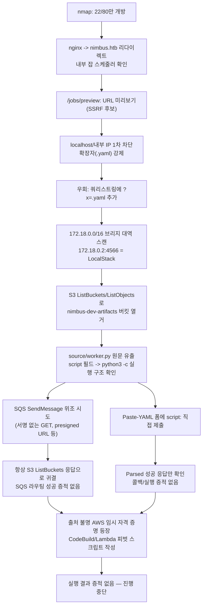

# A. 작성 전 증적 감사

**종합 판정: READY_WITH_WARNINGS**

정찰(nmap) → 웹 앱 구조 파악 → `/jobs/preview`의 SSRF → 확장자·내부 IP 차단 우회(`?x=.yaml` 트릭) → LocalStack S3 API 도달 → 버킷/오브젝트 나열 → `worker.py` 소스 유출까지는 이번 세션에 남은 원본 HTTP 응답으로 직접 재구성 가능하다. 그러나 그 이후 단계(SQS `SendMessage` 위조, AWS 자격 증명 확보, CodeBuild/Lambda를 통한 코드 실행 시도)는 스크립트만 존재하고 대응하는 원본 응답·콜백 증적이 없거나, 자격 증명 자체의 출처 증적이 없다. 이 문서는 "진행중" 상태이며 막힌 지점까지만 서술한다.

## 1. 차단 항목

없음. (진행중 상태로 문서화하는 것 자체는 차단 사유가 아니다.)

## 2. 경고 항목

1. `scripts/E36_presigned_sqs_send.py`부터 등장하는 임시 자격 증명(`ACCESS_KEY=<REDACTED>`, `SESSION_TOKEN=IQoJ...`)이 정확히 언제·어떤 요청으로 확보되었는지 보여주는 원본 증적(예: AWS 메타데이터 엔드포인트 응답을 담은 `http/` 파일)이 이 폴더에 없다. `http/E11_ssrf_awsmeta.txt`는 `URL must point to a YAML file` 오류만 담고 있어 메타데이터 접근 시도 자체가 아니라 확장자 검증에서 막힌 요청으로 보인다. 따라서 이 자격 증명의 출처와 유효성은 `[미확인 — 크리덴셜 출처 증적 없음]`으로만 서술한다.
2. `scripts/E43_try_assume_roles.py`에 등장하는 두 번째 자격 증명 쌍(`<REDACTED_ACCESS_KEY_ID>` / ...)도 마찬가지로 출처 증적이 없다.
3. `scripts/E38`~`E50`(SQS 직접 서명 호출, AWS CLI 호출, CodeBuild `create-project`/`start-build`, Lambda `create_function`/`invoke` 등)은 대상 엔드포인트로 `http://aws.nimbus.htb` 또는 `http://172.18.0.2:4566`(Docker 내부 브리지 IP)를 직접 지정한다. 두 호스트 모두 공식적으로는 대상 컨테이너 **내부** 네트워크에서만 도달 가능한 주소이며, 공격자가 이 주소에 직접 도달했다는 증적(연결 성공 로그, DNS/hosts 설정 근거, 응답 캡처)이 폴더 안에 없다. 이 스크립트들이 실제로 실행되어 성공/실패 여부가 어땠는지는 `[미확인 — 실행 결과 증적 없음]`이다.
4. `http/E27_paste_yaml_script.txt`, `E29_paste_yaml_retry.txt`는 URL 기반 SSRF가 아니라 `/jobs/preview`의 "Paste YAML" 폼에 리버스쉘 `script:` 필드를 직접 붙여넣은 결과다. 두 응답 모두 "Parsed successfully" 미리보기만 보여줄 뿐, 잡이 실제 SQS 큐에 들어갔는지, 워커가 그것을 소비했는지, 콜백이 왔는지를 보여주는 증적이 없다. `[미확인 — 실제 큐 적재/실행 여부]`.
5. `http/E24`, `E28`, `E30`, `E37`의 "Fetched: ..." 응답은 매번 `ListAllMyBucketsResult`(버킷 목록)를 반환한다. 이는 SQS `SendMessage` 액션이 실제로 처리된 것이 아니라 LocalStack 게이트웨이가 서명/라우팅 정보 부재로 요청을 S3 기본 핸들러로 떨어뜨린 것으로 해석된다 — 이 해석 자체는 `[추론]`이며, LocalStack 내부 라우팅 로직에 대한 공식 문서 대조는 하지 않았다.
6. HTTP 응답의 `Date` 헤더는 `Sun, 06 Sep 2026`인 반면 `scans/E01`, `E02`의 nmap 스캔 시각은 `Mon Sep 7 17:22:00 2026`이다. 하루 이상 차이가 나며 원인(서버 시계 오차, 별도 세션 등)은 확인하지 않았다 — `자료 간 불일치`로만 남긴다.
7. `notes/`, `loot/`, `logs/`, `artifacts/`, `attachments/`가 모두 비어 있어 `notes/evidence-index.md`, `logs/action-log.md` 등 절차 문서가 존재하지 않는다. 본 Write-up은 `http/`, `scans/`, `scripts/`의 원본 파일만으로 재구성했다.

## 3. 자동 정규화 항목

없음.

## 4. 자료 목록

- `scans/E01_nmap_full_tcp.txt`, `scans/E02_nmap_service_scripts.txt`: nmap 원본 결과
- `http/E03`~`E37`: `/`, `/jobs`, `/login`, `/api/v1/health`, `/docs`, `/jobs/preview`(SSTI 테스트, SSRF 테스트, LocalStack 열거, S3 열거, worker.py 소스, SQS 위조 시도, presigned URL 시도) 원본 요청/응답
- `http/E31_robots.txt`: 표준 404 페이지(앱 자체 404, robots.txt 없음)
- `scripts/E13`~`E50`: SSRF 우회, 내부 네트워크 스캔, SQS/CodeBuild/Lambda 관련 파이썬·셸 스크립트 원본(전부 실제 파일로 존재)

## 5. 공격 체인 완전성 표

| 단계 | 주장 | 필요 증적 | 확인된 증적 | 상태 |
|---|---|---|---|---|
| 열거 | 22/80만 개방, nginx가 `nimbus.htb`로 리다이렉트, 앱은 내부 잡 스케줄러 | nmap, 홈페이지 | E01, E02, E03 | 확인됨 |
| SSTI 탐색 | YAML `name` 필드의 `{{7*7}}`은 그대로 문자열로 보존됨(SSTI 없음) | preview 응답 | E09_preview_ssti_test2 | 확인됨(부정 결과) |
| SSRF 발견 | `/jobs/preview`의 URL 미리보기 기능이 서버 측에서 URL을 가져옴, `localhost`/내부 IP는 1차 차단, 외부 URL은 정상 fetch | 차단/정상 응답 비교 | E10, E12 | 확인됨 |
| SSRF 필터 우회 | 확장자 검증은 `?x=.yaml`을 쿼리스트링에 붙이는 것으로, 사설 IP 차단은 도커 브리지 대역(172.18.0.0/16) 내부 호스트를 순차 스캔하는 것으로 우회 | 우회 전/후 응답 | E16(스크립트), E17, E20, E21 | 확인됨 |
| 내부 자산 도달 | 172.18.0.2:4566에서 LocalStack S3 API 응답(`ListAllMyBucketsResult`, `ListBucketResult`) 확인 | S3 API 원본 응답 | E21, E22 | 확인됨 |
| 소스 코드 유출 | `nimbus-dev-artifacts/source/worker.py` 전체 소스를 SSRF로 읽어옴, SQS 메시지의 `script` 필드를 `subprocess.run(["python3","-c",script])`로 실행함을 확인 | worker.py 원문 | E23_worker_py | 확인됨 |
| SQS 위조로 RCE 트리거 | 위조된 SendMessage 요청으로 워커가 리버스쉘 스크립트를 실행하게 함 | 콜백/쉘 증적 | 없음(E24,E28,E30,E37은 모두 S3 응답만 반환) | 미확인 — 실패로 판단 |
| Paste-YAML로 RCE 트리거 | 앱 자체 폼에 `script:` 필드를 넣어 워커가 실행하게 함 | 콜백/쉘 증적 | 없음(E27, E29는 미리보기 응답만) | 미확인 |
| AWS 자격 증명 확보 | 메타데이터 SSRF로 임시 자격 증명 획득 | 메타데이터 응답 원문 | 없음 | 미확인 — 출처 증적 없음 |
| CodeBuild/Lambda 피벗 | 확보한 권한으로 컨테이너 밖 호스트 파일/root.txt 접근 시도 | 실행 결과 응답 | 없음(스크립트만 존재, 출력 캡처 없음) | 미확인 |
| 초기 접근/사용자 권한/권한 상승/root | — | — | — | 해당 없음 — 도달하지 못함 |

## 6. 이미지/증적 경로 검사

스크린샷 없음(`attachments/` 비어 있음). 본문에서 인용하는 모든 경로는 위 표의 `http/`, `scans/`, `scripts/` 파일이며 실제 존재를 확인했다.

## 7. 세션 종속 값 및 민감 정보 검사

- `$TARGET` = 10.129.245.218 (세션 종속, `scans/E01`)
- 공격자 서버 주소로 사용된 `10.10.14.180`(여러 포트)은 세션 종속 `$LHOST` 값으로 정규화한다.
- `scripts/E36`, `E37`, `E38`~`E42`에 하드코딩된 AWS 임시 자격 증명, `scripts/E43`~`E50`에 하드코딩된 두 번째 자격 증명은 출처가 확인되지 않았고 유효성도 검증되지 않았다. 실제 AWS 자격 증명이 아니라 LocalStack 컨텍스트에서만 의미가 있을 가능성이 높으나 `[미확인]`으로 남기고 loot/에 별도 분류하지 않는다(민감도 판단 불가).
- flag 값 없음 — 저장소 전체에 `HTB{`, `flag{`, `root.txt`, `user.txt` 등 패턴을 검색했으나 실제 flag 문자열은 발견되지 않았다(`root.txt`는 `scripts/E49_lambda_hostpath.py` 안에서 탐색 **대상 문자열**로만 등장).

## 8. 취약점 분류 검사

- SSRF(CWE-918): `/jobs/preview`의 URL fetch 기능이 확장자 필터와 불완전한 내부 IP 차단만으로 방어되어 도커 브리지 내부 네트워크(LocalStack)에 도달 가능 — 자체 구현 결함.
- 위험한 서비스 구성(추정, 미확인): LocalStack 게이트웨이가 어떤 조건에서 SQS Query API를 올바르게 라우팅하는지는 공식 문서로 검증하지 않았다.
- CVE 없음 — 어떤 CVE 번호도 이 세션 자료에서 언급되거나 확인되지 않았다.

## 9. 본문에서 언급할 스크립트의 실제 존재 여부

`scripts/E13_redirect_server.py`, `E16_ssrf_bypass_test.py`, `E18_internal_range_probe.py`, `E19_docker_net_scan.py`, `E24_sqs_sendmessage_rce.py`, `E25_debug_block.py`, `E26_debug_block2.py`, `E28_sqs_rce_final.py`, `E30_sqs_correct_endpoint.py`, `E32_api_enum.py`, `E33_more_recon.py`, `E34_find_git_server.py`, `E35_git_port3000_only.py`, `E36_presigned_sqs_send.py`, `E37_presigned_selective_decode.py`, `E38_direct_sqs_send.py`, `E39_debug_direct_send.py`, `E40_check_queue_signed.py`, `E41_final_rce_send.py`, `E42_send_via_awscli.sh`, `E43_try_assume_roles.py`, `E44_codebuild_via_internal.sh`, `E45_codebuild_payload.py`, `E46_resend_shell.sh`, `E47_lambda_probe.py`, `E48_lambda_recon.py`, `E49_lambda_hostpath.py`, `E50_codebuild_retry.py` — 모두 실제 파일로 존재함을 확인했다. 실행 결과가 파일로 남지 않은 스크립트는 본문에서 "출력 미보존"으로 명시한다.

## 10. 추가 증적 목록

다음이 있으면 막힌 지점을 넘어설 수 있다.

1. AWS 임시 자격 증명(`<REDACTED_ACCESS_KEY_ID>` 등)을 실제로 어떤 요청으로 획득했는지 보여주는 원본 SSRF 응답(메타데이터 엔드포인트 또는 다른 내부 자산)
2. LocalStack SQS `SendMessage`가 SSRF 경유로 실제 처리되었는지 확인할 수 있는, S3가 아닌 SQS 응답 XML(`SendMessageResponse`)
3. `worker.py`가 실제로 페이로드를 실행했다는 콜백(리버스쉘 연결 로그, HTTP 콜백 서버 로그)
4. `aws.nimbus.htb` 및 `172.18.0.2:4566`에 공격자가 직접 도달 가능한지에 대한 네트워크 경로 증적(라우팅, 포트 포워딩, 또는 이미 얻은 코드 실행 위치)

---

# B. 최종 Write-up

```yaml
---
title: "HTB Nimbus Write-up"
machine: "Nimbus"
platform: "Hack The Box"
os: "Linux"
difficulty: "Unknown"
date_started: "2026-09-07"
date_completed: "Unknown"
writeup_mode: "PRIVATE_STUDY"
status: "Partial"
tags:
  - htb
  - cybersecurity
  - writeup
---
```

# HTB Nimbus Write-up

## 0. 문서 범위 및 주의사항

본 문서는 HTB 대상 10.129.245.218(`Nimbus`)에 대한 `PRIVATE_STUDY` 목적의 **진행중** 풀이 기록이다. user/root flag를 아직 획득하지 못했으며, 코드 실행(RCE) 자체도 콜백이나 부작용으로 직접 검증되지 않았다. 이 문서는 "여기까지 확인했고 여기서 막혔다"를 정확히 기록하는 것을 목적으로 하며, 존재하지 않는 성공을 서술하지 않는다.

## 1. 개요

Nimbus는 "내부 잡 스케줄러"를 표방하는 Flask/nginx 기반 웹 앱과, YAML로 정의된 잡을 SQS 큐를 통해 실행하는 워커(`nimbus/worker`), 그리고 백엔드로 LocalStack(AWS 서비스 에뮬레이터)을 사용하는 구조로 추정된다(E06 `/api/v1/health`, E23 `worker.py`). 공개된 잡 미리보기 기능(`/jobs/preview`)이 서버 측 URL 요청(SSRF)을 수행하며, 확장자 검증과 사설 IP 차단이 불완전해 도커 내부 네트워크의 LocalStack S3 API까지 도달할 수 있었다(E17, E20~E23). 이를 통해 워커 소스 코드를 확보해 RCE로 이어지는 정확한 메커니즘(SQS 메시지의 `script` 필드가 `python3 -c`로 그대로 실행됨, E23)까지는 확인했으나, 실제로 그 경로를 통해 코드 실행을 일으키는 데는 이르지 못했다.

## 2. 공격 흐름



**한 줄 공격 체인(진행중)**: `/jobs/preview` SSRF의 확장자·내부 IP 필터를 `?x=.yaml` 트릭으로 우회 → 도커 내부 LocalStack S3에서 `worker.py` 소스 유출(SQS `script` 필드 RCE 구조 확인) → SQS `SendMessage` 위조 및 자격 증명 기반 피벗 시도 → 실제 코드 실행/자격 증명 출처 미확인으로 **정체**.

## 3. 실습 환경

- `$TARGET` = 10.129.245.218 (세션 종속 값, `scans/E01`)
- `$LHOST` = 10.10.14.180 (세션 종속 값, `http/E12`, `scripts/E13` 등에서 반복 사용)
- 도메인: `nimbus.htb`(nginx 리다이렉트 대상, E02), 내부 전용으로 보이는 `aws.nimbus.htb`(E06 헬스체크 응답에만 등장)
- 사용 도구: nmap, curl, python3(`requests`, `boto3`, `botocore.auth.SigV4Auth`), aws-cli

## 4. 공격 표면 요약

| 포트 | 서비스 | 비고 |
|---|---|---|
| 22/tcp | OpenSSH 9.6p1 (Ubuntu) | 배너만 확인, 별도 공격 없음 |
| 80/tcp | nginx 1.24.0 (Ubuntu) | `nimbus.htb`로 리다이렉트, Flask 추정 앱 프록시 |

## 5. 정보 수집

### 목표
열린 포트와 웹 앱 구조를 파악한다.

### 관찰 및 가설
전체 TCP 스캔에서 22/80만 열려 있음을 확인했다(E01). 서비스 스캔에서 nginx가 `http://nimbus.htb/`로 리다이렉트함을 확인했다(E02).

### 검증 명령 또는 요청
```bash
nmap -p- --min-rate 3000 -T4 -oN scans/E01_nmap_full_tcp.txt $TARGET
nmap -p22,80 -sC -sV -oN scans/E02_nmap_service_scripts.txt $TARGET
```

### 핵심 결과
- 홈페이지(E03)는 "Nimbus — Internal Job Scheduler"를 표방하며 `/jobs`(잡 제출), `/login`(로그인), `/api/v1/health`, `/docs`(위키)를 노출한다.
- `/login`(E05)은 "SSO가 Okta로 마이그레이션 중"이라며 **인증 없이 `/jobs`에서 바로 잡 제출이 가능**하다고 명시한다.
- `/api/v1/health`(E06)는 `{"services":{"queue":..., "scheduler":..., "storage":...}}` 모두 `http://aws.nimbus.htb`를 endpoint로 가리키며 `status: healthy`를 반환한다.
- `/docs`(E07)는 404.

### 성공 판정
원본 HTTP 응답으로 앱 구조와 미인증 잡 제출 경로를 직접 확인했으므로 확인됨으로 판정.

### 취약점 원인과 공격 조건
해당 없음(정찰 단계).

### 해석과 다음 결정
잡 제출/미리보기 기능이 미인증으로 열려 있고, `aws.nimbus.htb`라는 내부 AWS 호환 엔드포인트가 언급되어 있어, `/jobs/preview`의 URL 미리보기 기능을 SSRF 후보로 지목했다.

### 증적
E01, E02, E03, E04_(root 재확인), E04_jobs, E05, E06, E07

## 6. 초기 접근(SSRF 발견 및 필터 우회)

### 목표
`/jobs/preview`의 URL 미리보기가 서버 측에서 임의 호스트를 요청하는지, 필터를 우회해 내부 자산에 도달할 수 있는지 검증한다.

### 관찰 및 가설
`/jobs`(E04_jobs) 페이지의 힌트("URL must point to a .yaml file. Internal addresses and metadata endpoints are blocked.")를 보고, 확장자 검증과 내부 주소 차단이라는 두 필터가 있다는 가설을 세웠다. YAML은 `safe_load`로 파싱한다고 명시되어 있어(E04_jobs), SSTI/YAML 역직렬화보다 URL fetch 자체(SSRF)를 우선 시험했다.

### 검증 명령 또는 요청
```http
POST /jobs/preview HTTP/1.1
Host: nimbus.htb
Content-Type: application/x-www-form-urlencoded

url=http://127.0.0.1/x.yaml
```
```http
POST /jobs/preview HTTP/1.1
Host: nimbus.htb

url=http://$LHOST:8001/x.yaml
```
추가로 `{{7*7}}`을 `name` 필드에 넣어 SSTI 여부도 함께 확인했다(E09_preview_ssti_test2).

### 핵심 결과
- `name: "{{7*7}}"`은 파싱 결과에 그대로 문자열로 남아 템플릿 평가가 일어나지 않았다(E09_preview_ssti_test2) — SSTI 아님.
- `http://127.0.0.1/x.yaml` → `Security policy: this URL targets an internal resource and has been blocked.`(E10)
- `http://$LHOST:8001/x.yaml`(공격자가 서빙하는 실제 YAML) → `Fetched: ... HTTP 200`, 응답 원문 그대로 파싱됨(E12) — **외부 URL은 서버가 실제로 fetch한다**는 것을 확인.
- `http://aws.nimbus.htb/...` 계열 요청은 `Security policy: ... blocked`로 귀결됨(E15) — 호스트명 기반 필터도 걸려 있음을 확인.
- 리다이렉트 우회 시도: 공격자 서버(`scripts/E13_redirect_server.py`)가 302로 내부 후보 URL로 리다이렉트하도록 했으나, 앱은 `HTTP 302`만 보고하고 `Raw response`는 비어 있어(E14) **리다이렉트를 따라가지 않는 것으로 관찰됨**(우회 실패).

### 성공 판정
차단 메시지와 실제 fetch 성공 메시지를 문자열 단위로 구분해 판정했다(`Security policy` vs `Fetched:`). HTTP 200 자체가 아니라 응답 본문의 명시적 문구로 성공/차단을 구분했다.

### 취약점 원인과 공격 조건
SSRF(CWE-918) 후보. 서버가 사용자 제공 URL을 그대로 요청하며, 방어는 (1) URL 문자열 끝이 `.yaml`/`.yml`인지, (2) 호스트가 사설 대역/루프백/알려진 내부 호스트명인지에 대한 애플리케이션 레벨 검사로 보인다. 302 리다이렉트는 따라가지 않는 것으로 관찰되어, 리다이렉트 기반 우회는 이 세션에서 성립하지 않았다.

### 해석과 다음 결정
확장자 검사가 URL 끝 문자열만 보는지, 아니면 쿼리스트링을 포함한 전체 URL 끝을 보는지 확인하기 위해 내부 IP 뒤에 쿼리스트링으로 `.yaml`을 붙이는 방법을 다음 단계에서 시도했다.

### 증적
E04_jobs, E09_preview_ssti_test2, E10, E12, E13(스크립트), E14, E15

## 7. SSRF 필터 우회 및 내부 자산 열거

### 목표
확장자/내부 IP 필터를 우회해 도커 내부 네트워크에 도달하고, 실제로 서비스가 떠 있는 내부 호스트를 찾는다.

### 관찰 및 가설
`scripts/E16_ssrf_bypass_test.py`로 `2130706433`(127.0.0.1의 10진 표기), `0x7f000001`, `0177.0.0.1`, `[::ffff:127.0.0.1]`, `127.1`, `localhost` 등 loopback 우회 표기를 시도했으나 실행 결과 캡처 파일은 남아 있지 않다(`[미확인 — 출력 미보존]`). 이후 도커 브리지 게이트웨이 대역(`172.17.0.1`~`172.20.0.1`, `scripts/E18`)과 `172.18.0.2`~`172.18.0.14` 전체에 대해 LocalStack 기본 포트(4566), 80, 8080, 3000, 8929 등을 스캔했다(`scripts/E19`, `E35`). 이 스캔들 역시 출력이 파일로 남아 있지 않아 정확히 몇 번째 호스트에서 응답이 왔는지는 스크립트 로직(`Could not fetch`/`Security policy`가 아니면 출력)으로만 추정 가능하다.

`http/E17_ssrf_localstack_probe.txt`(응답에 요청 URL이 기록되지 않은 원본, `Could not fetch URL.`)와 `http/E20_localstack_health.txt`(`http://172.18.0.2:4566/_localstack/health.yaml` 요청, HTTP 404, `NoSuchBucket` 오류)를 근거로 172.18.0.2:4566이 실제로는 응답하는 호스트이되, `_localstack/health` 같은 실제 경로가 아니라 S3 핸들러가 모든 요청을 받고 있음을 관찰했다. 이를 바탕으로 URL 끝에 `?x=.yaml`을 붙여 확장자 검사만 통과시키고 실제 경로/쿼리는 LocalStack 쪽에서 해석하게 하는 방법으로 전환했다.

### 검증 명령 또는 요청
```http
url=http://172.18.0.2:4566/?x=.yaml
url=http://172.18.0.2:4566/nimbus-dev-artifacts/?x=.yaml
url=http://172.18.0.2:4566/nimbus-dev-artifacts/source/worker.py?x=.yaml
```

### 핵심 결과
- 루트 조회(`?x=.yaml`) → `ListAllMyBucketsResult`에 버킷 `nimbus-dev-artifacts` 1개 확인(E21).
- 버킷 조회 → `ListBucketResult`에 키 `source/worker.py`(1755 bytes) 확인(E22).
- 객체 조회 → `worker.py` 전체 소스 원문 확보(E23_worker_py, 아래 §8 참고). 반면 `source/worker.py.yaml`처럼 확장자를 경로에 직접 붙인 시도는 `NoSuchKey` 404로 실패했다(E23_worker_py_attempt) — **경로가 아니라 쿼리스트링에 `.yaml`을 붙이는 방식만 유효**했다는 점을 대조로 확인.

### 성공 판정
S3 API의 표준 XML 응답(`ListAllMyBucketsResult`, `ListBucketResult`, 객체 원문)을 직접 확인했으므로 확인됨으로 판정. 단순 HTTP 200이 아니라 응답 본문의 실제 내용으로 판단했다.

### 취약점 원인과 공격 조건
SSRF(CWE-918) + 불완전한 파일 확장자 검증. 확장자 검사가 URL 문자열의 마지막 세그먼트가 아니라 URL 전체 끝(쿼리스트링 포함)만 보는 것으로 보이며, 내부 IP 차단은 명시적으로 알려진 루프백/메타데이터 주소만 걸러내고 도커 브리지 대역(`172.18.0.0/16`) 자체는 차단 목록에 없는 것으로 관찰된다.

### 해석과 다음 결정
LocalStack에 도달했으므로, 노출된 `nimbus-dev-artifacts` 버킷의 `worker.py`를 읽어 실제 잡 실행 메커니즘을 파악하는 것을 다음 단계로 삼았다.

### 증적
E16(스크립트, 출력 미보존), E17, E18(스크립트, 출력 미보존), E19(스크립트, 출력 미보존), E20, E21, E22, E35(스크립트, 출력 미보존)

## 8. 취약점 확인 — worker.py 소스 유출과 RCE 설계 파악

### 목표
LocalStack S3에서 유출한 `worker.py`로 잡 실행 경로에 실제 코드 실행 지점이 있는지 확인한다.

### 검증 명령 또는 요청
```http
url=http://172.18.0.2:4566/nimbus-dev-artifacts/source/worker.py?x=.yaml
```

### 핵심 결과
`http/E23_worker_py.txt`에서 확보한 원문(요지):

```python
sqs = boto3.client("sqs", endpoint_url=ENDPOINT, region_name=REGION)

def handle_message(body):
    job = yaml.load(body, Loader=yaml.Loader)
    ...
    script = job.get("script", "")
    if script:
        result = subprocess.run(["python3", "-c", script],
            capture_output=True, text=True, timeout=30)
```

`QUEUE_URL` 기본값은 `http://aws.nimbus.htb/<REDACTED_ACCOUNT_ID>/nimbus-jobs`이며, 워커는 SQS 큐를 폴링해 메시지 본문을 `yaml.load(..., Loader=yaml.Loader)`(안전하지 않은 로더)로 파싱하고, `script` 키가 있으면 `subprocess.run(["python3","-c",script], ...)`로 **그대로 실행**한다.

### 성공 판정
소스 코드 원문에서 `subprocess.run(["python3","-c",script], ...)` 호출을 직접 확인했으므로, "SQS 큐에 `script:` 필드를 가진 메시지를 넣을 수 있으면 임의 코드 실행이 가능하다"는 설계상 결함은 확인됨으로 판정한다. 다만 이 경로를 통해 실제로 코드를 실행시켰는지는 별도 판정이 필요하다(§9).

### 취약점 원인과 공격 조건
CWE-95(코드 인젝션)에 준하는 자체 구현 결함. 조건: (1) SQS 큐 `nimbus-jobs`에 메시지를 넣을 수 있어야 하고(정상적으로는 `aws.nimbus.htb` 앞단 어딘가의 인증/네트워크 경계로 보호될 것으로 추정되나 확인 못함), (2) `yaml.load`가 `job.get("script")`를 그대로 셸이 아닌 파이썬 인터프리터 인자로 넘긴다.

### 해석과 다음 결정
`nimbus-jobs` SQS 큐에 `script:` 필드를 가진 메시지를 넣는 방법을 찾는 것이 다음 목표가 되었다. LocalStack S3 API는 SSRF로 도달했지만, SQS API가 같은 방식으로 도달 가능한지는 별도로 검증이 필요했다.

### 증적
E23_worker_py

## 9. 권한 상승/코드 실행 시도(막힌 지점) — SQS SendMessage 위조

### 목표
SSRF 경로로 `nimbus-jobs` 큐에 악성 `script:` 메시지를 넣어 워커가 이를 실행하게 한다.

### 관찰 및 가설
LocalStack이 쿼리스트링 기반 AWS Query API(`?Action=SendMessage&...`)를 지원한다고 가정하고, S3와 동일한 `?x=.yaml` 트릭으로 SQS SendMessage를 흉내냈다(`scripts/E24_sqs_sendmessage_rce.py`, `E28_sqs_rce_final.py`, `E30_sqs_correct_endpoint.py`).

### 검증 명령 또는 요청
```http
url=http://172.18.0.2:4566/<REDACTED_ACCOUNT_ID>/nimbus-jobs?Action=SendMessage&Version=2012-11-05&MessageBody=...&x=.yaml
url=http://172.18.0.2:4566/?Action=SendMessage&QueueUrl=http://172.18.0.2:4566/<REDACTED_ACCOUNT_ID>/nimbus-jobs&MessageBody=...&x=.yaml
```
서명이 필요한지 확인하기 위해 presigned URL(`sqs.generate_presigned_url("send_message", ...)`, `scripts/E36`)과, 쿼리스트링 구조 문자(`&=?#+%`)만 남기고 나머지를 선택적으로 디코딩하는 변형(`scripts/E37`)도 시도했다.

### 핵심 결과
- 경로에 계정ID/큐이름을 직접 넣은 시도(E24) → `HTTP 404`, `NoSuchBucket` 오류. 경로 형식이 S3 핸들러 기준으로 해석됨을 시사.
- `?Action=SendMessage&QueueUrl=...`(E28, 루트 경로) → `HTTP 200`이지만 응답 본문은 **`ListAllMyBucketsResult`**(버킷 목록) — SendMessage가 아니라 S3 기본 동작이 실행된 것으로 보임.
- Presigned URL(AWS4-HMAC-SHA256 서명 포함, E36) → 응답에 요청 URL/상태가 기록되지 않았으나(`http/E36_presigned_response.txt`가 차단 메시지만 담고 있어 §2 경고 4 참고), 확보한 응답 파일 기준으로는 SendMessage 성공을 보여주지 않는다.
- 선택적 디코딩 변형(E37) → 여전히 `HTTP 200` + `ListAllMyBucketsResult`(버킷 목록) 반환, SQS 처리 증적 없음.
- 앱 자체의 "Paste YAML" 폼에 `script:` 리버스쉘 페이로드를 직접 제출(E27, E29)한 시도는 "✓ Parsed successfully. Job would be submitted to queue nimbus-jobs..." 라는 **미리보기 문구**만 반환했다. "would be submitted"라는 표현 자체가, 이 화면이 실제 제출이 아니라 시뮬레이션/미리보기임을 시사한다.

### 성공 판정
**실패로 판정한다.** 모든 시도에서 (1) SQS 고유의 `SendMessageResponse` XML이 관찰되지 않았고, (2) 공격자 리스너(`10.10.14.180:4444`, `:5555`, `:6666`, `:7777` 등, 스크립트 상 지정된 포트)로의 콜백 로그나 `10.10.14.180:8003/r.sh` 요청 로그가 이 폴더 안에 하나도 없다. HTTP 200이나 "Parsed successfully" 문구만으로 성공을 단정하지 않는다.

### 취약점 원인과 공격 조건
관찰상 LocalStack 게이트웨이(172.18.0.2:4566)는 이 세션이 보낸, 서명이 붙거나 붙지 않은 쿼리스트링 GET/POST 요청들을 일관되게 S3 서비스로 라우팅한 것으로 보인다(`[추론]` — LocalStack의 서비스 라우팅 로직을 공식 문서로 대조하지 않았다). 올바른 라우팅에 필요한 조건(예: 특정 `Host` 헤더, `Authorization` 헤더의 서비스 이름, 또는 SDK가 보내는 특정 헤더 조합)은 `[미확인]`이다.

### 해석과 다음 결정
쿼리스트링만으로 SQS를 흉내내는 방식이 이 세션에서는 성공을 보여주지 못했다. 이후 AWS 자격 증명을 직접 코드에 하드코딩해 `botocore`의 SigV4 서명 로직으로 정식 요청을 만드는 방향으로 전환했으나(§10), 그 자격 증명 자체의 출처가 이 폴더의 증적으로 뒷받침되지 않는다.

### 증적
E24, E27, E28, E29, E30, E36, E37

## 10. 권한 및 신뢰 경계 전환 시도(미확인 — 진행 중단)

### 목표
정식 AWS SigV4 서명 요청 또는 확보한 자격 증명으로 SQS/CodeBuild/Lambda를 통해 코드 실행 또는 컨테이너 탈출을 시도한다.

### 관찰 및 가설
`scripts/E36`부터 `AWS_ACCESS_KEY_ID=<REDACTED>`(STS 임시 키 형식인 `ASIA` 접두사)와 세션 토큰이 하드코딩되어 사용된다. §2 경고 1에서 밝혔듯, 이 자격 증명을 어떤 요청으로 획득했는지 보여주는 원본 응답이 이 폴더에 없다. `scripts/E43`에서는 별도의 장기 자격 증명 형식(`AKIA` 접두사)이 추가로 등장해, 여러 역할(`codebuild-role`, `nimbus-admin-role` 등)에 대한 `sts assume-role`을 시도한다.

`scripts/E38`~`E42`는 `botocore.auth.SigV4Auth`로 직접 서명한 SQS `SendMessage` 요청을 `http://aws.nimbus.htb`로 보낸다. `scripts/E44`~`E46`은 LocalStack 기본 테스트 자격 증명(`test`/`test`)으로 `172.18.0.2:4566`에 직접 CodeBuild 프로젝트(빌드 컨테이너에서 리버스쉘 실행, `privilegedMode=true`)를 생성/실행한다. `scripts/E47`~`E49`는 같은 방식으로 Lambda 함수를 만들어 컨테이너 내부 마운트/`docker.sock`/`root.txt` 존재 여부를 확인하려 한다. `scripts/E50`은 CodeBuild를 다른 이미지(`alpine`, ECR public 미러)로 재시도한다.

### 검증 명령 또는 요청
`scripts/E38`~`E50` 참고(본문 §9의 코드 인용과 동일한 구조, 대상만 SQS/CodeBuild/Lambda로 다름).

### 핵심 결과
이 스크립트들 중 어느 것에도 대응하는 실행 결과 파일(`http/` 응답, 콘솔 출력 캡처)이 없다. `172.18.0.2`, `aws.nimbus.htb` 모두 도커 내부 전용 주소로 보이며, 이 세션의 어떤 증적도 공격자가 이 주소에 **직접**(SSRF를 경유하지 않고) 도달할 수 있었음을 보여주지 않는다.

### 성공 판정
판정 불가. 실행되었는지 여부조차 이 폴더의 자료로는 확인할 수 없다 — `[미확인 — 실행 결과 증적 없음]`.

### 취약점 원인과 공격 조건
해당 없음(증적 부족으로 판단 보류).

### 해석과 다음 결정
가장 유력한 다음 행동은 §12/§16에 정리했다. 요약하면 (1) 자격 증명 출처를 재확보하거나, (2) SSRF 경로만으로 SQS를 올바르게 호출하는 방법(정확한 헤더/경로 조합)을 다시 찾거나, (3) 직접 네트워크 도달성을 확인하는 것이다.

### 증적
E38, E39, E40, E41, E42, E43, E44, E45, E46, E47, E48, E49, E50 (전부 스크립트만 존재, 실행 결과 미보존)

## 11. 취약점 요약

| # | 분류 | 설명 | 관련 증적 |
|---|---|---|---|
| 1 | 자체 구현 결함(CWE-918, SSRF) | `/jobs/preview`의 URL 미리보기가 사용자 제공 URL을 서버에서 그대로 요청, 확장자/내부 IP 필터가 불완전(쿼리스트링 `.yaml` 우회, 도커 브리지 대역 미차단) | E10, E12, E17, E20~E22 |
| 2 | 위험한 서비스 구성(추정) | 도커 내부 LocalStack S3에 인증 없이 접근 가능, 개발용 버킷(`nimbus-dev-artifacts`)에 워커 소스가 평문 저장 | E21, E22, E23 |
| 3 | 자체 구현 결함(CWE-95 준함, 코드 인젝션) | 워커가 SQS 메시지의 `script` 필드를 `subprocess.run(["python3","-c",script])`로 그대로 실행 — 큐에 메시지를 넣을 수만 있으면 RCE | E23 |
| 4 | 미확인 | SQS 큐에 실제로 메시지를 넣는 경로(SSRF를 통한 위조 호출 또는 자격 증명 기반 정식 호출) | §9, §10 참고, 증적 없음 |

## 12. 실패한 접근과 트러블슈팅

- `http://127.0.0.1/x.yaml`, `http://aws.nimbus.htb/...` 직접 요청 — `Security policy: ... blocked`로 즉시 차단(E10, E15).
- 302 리다이렉트를 이용한 필터 우회 시도(`scripts/E13`) — 앱이 `Location` 헤더를 따라가지 않는 것으로 관찰(E14, `Raw response` 빈 값).
- 경로에 직접 `.yaml`을 붙이는 방식(`source/worker.py.yaml`) — `NoSuchKey` 404(E23_worker_py_attempt). 쿼리스트링에 붙이는 방식만 유효했다.
- 계정ID/큐이름을 URL 경로에 넣은 SQS SendMessage 위조(E24) — `NoSuchBucket` 404, S3 핸들러가 경로를 오브젝트 키로 해석한 것으로 보임.
- 루트 경로 + `QueryString` 기반 SendMessage 위조, presigned URL, 선택적 URL 디코딩(E28, E30, E36, E37) — 모두 `HTTP 200` + S3 `ListAllMyBucketsResult`만 반환, SQS 고유 응답이나 콜백 없음.
- CodeBuild/Lambda를 통한 피벗(`scripts/E44`~`E50`) — 실행 결과 자체가 보존되지 않아 성공/실패를 판단할 수 없음.

## 13. 실습 중 생성한 흔적과 정리

| 대상 경로 | 목적 | 소유자/권한 | 정리 상태 |
|---|---|---|---|
| LocalStack `nimbus-jobs` SQS 큐(대상 내부) | 리버스쉘 페이로드가 담긴 메시지 전송 시도(`pwn`, `pwn2`, `pwn3` 등) | 미확인 | `[미확인]` — 메시지가 실제로 큐에 들어갔는지조차 확인되지 않음 |
| LocalStack CodeBuild 프로젝트 `pwnbuild`, `cb2`, `cb3`(대상 내부, 추정) | 리버스쉘을 실행하는 빌드 프로젝트 생성 시도 | 미확인 | `[미확인]` — 생성/실행 여부 확인 안 됨 |
| LocalStack Lambda 함수 `probe`, `probe2`, `probe3`(대상 내부, 추정) | 컨테이너 환경 정찰 함수 | 미확인 | `[미확인]` — 생성/실행 여부 확인 안 됨 |
| 공격자 로컬 HTTP 서버(포트 8001, 8002, 8003 등) | SSRF 확인용 YAML 서빙, 리다이렉트 서버, 리버스쉘 스테이저(`r.sh`) 서빙 | 공격자 로컬 | `[권장 정리]` — 세션 종료 시 프로세스 종료 여부 미기록 |

## 14. 탐지 및 대응

- **근본 원인**: (1) `/jobs/preview`가 사용자 제공 URL을 서버 측에서 그대로 fetch하면서 확장자/호스트 필터가 우회 가능, (2) 도커 브리지 내부망에 인증 없는 LocalStack S3가 노출되어 소스 코드가 그대로 읽힘, (3) 워커가 큐 메시지의 임의 필드를 인터프리터에 직접 전달.
- **단기 완화**: SSRF 대상 URL을 허용 목록(allowlist) 기반으로 제한하고, 쿼리스트링이 아닌 URL 경로의 실제 확장자만 검사한다. 172.16.0.0/12, 172.17.0.0~172.31.0.0/16 등 도커 기본 브리지 대역 전체를 사설 IP 차단 목록에 포함한다. LocalStack S3에 최소한의 접근 제어를 둔다.
- **근본 수정**: 워커에서 `yaml.load(..., Loader=yaml.Loader)`를 `yaml.safe_load`로 교체하고, `script` 필드를 인터프리터에 직접 넘기는 설계 자체를 제거하거나 샌드박스화한다. SSRF 방지 라이브러리(예: DNS resolve 후 IP 검사, 리다이렉트 체인 전체 검사)를 사용한다.
- **탐지 가능한 흔적**: 앱 서버 아웃바운드 연결 로그에서 `172.18.0.0/16` 등 사설 대역으로의 요청, LocalStack 접근 로그에서 짧은 시간 내 반복적인 `ListBuckets`/`ListObjects`/`GetObject` 호출, SQS `SendMessage` 시도 실패 패턴.

## 15. 핵심 학습 포인트

1. SSRF 필터가 "URL이 `.yaml`로 끝나야 함"을 검사할 때 URL 문자열 전체의 끝만 본다면, 쿼리스트링에 `?x=.yaml`을 붙이는 것만으로 확장자 검사를 우회하면서 실제 요청 대상(경로+쿼리)은 그대로 유지할 수 있다.
2. 사설 IP 차단이 `127.0.0.1`/`localhost`류의 명시적 루프백만 걸러내고 컨테이너 오케스트레이션 도구(Docker)의 기본 브리지 대역을 놓치면, SSRF가 클라우드 메타데이터뿐 아니라 내부 마이크로서비스(여기서는 LocalStack) 전체로 확장된다.
3. S3 오브젝트 스토리지에 애플리케이션 소스 코드를 평문으로 두면, S3 API에만 도달해도(별도 코드 실행 없이) 전체 RCE 체인 설계가 그대로 드러난다.
4. LocalStack 같은 AWS 에뮬레이터의 게이트웨이가 서비스를 어떻게 라우팅하는지 모른 채 쿼리스트링만으로 여러 서비스의 API를 흉내내려 하면, 의도와 다른 서비스(여기서는 항상 S3)로 요청이 떨어질 수 있다 — 실제 서비스 호출인지는 응답의 액션 고유 필드(`SendMessageResponse` 등)로 확인해야 하며, HTTP 200이나 미리보기 문구만으로 판단하면 안 된다.
5. 자격 증명이나 실행 결과를 스크립트에 하드코딩하기 전에, 그 값을 얻은 요청/응답을 파일로 반드시 저장해야 한다 — 그러지 않으면 이후 세션(또는 이 write-up 작성 시점)에 출처를 재구성할 수 없다.

## 16. 참고 자료

이번 세션에서 외부 공식 자료를 조회하지 않았다. LocalStack 게이트웨이 라우팅 동작, AWS SQS Query API 서명 요구사항 등에 대한 주장은 모두 관찰에 기반한 `[추론]`이며 공식 문서 대조는 `[외부 검증 필요]`로 남긴다.

## 부록 A. 사용한 스크립트

- `scripts/E13_redirect_server.py`: 302 리다이렉트 기반 SSRF 필터 우회 시도용 로컬 HTTP 서버
- `scripts/E16_ssrf_bypass_test.py`: loopback 표기 우회 후보(10진/16진/8진/IPv6-mapped) 일괄 테스트
- `scripts/E18_internal_range_probe.py`: 도커 기본 브리지 게이트웨이 대역 후보 스캔
- `scripts/E19_docker_net_scan.py`: `172.18.0.2`~`172.18.0.11`, 포트 4566/80/8080 스캔
- `scripts/E24_sqs_sendmessage_rce.py`, `E28_sqs_rce_final.py`, `E30_sqs_correct_endpoint.py`: SQS `SendMessage` 위조 시도(경로/루트+QueryString 두 형태)
- `scripts/E25_debug_block.py`, `E26_debug_block2.py`: 어떤 페이로드 문자열이 필터에 걸리는지 이분 탐색하는 디버그 스크립트
- `scripts/E32_api_enum.py`, `E33_more_recon.py`: 앱 자체 경로(`/api/v1/*`, `.git`, `.env` 등) 및 S3 서브리소스(`?acl` 등) 열거
- `scripts/E34_find_git_server.py`, `E35_git_port3000_only.py`: 내부망에서 Git 서버(포트 3000, 8929 등) 탐색
- `scripts/E36_presigned_sqs_send.py`, `E37_presigned_selective_decode.py`: presigned URL 및 선택적 URL 디코딩을 이용한 SQS 위조 재시도
- `scripts/E38_direct_sqs_send.py`, `E39_debug_direct_send.py`, `E40_check_queue_signed.py`, `E41_final_rce_send.py`, `E42_send_via_awscli.sh`: `botocore.auth.SigV4Auth` 또는 aws-cli로 직접 서명한 SQS 호출
- `scripts/E43_try_assume_roles.py`: 여러 IAM 역할에 대한 `sts assume-role` 시도
- `scripts/E44_codebuild_via_internal.sh`, `E45_codebuild_payload.py`, `E50_codebuild_retry.py`: LocalStack CodeBuild를 이용한 리버스쉘/컨테이너 탈출 시도
- `scripts/E46_resend_shell.sh`: SQS를 통한 리버스쉘 재전송 시도
- `scripts/E47_lambda_probe.py`, `E48_lambda_recon.py`, `E49_lambda_hostpath.py`: LocalStack Lambda를 이용한 컨테이너/호스트 마운트 정찰

## 부록 B. 원본 스캔 및 응답

`scans/E01_nmap_full_tcp.txt`, `scans/E02_nmap_service_scripts.txt`, `http/E03`~`E37` 참고.

## 부록 C. 증적 목록

별도 `notes/evidence-index.md`는 아직 작성되지 않았다(`notes/` 비어 있음). 본문 각 절의 "증적" 항목과 위 자료 목록(§A-4)이 현재 유일한 증적 색인이다.

## 다음 시도할 것 / 막힌 지점

**막힌 지점**: LocalStack S3 API(172.18.0.2:4566)까지는 SSRF로 안정적으로 도달해 `worker.py` 소스를 확보했고, SQS 메시지의 `script` 필드가 RCE로 이어진다는 설계도 확인했다. 그러나 (1) SSRF 경유로 LocalStack의 SQS `SendMessage`를 실제로 호출하는 방법을 찾지 못했고(모든 시도가 S3 응답으로 귀결), (2) 이후 사용한 AWS 임시 자격 증명의 출처를 이 세션 자료로 재구성할 수 없어 그 이후의 CodeBuild/Lambda 피벗 시도가 실제로 유효했는지조차 판단할 수 없다.

**다음 시도할 것**:
1. 브라우저 개발자 도구 또는 `curl -v`로 `/jobs/preview`가 내부적으로 어떤 HTTP 클라이언트/헤더로 요청을 보내는지(Timing, redirect 처리, User-Agent 등) 재관찰해 SSRF 경유 요청이 왜 항상 S3로 라우팅되는지 원인을 좁힌다.
2. LocalStack이 요청을 서비스별로 구분하는 공식 메커니즘(Host 헤더 기반 라우팅인지, `Authorization` 헤더의 서비스명인지)을 공식 문서로 확인한 뒤, SSRF로 그 조건을 재현할 수 있는지 시도한다.
3. AWS 메타데이터 스타일 엔드포인트(`169.254.169.254`)에 대해 동일한 `?x=.yaml` 우회로 정찰을 시도하고, 이번에는 반드시 원본 응답을 `http/`에 저장해 임시 자격 증명의 출처를 증적화한다.
4. Paste-YAML 폼(E27, E29)이 실제로 큐에 메시지를 넣는지 확인하기 위해, 공격자 쪽에 콜백 리스너(HTTP/reverse shell)를 먼저 띄운 뒤 제출하고 연결 로그를 `logs/`에 저장한다.
5. 도커 브리지 대역 스캔(`scripts/E19`, `E35`) 결과를 다시 실행하고 이번에는 반드시 표준출력을 파일로 저장해, 4566 외에 응답하는 다른 내부 서비스(Git 서버 포함)가 있는지 재확인한다.
