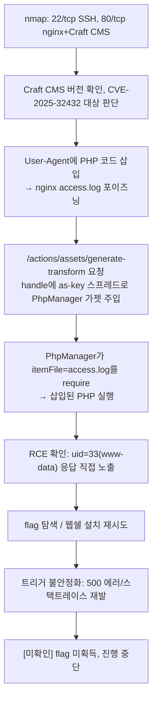

# A. 작성 전 증적 감사

**종합 판정: READY_WITH_WARNINGS (진행중 문서)**

이 문서는 완료된 풀이가 아니라 **진행중** 기록이다. 초기 RCE는 원본 HTTP 응답(`uid=33(www-data)` 직접 노출)으로 확인됐으나, 이후 flag 탐색·권한 상승 단계는 저장된 결과가 없어 성공/실패를 판정할 수 없다. 미확인 구간은 추측으로 채우지 않고 `[미확인]`으로 남긴다.

## 1. 차단 항목

없음 — 진행중 상태로 문서화하는 것을 사용자가 명시적으로 요청.

## 2. 경고 항목

1. `scripts/E37`~`E41`(다중 명령 실행, 직접 파일 읽기, 파일 쓰기-읽기, PHP 웹쉘 설치, flag 읽기)은 스크립트 원본은 존재하나 **실행 결과가 저장되어 있지 않다.** 따라서 이 단계들이 실제로 성공했는지 여부는 `[미확인]`이다.
2. `http/E28_env_response.txt`, `E30_id_response.txt`, `E34_response.html`은 명령 실행 결과가 아니라 **Craft/Yii2의 디버그 스택트레이스(에러 페이지)** 를 담고 있다 — 즉 이 시점들에서는 트리거가 실패하고 있었다는 근거다.
3. 머신 난이도·릴리스 정보는 HTB UI에서 직접 확인하지 않아 `Unknown`으로 남긴다.
4. root/user flag를 확보하지 못했으므로 본 문서에 flag 값은 없다.

## 3. 자동 정규화 항목

없음.

## 4. 자료 목록

- `scans/E01`, `E02`: nmap 전체 포트 / 서비스 스캔
- `http/E03`~`E15`: 초기 정찰(루트, 관리자 로그인 페이지) 및 첫 RCE 트리거 응답(`E13`에 `uid=33` 확인)
- `http/E28`, `E30`, `E34`: 이후 재시도 중 발생한 에러 스택트레이스
- `artifacts/Component.php`: 취약점 분석에 사용된 Yii2 프레임워크 소스(공개 소스코드, 패치 이전 버전 동작 확인용)
- `scripts/E06`~`E41`: CVE-2025-32432 PoC 및 후속 익스플로잋 스크립트 원본

## 5. 공격 체인 완전성 표

| 단계 | 주장 | 필요 증적 | 확인된 증적 | 상태 |
|---|---|---|---|---|
| 열거 | SSH(22) + nginx/Craft CMS(80)만 노출 | nmap 출력 | E01, E02 | 확인됨 |
| 취약점 식별 | Craft CMS ≤5.6.16, CVE-2025-32432(Yii2 Component `as <name>` 스프레드 + PhpManager 가젯) | 공식 CVE/벤더 권고 | scripts/E06 주석 내 참고 링크(craftcms.com, GHSA, NVD) | 외부 검증됨(문서 인용, 이번 세션에서 URL 재접속 검증은 안 함 — `[외부 검증 필요]`) |
| 초기 접근(RCE) | nginx access.log 로그 포이즈닝 → PhpManager 가젯 트리거로 www-data 권한 코드 실행 | RCE 응답에 uid= 직접 노출 | http/E13_trigger200_response.html (`uid=33(www-data)`) | 확인됨 |
| flag 탐색/권한 상승 | `/var/www/FLAG.txt`, `/root/root.txt` 등 탐색, 웹쉘 설치 시도 | 실행 결과 저장 파일 | 없음 | 미확인 — 저장된 출력 없음 |

## 6. 이미지/증적 경로 검사

스크린샷 없음. `http/E13_trigger200_response.html`의 실제 존재와 내용(`uid=33(www-data) gid=33(www-data) groups=33(www-data)` 포함)을 직접 확인했다.

## 7. 세션 종속 값 및 민감 정보 검사

- 대상 IP(10.129.244.146)는 세션 종속 값(HTB 배정 IP)이며 본문에서 `$TARGET`으로 정규화한다.
- root/user flag는 미확보이므로 기재할 값 없음.

## 8. 취약점 분류 검사

- CVE-2025-32432(Craft CMS ≤5.6.16, Yii2 2.0.49 이하 `Component::__set` 미검증) — 공식 CVE.

## 9. 본문에서 언급할 스크립트의 실제 존재 여부

`scripts/E06_exploit_cve-2025-32432.py`부터 `E41_flag_read.py`까지 언급된 모든 스크립트가 실제로 폴더에 존재함을 확인했다.

## 10. 추가 증적 목록

다음 재개 시 §"막힌 지점과 다음 시도"에 적은 항목의 실행 결과를 저장해야 이후 진행 상황을 판정할 수 있다.

---

# B. 진행중 Write-up

```yaml
---
title: "HTB Orion Write-up (In Progress)"
machine: "Orion"
platform: "Hack The Box"
os: "Linux"
difficulty: "Unknown"
date_started: "2026-08-24"
date_completed: null
writeup_mode: "PRIVATE_STUDY"
status: "In Progress / 진행중"
tags:
  - htb
  - cybersecurity
  - writeup
  - in-progress
---
```

# HTB Orion Write-up (진행중)

## 0. 문서 범위 및 주의사항

본 문서는 HTB 플랫폼이 승인한 랩 환경(10.129.244.146)만을 대상으로 한 `PRIVATE_STUDY` 목적의 개인 풀이 기록이며, **아직 완료되지 않았다.** root/user flag를 확보하지 못한 상태이며, 이 문서는 지금까지 실제로 확인된 것과 막힌 지점을 정확히 구분해 남기는 것을 목적으로 한다.

## 1. 개요

Orion은 nginx 1.18.0 위에서 동작하는 Craft CMS 기반 웹 서비스(`orion.htb`)를 노출하는 Linux 머신이다. Craft CMS의 이미지 트랜스폼 생성 로직에 존재하는 CVE-2025-32432(인증 없는 원격 코드 실행)를 이용해 `www-data` 권한 코드 실행까지는 확인했으나, 이후 flag 획득 및 권한 상승 시도에서 익스플로잋 트리거가 불안정해지며 진행이 막혔다.

## 2. 공격 흐름 (확인된 부분까지)



**한 줄 상태**: nginx 로그 포이즈닝 + Yii2 PhpManager 가젯 체이닝으로 CVE-2025-32432 RCE를 www-data 권한으로 1회 확인 → 이후 flag 탐색/웹쉘 설치 재시도에서 트리거가 불안정해져 진행 중단(`[미확인]`).

## 3. 실습 환경

- `$TARGET` = 10.129.244.146 (세션 종속 값, HTB 배정 IP), 도메인 `orion.htb`
- 공격 환경: WSL2 Kali Linux, HTB VPN
- 사용 도구: nmap, python3(requests), curl

## 4. 공격 표면 요약

| 포트 | 서비스 | 비고 |
|---|---|---|
| 22/tcp | OpenSSH 8.9p1 (Ubuntu) | 직접 사용 안 함 |
| 80/tcp | nginx 1.18.0 (Ubuntu) | Craft CMS, `orion.htb`로 리다이렉트 |

### 증적
E01, E02

## 5. 취약점 식별

### 목표
노출된 Craft CMS 버전에서 알려진 인증 없는 RCE가 성립하는지 판단한다.

### 관찰 및 가설
`/admin/login` 응답과 버전 단서로 Craft CMS를 확인했고, `scripts/E06_exploit_cve-2025-32432.py`의 주석에 정리된 CVE-2025-32432 설명(Craft CMS ≤5.6.16, `AssetsController::actionGenerateTransform`이 사용자 제어 `handle` 파라미터를 `Craft::createObject()`에 그대로 전달하며, `as <name>` 키 스프레드가 `yii\base\Component::__set`을 통해 임의 클래스를 `Yii::createObject()`로 생성하게 만든다는 내용)를 근거로, `yii\rbac\PhpManager` 가젯(생성 시 `itemFile`을 `require`)을 조합하면 RCE가 성립한다는 가설을 세웠다.

### 검증 명령 또는 요청
`artifacts/Component.php`(대상과 같은 계열의 Yii2 프레임워크 소스, 패치 전 `__set` 동작 확인용)를 참고해 가젯 체인을 구성했다.

### 성공 판정
아직 없음(§6에서 실제 RCE로 판정).

### 취약점 원인과 공격 조건
CVE-2025-32432. Craft CMS ≤5.6.16 + Yii2 2.0.49 이하 조합에서 `Component::__set`이 `as <name>` 키를 Behavior 서브클래스인지 검증하지 않고 그대로 `Yii::createObject()`에 전달한다.

### 해석과 다음 결정
로그 포이즈닝 + PhpManager 가젯 체인으로 실제 코드 실행이 가능한지 검증하기로 했다.

### 증적
scripts/E06 (주석의 취약점 설명 및 참고 링크)

## 6. 초기 접근 (RCE 확인)

### 목표
CVE-2025-32432로 실제 코드 실행이 가능한지 검증한다.

### 관찰 및 가설
Craft CMS가 요청 헤더(User-Agent 등)를 nginx `access.log`에 그대로 기록하고, `PhpManager.itemFile`을 이 로그 파일로 지정하면 `require`가 로그 안의 PHP 코드를 실행할 것이라는 가설.

### 검증 명령 또는 요청
```python
# scripts/E29_simple_rce.py 요지
php1 = "<?php system('id');?>"
s.get(f"{TARGET}/", headers={"User-Agent": php1})   # 로그 포이즈닝

payload = {"assetId": 2, "handle": {"width": 1, "height": 1,
    "as x": {"class": "yii\\rbac\\PhpManager", "itemFile": "/var/log/nginx/access.log"}}}
r = s.post(f"{TARGET}/actions/assets/generate-transform", data=payload)
```

### 핵심 결과
`http/E13_trigger200_response.html`에 저장된 access.log 원문 일부:
```
...GET / HTTP/1.1" 200 12293 "-" "===uid=33(www-data) gid=33(www-data) groups=33(www-data)
```

### 성공 판정
HTTP 상태 코드가 아니라, 대상이 반환한 access.log 내용 안에 `uid=33(www-data)`가 실제로 포함되어 있음을 직접 확인 — 코드 실행 자체가 성립했다는 판정.

### 취약점 원인과 공격 조건
§5와 동일(CVE-2025-32432). 인증이나 계정 없이 HTTP 요청만으로 트리거 가능.

### 해석과 다음 결정
www-data 권한 코드 실행이 확인됐으므로, 이어서 flag 파일 탐색과 권한 상승을 시도했다.

### 증적
E13, scripts/E29

## 7. flag 탐색 및 권한 상승 시도 — [미확인, 진행중]

### 목표
`/var/www/FLAG.txt`, `/home/*/user.txt`, `/root/root.txt` 등을 확인하고 가능하면 권한을 상승한다.

### 시도한 것
- `scripts/E36_quick_rce.py`: `whoami`, `find / -name '*flag*'` 등을 base64 인코딩해 전달하는 반복 실행기 작성.
- `scripts/E37_multi_cmd.py`, `E38_direct_read.py`, `E39_file_write_read.py`: 명령 결과를 파일에 쓰고 웹으로 다시 읽어오는 방식 시도.
- `scripts/E40_php_shell.py`: `/var/www/html/cmd.php` 웹쉘을 파일에 직접 써서 이후 `?c=<cmd>`로 재사용 가능하게 하려는 시도.
- `scripts/E41_flag_read.py`: 위 방식들로 `cat /var/www/FLAG.txt`, `/root/root.txt`를 확인하려는 최종 스크립트.

### 핵심 결과
이 스크립트들의 **실행 결과가 저장된 파일이 없다.** 대신 같은 시기의 `http/E28_env_response.txt`, `E30_id_response.txt`, `E34_response.html`에는 명령 출력이 아니라 Craft/Yii2 디버그 스택트레이스(`ServerErrorHttpException: Image transform cannot be created`)가 담겨 있어, 이 구간에서는 최초 RCE(§6)와 달리 트리거가 실패하고 있었다는 근거가 된다.

### 성공 판정
불가 — `[미확인]`. 웹쉘 설치나 flag 읽기가 실제로 성공했는지 실패했는지 판단할 증적이 없다.

### 취약점 원인과 공격 조건
해당 없음(판정 보류).

### 해석과 다음 결정
§"막힌 지점과 다음 시도" 참고.

### 증적
scripts/E36~E41 (스크립트 원본만 존재, 실행 결과 없음), http/E28, E30, E34 (에러 응답)

## 8. 막힌 지점과 다음 시도할 것

- **막힌 지점**: 최초 RCE(§6)는 확인됐지만, 이후 반복 트리거에서 Craft/Yii2가 `ServerErrorHttpException: Image transform cannot be created`로 실패하기 시작했다. asset/transform 상태가 대상 측에서 캐시되거나 1회성으로 소모되는 등, 페이로드 자체보다는 **트리거 재현성** 문제로 추정되나 `[미확인]` — 대상 소스 확인 없이 단정하지 않는다.
- **다음 시도**:
  1. `assetId`를 다른 값으로 바꾸거나 트랜스폼 캐시를 우회하는 방법 조사(예: `handle`의 세부 파라미터를 매번 다르게 해 캐시 미스를 유도).
  2. 요청 간 대기 시간을 늘려 로그 포이즈닝 타이밍 문제인지 확인(§6에서는 `time.sleep(0.3~1)`을 사용했으나 재현 실패 시점의 정확한 지연은 기록되지 않음 — `[미확인]`).
  3. 성공 시 **반드시 실행 결과를 파일로 저장**(`E38`처럼 인쇄만 하지 않고 `http/`에 원본 저장)해 이후 판정 가능하게 할 것.
  4. www-data 권한에서의 로컬 권한 상승 벡터(sudo -l, SUID, cron 등)는 아직 전혀 조사되지 않았다.

## 9. 취약점 요약

| # | 분류 | 설명 | 관련 증적 |
|---|---|---|---|
| 1 | 공식 CVE | CVE-2025-32432 — Craft CMS ≤5.6.16 + Yii2 ≤2.0.49, `Component::__set` 미검증으로 인한 인증 없는 RCE | E13, scripts/E06, E29 |

## 10. 실패한 접근과 트러블슈팅

- `scripts/E37`~`E41`의 반복 시도가 최초 RCE 이후 안정적으로 재현되지 않음(§7, §8).
- 웹쉘(`cmd.php`) 설치 시도(`E40`)의 성공 여부는 `[미확인]` — 설치 확인용 GET 요청 응답이 저장되지 않았다.

## 11. 참고 자료

- CVE-2025-32432 공식 권고: `scripts/E06_exploit_cve-2025-32432.py` 주석에 인용된 craftcms.com 지식베이스, GitHub Security Advisory(GHSA-f3gw-9ww9-jmc3), NVD 항목 — 이번 세션에서 URL을 직접 재접속해 검증하지는 않음(`[외부 검증 필요]`).

## 부록 A. 사용한 스크립트

- `scripts/E06_exploit_cve-2025-32432.py`: CVE 설명 및 초기 PoC
- `scripts/E29_simple_rce.py`, `E36_quick_rce.py`: RCE 확인 및 명령 반복 실행기
- `scripts/E37_multi_cmd.py`, `E38_direct_read.py`, `E39_file_write_read.py`, `E40_php_shell.py`, `E41_flag_read.py`: flag 탐색/웹쉘/권한 상승 시도(결과 미저장)

## 부록 B. 원본 스캔 및 응답

`scans/E01`, `E02`, `http/E13_trigger200_response.html`(RCE 확인), `http/E28`, `E30`, `E34`(실패 시점 에러 응답) 참고.
